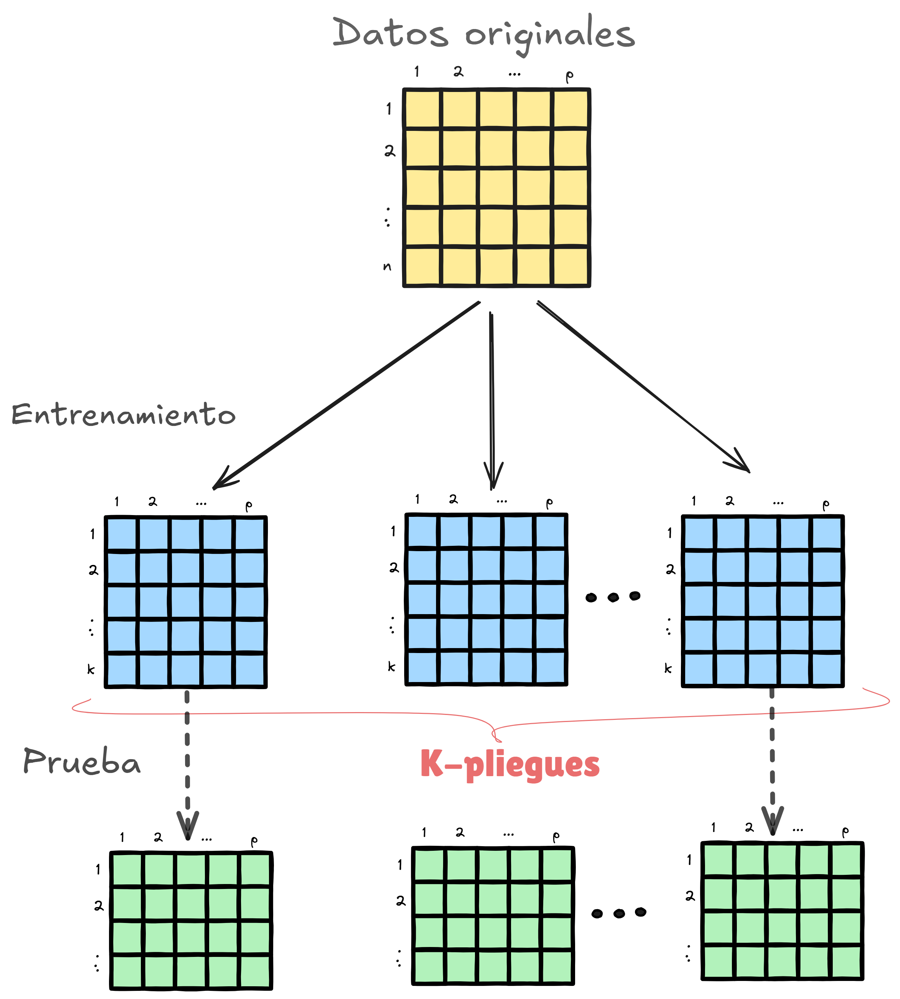
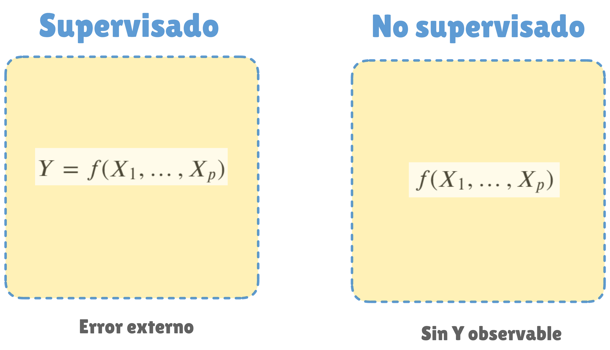
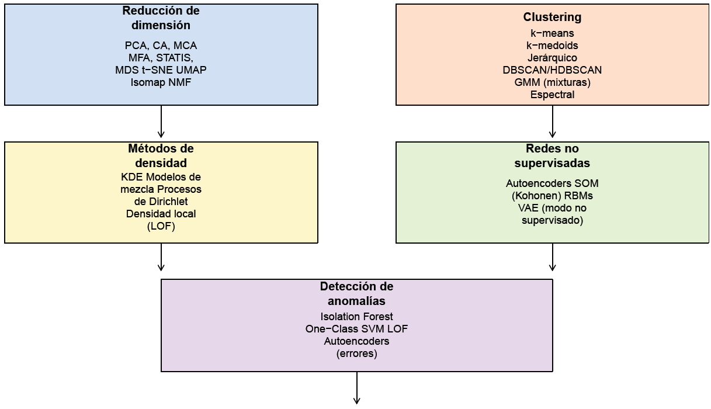
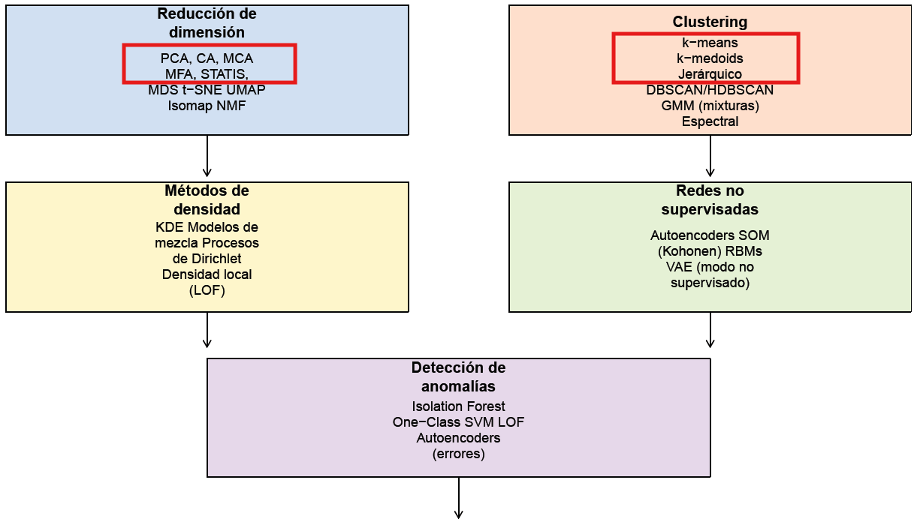
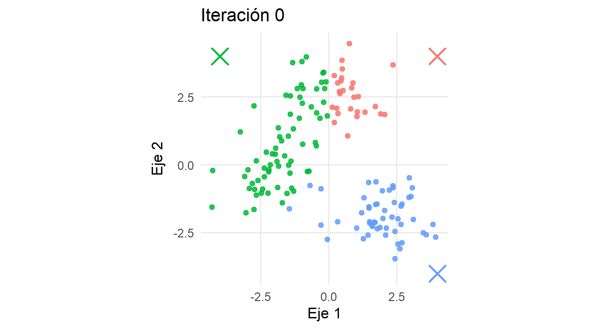
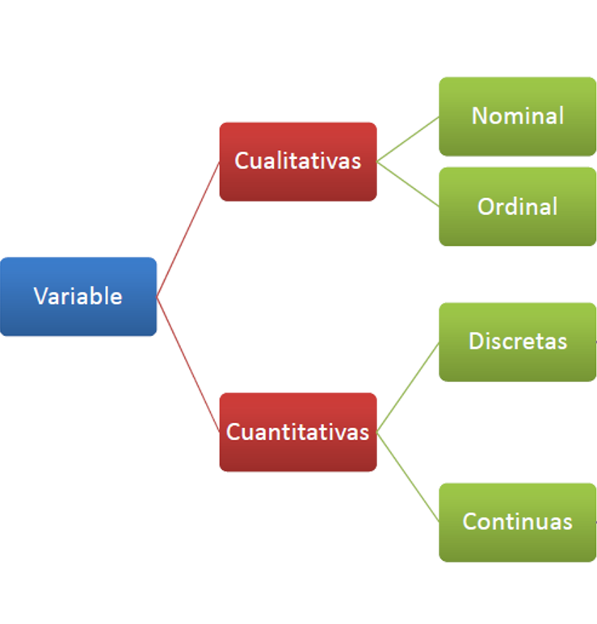
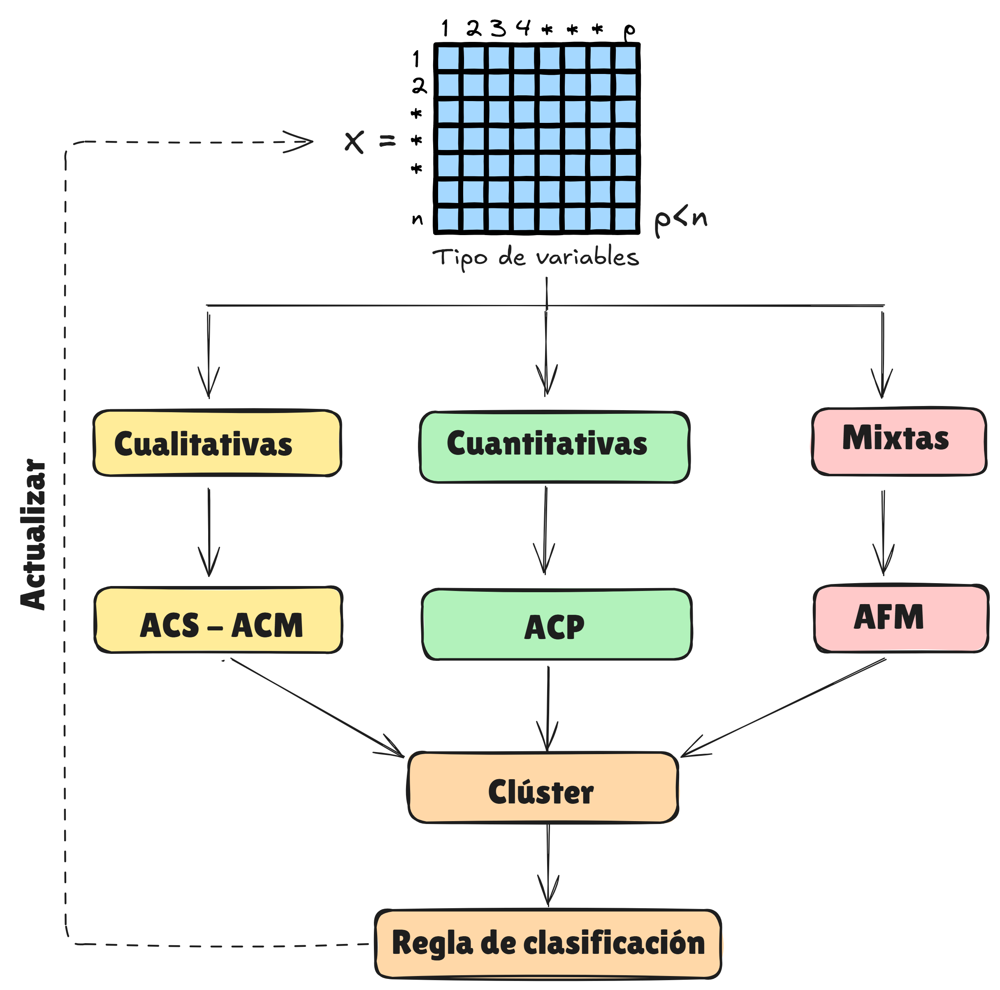
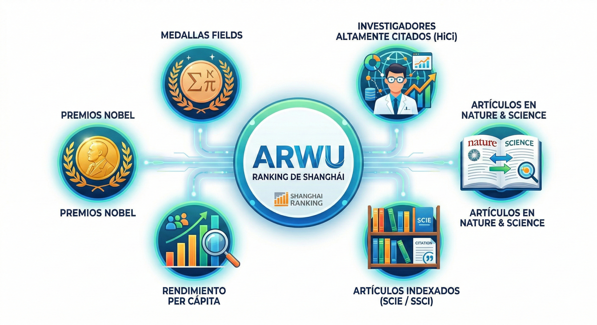

\newcommand\norm[1]{\left\lVert#1\right\rVert}

```{r}
library(pacman)

p_load(here)
```

# Panorama de la Estadística Descriptiva Multivariada \ en el moderno contexto del aprendizaje estadístico no supervisado {background-color="#0077b6"}

---

##  **Objetivo de los métodos supervisados** 

### Predecir una variable respuesta $Y$ a partir de predictores $X_1, \ldots, X_p$ mediante un modelo

$$Y = f(X_1, \ldots, X_p)$$
**Evaluación.** La calidad del modelo se mide con un *criterio externo de error*
que compara predicciones $\hat{y}_i$ con observaciones reales $y_i$.

---

### Relación entre el predictor y la variable respuesta

```{r, fig.align='center'}
#| message: false
#| warning: false
#| fig-width: 8
#| fig-height: 7

library(ggplot2)

set.seed(123)
n  <- 120
x  <- runif(n, -3, 3)
fx <- 1.2 + 0.9*x - 0.25*x^2
y  <- fx + rnorm(n, sd=0.6)

df <- data.frame(x = x, y = y)

ggplot(df, aes(x = x, y = y)) +
  geom_point(aes(color = "datos"),
             size = 2.2, alpha = 0.75) +
  stat_function(aes(color = "modelo"),
                fun = function(x) 1.2 + 0.9*x - 0.25*x^2,
                linewidth = 1.3) +
  scale_color_manual(
    values = c("datos" = "#1F3B73",
               "modelo" = "#C0392B"),
    labels = c("Datos observados",
               expression(hat(y) == f(X[1]))),
    name = NULL
  ) +
  labs(
    x = expression(X[1]),
    y = expression(hat(y))
  ) +
  theme_minimal(base_size = 15) +
  theme(
    legend.position = "top",
    legend.justification = "left",
    panel.grid.minor = element_blank(),
    panel.grid.major = element_line(color = "grey85"),
    axis.title = element_text(face = "bold"),
    legend.text = element_text(size = 12)
  )
```

## ¿Qué es lo supervisado?


**Idea clave.** Al observar $Y$, el aprendizaje se puede *supervisar*:

::: columns
::: {.column width="60%"}

</br></br>

* **Entrenamiento:** ajustar $f$ usando una fracción de los datos.
* **Prueba/validación:** evaluar en datos independientes comparando $\hat{y}_i$ vs. $y_i$ con una medida de error.

:::

::: {.column  width="40%"}

{fig-align="center" width="100%"}

:::

:::


## Métodos típicos en la categoría supervisados

</br>

* **Regresión**: Regresión lineal, polinómica y regularizada (ridge/lasso).

* **Clasificación**: Regresión logística, árboles, k-NN, SVM y redes neuronales.

* **Modelos extendidos**: Modelos lineales generalizados (GLM) y aditivos generalizados (GAM).

## Contraste: Aprendizaje Supervisado vs No Supervisado

**Idea central.** En el **Aprendizaje Estadístico No Supervisado** solo se observan variables explicativas $X_1, \ldots, X_p$; no existe una variable respuesta $Y$ que permita supervisar el aprendizaje ni evaluar el ajuste mediante un criterio externo de error.

. . . 

* No hay una respuesta observable que se desee predecir.
* El problema no se formula en términos de predicción supervisada.
* La evaluación del resultado es interna al método y de carácter exploratorio.

## Contraste: Aprendizaje Supervisado vs No Supervisado


{fig-align="center" width="80%"}

## Métodos en Aprendizaje No Supervisado

Como parte del **Aprendizaje Estadístico No Supervisado** se incluyen, entre otros, los siguientes métodos:

</br>

- **Reducción de dimensión:** Análisis de Componentes Principales (ACP).
- **Asociación en tablas categóricas:** Análisis de Correspondencias (AC) y Análisis de Correspondencias Múltiples (ACM).
- **Estructura de similitud:** métodos de agrupamiento (*clustering*).

---

## Ilustración en el plano factorial

```{r}
#| fig-width: 14
#| fig-height: 7
#| fig-dpi: 300
#| out-width: 100%
#| fig-align: center

set.seed(2026)
n <- 90

g <- rep(1:3, each = n/3)
x1 <- c(rnorm(n/3, -2, 0.6), rnorm(n/3,  0, 0.6), rnorm(n/3,  2, 0.6))
x2 <- c(rnorm(n/3,  0, 0.7), rnorm(n/3,  2, 0.7), rnorm(n/3, -1.5, 0.7))

pc1 <- as.numeric(scale(x1 + 0.2*x2))
pc2 <- as.numeric(scale(-0.3*x1 + x2))

df <- data.frame(
  pc1 = pc1,
  pc2 = pc2,
  grupo = factor(g, labels = paste0("Grupo ", 1:3))
)

centros <- aggregate(cbind(pc1, pc2) ~ grupo, data = df, FUN = mean)

library(ggplot2)
library(ggrepel)

ggplot(df, aes(pc1, pc2)) +
  geom_point(aes(color = grupo), size = 2.2, alpha = 0.85) +
  stat_ellipse(aes(color = grupo), level = 0.80, linewidth = 0.9, alpha = 0.20) +
  geom_point(
    data = centros,
    aes(pc1, pc2),
    shape = 4, size = 6, stroke = 1.4,
    inherit.aes = FALSE
  ) +
  geom_label_repel(
    data = centros,
    aes(pc1, pc2, label = grupo),
    inherit.aes = FALSE,
    size = 4.2,
    label.size = 0.25,
    min.segment.length = 0,
    seed = 2026
  ) +
  scale_color_brewer(palette = "Dark2") +
  labs(
    x = "Eje 1 (factor / componente)",
    y = "Eje 2 (factor / componente)",
    color = NULL
  ) +
  coord_equal() +
  theme_minimal(base_size = 20) +
  theme(
    legend.position = "none",
    panel.grid.minor = element_blank(),
    axis.title = element_text(face = "bold"),
    plot.margin = margin(5, 5, 5, 5)
  )
```

## Mapa conceptual

### La estadística multivariada en el contexto del aprendizaje no supervisado

{fig-align="center" width="100%"}

## Mapa conceptual

### La estadística multivariada en el contexto del aprendizaje no supervisado

{fig-align="center" width="100%"}

## Métodos tratados en este curso


* **PCA** (Principal Components Analysis).
* **CA** (Correspondence Analysis).
* **MCA** (Multiple Correspondence Analysis).
* **K-means**.
* **k-medoids** (Partitioning Around Medoids - PAM)
* **Clustering jerarquico** (aglomerativo o divisivo).

---

### Proceso iterativo no jerárquico

{fig-align="center" width="100%"}

## Métodos de reducción de dimensión

### Basados en descomposición SVD

::: {.incremental style="font-size: 0.88em;"}

- **PCA** (Análisis de Componentes Principales): Método lineal para variables numéricas que busca direcciones de máxima varianza. Basado en la **SVD** de la matriz centrada (y estandarizada).

- **CA** (Análisis de Correspondencias): Analiza la asociación entre dos variables cualitativas en tablas de contingencia a través de perfiles centrados y ponderados. Utiliza una **SVD ponderada** para obtener coordenadas principales.

- **MCA** (Análisis de Correspondencias Múltiples): Extensión del CA a múltiples variables cualitativas mediante la matriz indicatoria o de Burt. Fundamentado en una **SVD en el espacio chi-cuadrado**.

:::

## Métodos de reducción de dimensión

::: {.incremental style="font-size: 0.88em;"}

- **MFA** (Análisis Factorial Múltiple): Permite analizar múltiples tablas de variables cuantitativas y/o cualitativas; normaliza cada bloque y aplica una **SVD global** para extraer factores comunes.

- **STATIS** (incluye DiSTATIS): Método para tablas estructuradas en tres vías; construye una *compromise matrix* y aplica descomposición espectral para obtener configuraciones y compromisos.

- **MDS clásico** (CMDS): Recupera coordenadas en espacio euclidiano mediante la **descomposición espectral** de la matriz de distancias doblemente centrada; algebraicamente equivalente a una SVD.

:::

## Métodos no lineales de reducción

::: {.incremental style="font-size: 0.88em;"}

- **t-SNE** (*t-distributed Stochastic Neighbor Embedding*): Minimiza la divergencia de Kullback–Leibler entre distribuciones de vecinos. No utiliza SVD salvo como opción para inicialización.

- **UMAP** (*Uniform Manifold Approximation and Projection*): Aprendizaje de variedades basado en grafos *fuzzy* y optimización de atracción-repulsión. No utiliza SVD excepto cuando se inicializa con PCA.

- **Isomap**: Aprendizaje de manifolds basado en distancias geodésicas; aplica MDS al final pero no es un método basado en SVD.

- **NMF** (*Nonnegative Matrix Factorization*): Factorización iterativa de matrices no negativas mediante algoritmos multiplicativos o ALS. No utiliza SVD, aunque puede inicializarse con ella.

:::

## Métodos de agrupamiento (*Clustering*)

::: {.incremental style="font-size: 0.88em;"}

- **K-means**: Asigna cada observación al centroide más cercano minimizando la suma de distancias cuadráticas intra-grupo. Requiere fijar el número de *clusters* y es sensible a valores atípicos.

- **K-medoids (PAM)**: Variante robusta de K-means que utiliza medoids (observaciones reales) en lugar de centroides; adecuada para diferentes métricas de distancia.

- **Clustering jerárquico** (aglomerativo o divisivo): Construye un dendrograma secuencialmente. No requiere especificar el número de *clusters* a priori; permite distintos criterios de enlace (single, complete, average, Ward).

:::

## Métodos de agrupamiento (*Clustering*)

::: {.incremental style="font-size: 0.88em;"}

- **DBSCAN**: Método basado en densidad que identifica regiones densas separadas por zonas de baja densidad. Detecta ruido y produce *clusters* de formas arbitrarias sin necesidad de fijar el número de grupos.

- **HDBSCAN**: Extensión jerárquica de DBSCAN que permite densidades variables; produce *clusters* más estables con mejor detección de ruido en datos heterogéneos.

- **GMM** (*Gaussian Mixture Models*): Modelo probabilístico que representa los datos como mezcla de distribuciones normales. Ofrece pertenencias suaves (probabilidades) mediante el algoritmo EM.

- **Clustering espectral**: Utiliza los autovectores del Laplaciano de un grafo de similitudes para representar los datos en espacio reducido donde luego aplica K-means. Detecta *clusters* no lineales.

:::

## Elementos de álgebra lineal requeridos en análisis multivariado

::: {.incremental}

- **Espacios vectoriales:** vectores, subespacios, bases y dimensión.

- **Producto interno:** norma, ángulos y ortogonalidad.

- **Proyección ortogonal** y mínimos cuadrados.

- **Matrices:** operaciones matriciales, rango, traza e inversa (cuando existe).

- **Matrices simétricas** y definidas positivas.

- **Valores y vectores propios.**

- **Teorema de la descomposición espectral (TDE).**

- **Teorema de la descomposición en valores singulares (TDVS).**

:::


## Naturaleza de los conjuntos de datos del curso

A lo largo del desarrollo del curso se trabajará exclusivamente con **conjuntos de datos reales** del **contexto colombiano**, sobre los siguientes ámbitos:

- 🎓 **Educación**
- 📊 **Calidad de vida**
- 🏛 **Rankings universitarios**
- 🛍 **Investigación de mercados**
- 📚 **Otros contextos aplicados**


## Tipos de variables


{fig-align="center" width="100%"}

## Variables cualitativas

::: {.incremental}

- Describen **cualidades, categorías o clases** de los objetos.
- No admiten operaciones aritméticas directas.
- **Nominales**: funcionan como códigos sin orden implícito.
  - Ejemplos: ciudades, países, identificadores.
- **Categóricas (u ordinales)**: representan categorías con **orden o jerarquía**.
  - Ejemplos: niveles educativos, estratos socioeconómicos, posiciones en rankings.
- Sus valores se denominan **modalidades** u **opciones de respuesta**.

:::

## Variables cuantitativas

::: {.incremental}

- Se expresan en una **escala numérica** y admiten comparaciones métricas.
- Permiten definir distancias y aplicar operaciones aritméticas.
- **Continuas**: toman valores en un intervalo continuo.
  - Ejemplos: altura, edad, ingresos, longitud.
- **Discretas**: toman valores enteros.
  - Ejemplos: número de habitantes, conteos de eventos.
  - Los promedios pueden producir valores no directamente interpretables (p. ej., 4.6 aviones por minuto).

:::

## Tipos de variables y métodos multivariados

<div style="text-align:center; font-size:1.25em; line-height:1.6;">

<strong>Las variables son de tipo...</strong>

<div style="display:flex; justify-content:space-around; align-items:center;">

<div>
🔢<br>
<strong>Cuantitativas</strong><br>
<small>continuas o discretas numéricas</small><br>
⬇️<br>
<h3>PCA</h3>
</div>

<div>
🏷️<br>
<strong>Cualitativas</strong><br>
<small>nominales u ordinales</small><br>
⬇️<br>
<h3>MCA</h3>
</div>

<div>
🧩<br>
<strong>Mixtas / por grupos</strong><br>
<small>bloques de variables</small><br>
⬇️<br>
<h3>MFA</h3>
</div>

</div>
</div>

<p style="text-align:center; font-style:italic; opacity:0.8;">
El tipo de variable define la geometría del espacio y la métrica del análisis.
</p>

## Proceso de analítica


```{r, out.width= '100%'}
knitr::include_graphics(here::here("images/Ciclo.png"))
```
[Wickham, H. y otros (2023)](https://r4ds.hadley.nz/)


## Proceso de analítica


{fig-align="center" width="100%"}


# PANORAMA GENERAL {background-color="#0077b6"}

## Motivación: ¿por qué componentes principales?

::: {.incremental style="font-size: 0.90em; line-height: 1.2;"}

- Los **gráficos de dispersión** permiten explorar relaciones entre pares de variables cuantitativas e identificar patrones, tendencias y valores atípicos.

- Mediante colores, tamaños o etiquetas es posible incorporar información adicional, pero la representación sigue estando **limitada a dos dimensiones**.

- Cuando el número de variables es grande, los planos definidos por variables originales **no capturan adecuadamente** la estructura global de los datos.

- Las **componentes principales** definen nuevos ejes, como combinaciones lineales de las variables originales, que **maximizan la variabilidad**.

- Los planos generados por las primeras componentes proporcionan **representaciones más informativas y sintéticas** de los datos.

:::

## Motivación: variables originales vs plano PCA

```{r}
#| echo: false
#| fig-width: 12
#| fig-height: 6
#| out-width: 100%

library(ggplot2)
library(patchwork)

# Datos de ejemplo con correlación
set.seed(123)
X <- matrix(rnorm(200), ncol = 2)
X[,2] <- 0.8 * X[,1] + rnorm(100, sd = 0.5)

df <- data.frame(
  Variable1 = X[,1],
  Variable2 = X[,2]
)

# PCA
pca <- prcomp(X, scale. = TRUE)
Z <- as.data.frame(pca$x)

# Límites comunes simétricos
lim_orig <- max(abs(df))
lim_pca  <- max(abs(Z))

#----------------------------------
# Variables originales
#----------------------------------
p1 <- ggplot(df, aes(Variable1, Variable2)) +
  geom_point(color = "gray40", size = 1.5, alpha = 0.8) +
  coord_equal(xlim = c(-lim_orig, lim_orig),
              ylim = c(-lim_orig, lim_orig),
              expand = FALSE) +
  geom_hline(yintercept = 0, linetype = "dashed", linewidth = 0.4) +
  geom_vline(xintercept = 0, linetype = "dashed", linewidth = 0.4) +
  labs(
    title = "Variables originales",
    x = "Variable 1",
    y = "Variable 2"
  ) +
  theme_classic(base_size = 16) +
  theme(plot.title = element_text(hjust = 0.5))

#----------------------------------
# Plano PCA
#----------------------------------
p2 <- ggplot(Z, aes(PC1, PC2)) +
  geom_point(color = "steelblue", size = 1.5, alpha = 0.8) +
  coord_equal(xlim = c(-lim_pca, lim_pca),
              ylim = c(-lim_pca, lim_pca),
              expand = FALSE) +
  geom_hline(yintercept = 0, linetype = "dashed", linewidth = 0.4) +
  geom_vline(xintercept = 0, linetype = "dashed", linewidth = 0.4) +
  labs(
    title = "Plano PCA",
    x = "CP1",
    y = "CP2"
  ) +
  theme_classic(base_size = 16) +
  theme(plot.title = element_text(hjust = 0.5))

p1 + p2 + plot_layout(widths = c(1,1))
```

## Ejemplo: ARWU

<div style="text-align: center;">
{fig-align="center" width="85%"}
</div>

---

### ¿Qué son los rankings universitarios?

- Clasificación basada en **criterios definidos** por la entidad.
- Responde a un **modelo implícito de universidad de élite**.
- Los resultados **difieren** entre rankings.


::: {.fragment}


**Criterios frecuentes**

::: {.column width="50%"}
- Producción e impacto científico  
- Calidad de revistas  
- Investigación e innovación  
- Docentes con doctorado 
:::

::: {.column width="50%"}
- Reputación académica  
- Internacionalización  
- Premios y distinciones  
:::

::: 

## ARWU Cont.


### Construcción estadística de los rankings

::: {.incremental}

- Se basan en **múltiples indicadores** asociados a distintos criterios.

- Los indicadores se **normalizan o estandarizan** para hacerlos comparables.

- Se calcula un **puntaje total** mediante una  **combinación lineal ponderada** (los pesos reflejan el modelo implícito de universidad).

- Con el puntaje total se obtiene un **ordenamiento** (puesto 1 al mayor puntaje, puesto 2 al siguiente, etc.).

- El resultado es un **orden relativo**: las diferencias numéricas no necesariamente representan “distancias”.

:::

## Distribución por país en el Top 100 (ARWU 2013)

Universidades ubicadas en los **100 primeros puestos** del ARWU (año 2013). Se analizan sus posiciones **mundial** y, por derivación, sus posiciones **nacional** y **regional**.

```{r}
#| echo: true
#| message: false
#| warning: false
library(readr)

url <- "https://github.com/jgbabativam/Curso_Multivariado/raw/main/Datos/arwu.csv"
arwu <- read_csv2(url)
```


```{r, fig.align='center'}
#| echo: false
#| message: false
#| warning: false
#| fig-width: 12
#| fig-height: 5
#| out-width: 100%

library(tidyverse)
arwunis_pais <- arwu |>
  count(Country, sort = TRUE) |>
  slice_head(n = 10)

ggplot(arwunis_pais,
       aes(x = reorder(Country, -n),
           y = n)) +
  geom_col(fill = "steelblue", width = 0.7) +
  geom_text(aes(label = n),
            vjust = -0.4,
            size = 6) +
  labs(
    x = NULL,
    y = "Número de universidades"
  ) +
  theme_classic(base_size = 18) +
  theme(
    axis.text.x = element_text(angle = 0, hjust = 1),
    plot.margin = margin(10, 20, 10, 10)
  ) +
  expand_limits(y = max(arwunis_pais$n) * 1.15)
```

## Estructura de los datos

<div style="height:450px; overflow-y:auto;">

```{r}
#| echo: false
#| message: false
#| warning: false
#| prefer-html: true

library(gt)

arwu |>
  gt() |>
  opt_row_striping() |>
  # Encabezados en negrilla
  tab_style(
    style = cell_text(weight = "bold"),
    locations = cells_column_labels()
  ) |>
  tab_options(
    table.font.size = px(14),
    data_row.padding = px(4),
    table.width = pct(100)
  )
```
</div>

## ARWU Cont.

Comparación de la visualización de los datos originales con su proyección sobre las dos primeras componetes principales.

::: {.columns}

::: {.column width="50%"}

```{r}
#| echo: false
#| message: false
#| warning: false
#| fig-width: 6
#| fig-height: 6

library(ggplot2)
library(janitor)

arwu <- arwu |> clean_names()
ggplot(arwu,
       aes(x = regional_rank,
           y = world_rank,
           label = country)) +
  geom_text(size = 3) +
  geom_abline(intercept = 0,
              slope = 1,
              linetype = "dashed",
              color = "red",
              linewidth = 1) +
  scale_x_continuous(limits = c(0, 100)) +
  scale_y_continuous(limits = c(0, 100)) +
  labs(
    x = "Ranking regional",
    y = "Ranking mundial"
  ) +
  coord_equal() +
  theme_classic(base_size = 14)
```

:::

::: {.column width="50%"}

```{r}
#| echo: false
#| message: false
#| warning: false
#| fig-width: 6
#| fig-height: 6

library(FactoMineR)
library(factoextra)

arwupca <- PCA(arwu[, 3:5], quali.sup = 1, graph = FALSE)

fviz_pca_ind(arwupca,
             habillage = 1,
             repel = FALSE,
             pointsize = 2) +
  theme_classic(base_size = 14) 
  
```

:::

:::

## Rankings universidades latinoamericanas

::: {.columns .smaller}

::: {.column width="55%"}

### Scimago

Ranking orientado a la **actividad investigativa**.

**Indicadores principales:**

- Impacto y productividad científica  
- Colaboración internacional  
- Publicaciones de alta calidad  
- Liderazgo y excelencia científica  
- Talento científico  

:::

::: {.column width="45%"}

**Indicadores adicionales**

- 3 de innovación  
- 3 de factor social  

**Enfoque predominante:**  
Desempeño científico medido por producción e impacto.

:::

:::

## Rankings universidades latinoamericanas

::: {.columns .smaller}

::: {.column width="55%"}

### Webranking

Ranking de **presencia en la web**.

Evalúa visibilidad institucional mediante:

- Enlaces entrantes al dominio  
- Número de páginas web  
- Archivos publicados (`pdf`, `doc`, `xls`, etc.)  

:::

::: {.column width="45%"}

Incluye además:

- Indicador de excelencia proveniente de Scimago  

**Enfoque predominante:**  
Visibilidad digital y difusión académica en la web.

:::

:::

**Conclusión:**  
Principalmente un ranking de **visibilidad**.

## Rankings universidades latinoamericanas

::: {.columns .smaller}

::: {.column width="55%"}

### QS

Combina **reputación** y desempeño académico.

**Indicadores de reputación:**

- Reputación entre académicos  
- Reputación entre empleadores  

:::

::: {.column width="45%"}

**Otros indicadores:**

- Razón estudiantes/profesor  
- Profesores con doctorado  
- Citas por artículo  
- Artículos por docente  
- Impacto web (Webranking)

:::

:::

**Conclusión:**  
Principalmente un ranking de **reputación universitaria**.

## Comparación entre los rankings

Sobre inconsistencias en algunos rankings universitarios

<div style="text-align: center;">
{fig-align="center" width="85%"}
</div>

---

## ¿Qué están midiendo realmente los rankings?

::: {.columns .smaller}

::: {.column width="33%"}

### Scimago

**Prioriza:**

- Producción científica  
- Impacto de investigación  
- Excelencia académica  

**Dimensión dominante:**  
Investigación

:::

::: {.column width="33%"}

### Webranking

**Prioriza:**

- Visibilidad web  
- Presencia digital  
- Difusión de contenidos  

</br></br>
**Dimensión dominante:**  
Impacto digital

:::

::: {.column width="33%"}

### QS

**Prioriza:**

- Reputación académica  
- Opinión de empleadores  
- Indicadores institucionales  

**Dimensión dominante:**  
Reputación

:::

:::

## Rankings universidades latinoamericanas

```{r}
#| echo: true
#| message: false
#| warning: false
library(pacman)
p_load(readr, janitor)

url <- "https://github.com/jgbabativam/Curso_Multivariado/raw/main/Datos/r14_Sci_Qs_Webometrics.csv"
RankLatino <- read_csv2(url) |> clean_names()
```


<div style="height:450px; overflow-y:auto;">

```{r}
#| echo: false
#| message: false
#| warning: false
#| prefer-html: true

library(gt)

RankLatino |>
  select(1:5) |> 
  arrange(qs_ranking) |> 
  gt() |>
  opt_row_striping() |>
  # Encabezados en negrilla
  tab_style(
    style = cell_text(weight = "bold"),
    locations = cells_column_labels()
  ) |>
  tab_options(
    table.font.size = px(14),
    data_row.padding = px(4),
    table.width = pct(100)
  )
```
</div>


## Rankings universidades latinoamericanas

Entre más lejos de la diagonal mas diferentes son los rankings correspondientes:

```{r, echo=FALSE, message=FALSE, warning=FALSE,  fig.height=4}
library(ggplot2)
library(ggrepel)
library(patchwork)
library(dplyr)


base_theme <- theme_minimal(base_size = 13) +
  theme(
    plot.title = element_text(face = "bold"),
    plot.subtitle = element_text(size = 9, margin = margin(b = 5)),
    plot.caption = element_text(size = 9),
    panel.grid.minor = element_blank()
  )

#---------------------------------------------------------
# Función para crear gráfico comparativo
#---------------------------------------------------------
plot_rank <- function(data, xvar, yvar, xlab, ylab, subtitle_text){
  
  df <- data |> 
    select(pais, {{xvar}}, {{yvar}}) |> 
    na.omit() |> 
    rename(x = {{xvar}}, y = {{yvar}})
  
  df <- df |> mutate(highlight = y < x)
  
  ggplot(df, aes(x, y)) +
    geom_abline(slope = 1, intercept = 0,
                linetype = "dashed",
                color = "red",
                linewidth = 0.8) +
    geom_point(size = 1.0, alpha = 0.5) +
    geom_text(aes(label = pais,
                        color = highlight),
                    show.legend = FALSE,
                    size = 2.5) +
    scale_color_manual(values = c("black", "red")) +
    coord_cartesian(xlim = c(0,270), ylim = c(0,270)) +
    labs(
      x = xlab,
      y = ylab,
      subtitle = subtitle_text
    ) +
    base_theme
}

#---------------------------------------------------------
# (a) Scimago vs QS
#---------------------------------------------------------
p1 <- plot_rank(
  RankLatino,
  sc_lac_ranking,
  qs_ranking,
  "Ranking Scimago",
  "Ranking QS",
  "a) Mejor posicionadas en QS que en Scimago"
)

#---------------------------------------------------------
# (b) Scimago vs WEB
#---------------------------------------------------------
p2 <- plot_rank(
  RankLatino,
  sc_lac_ranking,
  web_ranking_la,
  "Ranking Scimago",
  "Ranking WEB",
  "b) Coincidencias importantes en posiciones"
)

#---------------------------------------------------------
# (c) WEB vs QS
#---------------------------------------------------------
p3 <- plot_rank(
  RankLatino,
  web_ranking_la,
  qs_ranking,
  "Ranking WEB",
  "Ranking QS",
  "c) Similar a a) pero respecto al ranking Web"
)


p1 | p2 | p3 
```

## Rankings universidades latinoamericanas

Representación simultánea de universidades y rankings etiquetados por país de origen:

```{r, fig.align='center'}
RankLatino <- RankLatino |> na.omit()
res.sc.qs <- PCA(RankLatino[,2:5], quali.sup = 1, graph = FALSE)

p <- fviz_pca_biplot(
  res.sc.qs,
  habillage = "pais",
  label = "var",
  col.var = "black",
  labelcolor = "black",
  repel = TRUE,
  legend.title="País", title = ""
) + theme_classic()

p
```

<div style="font-size: 0.75em;">

Los dos vectores que representan los ranking SC y WEB reflejan su grado de asociación visualizado en la gráfica b). El vector QS muestra el grado de independencia de éste con los otros dos rankings, ya identificada en los gráficos a) y c).

</div>

## Resultados recientes

::: columns
::: {.column width="50%"}

**Ranking QS**

{width=80%}

:::
::: {.column width="50%"}

**Ranking SCImago**

{width=80%}

:::
:::


# Análisis de Correspondencias Simples - ACS {background-color="#0077b6"}

---

## Tablas de contingencia - TC

Una **TC** organiza las frecuencias de las modalidades de dos variables cualitativas, $X$ con $I$ filas e $Y$ con $J$ columnas:

$$G=\{n_{ij}\}=\begin{pmatrix} n_{11}& n_{12}& \cdots& n_{1J}\\ n_{21}& n_{22}& \cdots& n_{2J}\\ \vdots& \vdots& \ddots& \vdots\\ n_{I1}& n_{I2}& \cdots& n_{IJ} \end{pmatrix}$$

$n_{ij}$ es el número de individuos que presentan simultáneamente la modalidad $i$ de $X$ y la modalidad $j$ de $Y$, con tamaño muestral total

<div style="margin-top:-35px;">

$$
n=\sum_{i=1}^{I}\sum_{j=1}^{J} n_{ij}.
$$

</div>

## Perfiles fila y perfiles columna

El análisis de una tabla de contingencia permite estudiar la **asociación entre variables cualitativas** a través de los perfiles fila y columna.

Cada fila define un **perfil fila**: distribución condicional de $Y$ dada la modalidad $i$ de $X$:

$$f_{ij}=\frac{n_{ij}}{n_{i\cdot}},\quad n_{i\cdot}=\sum_{j=1}^J n_{ij}$$

Cada columna define un **perfil columna**: distribución condicional de $X$ dada la modalidad $j$ de $Y$:

$$c_{ij}=\frac{n_{ij}}{n_{\cdot j}},\quad n_{\cdot j}=\sum_{i=1}^I n_{ij}$$

## Conexión con la teoría de probabilidad

Si dos variables $X$ e $Y$ son **independientes**, entonces:

$$P(X=i,Y=j) = P(X=i)\,P(Y=j)$$

. . .

Empíricamente, esta independencia se traduce en:

$$\frac{n_{ij}}{n} \approx \frac{n_{i\cdot}}{n}\,\frac{n_{\cdot j}}{n}$$

. . .

Las **desviaciones respecto a esta estructura de independencia** contienen toda la información sobre la asociación entre modalidades y constituyen el objeto de análisis del **Análisis de Correspondencias Simples (ACS)**.

## Distancia chi-cuadrado

Para cuantificar la proximidad entre perfiles se introduce la **distancia $\chi^2$**. Entre dos perfiles fila $i$ e $i'$:

$$d_{\chi^2}^2(i,i')=\sum_{j=1}^J \frac{1}{n_{\cdot j}/n} \left(\frac{n_{ij}}{n_{i\cdot}}-\frac{n_{i'j}}{n_{i'\cdot}}\right)^2$$

. . .

Esta métrica **pondera las diferencias entre perfiles** según la importancia de cada modalidad, medida por su frecuencia marginal. Constituye el fundamento geométrico del **Análisis de Correspondencias Simples**, que busca representar las nubes de perfiles en espacios de baja dimensión conservando dichas distancias.

## Ejemplo: Encuesta Mundial de Valores (EMV)

La  **Encuesta Mundial de Valores** es un estudio internacional comparativo que se realiza periódicamente desde 1981. Su objetivo es medir **valores, creencias y actitudes** de la población sobre múltiples temas sociales y culturales.

Una de sus preguntas indaga por la **confianza en la justicia** en países latinoamericanos:

> *¿Cree usted que la justicia en este país se aplica de manera justa para todos, independientemente de su origen social o económico?*

| Muchísimo | Mucho | No mucho | Nada |
|:---------:|:-----:|:--------:|:----:|


## EMV: Carga de datos

```{r}
#| echo: true
#| message: false
#| warning: false

library(pacman)
p_load(here, tidyverse, FactoMineR, factoextra, gt)

url <- "https://raw.githubusercontent.com/jgbabativam/Curso_Multivariado/main/Datos/ConfianzaJUsticia.csv"
confianza <- read.csv2(url)

paises_interes <- c("Mexico", "Colombia", "Ecuador", "Chile",
                    "Peru", "Argentina", "Brasil")

confianza_filtrado <- confianza |> 
                      filter(Pais %in% paises_interes) |> 
                      column_to_rownames("Pais") |> 
                      select(-no_sabe, -no_resp.) |> 
                      arrange(-muchis.)

```

## EMV: Tabla de contingencia

Resultados de la confianza en la justicia en países seleccionados.

```{r}
#| echo: false
#| message: false
#| warning: false
#| prefer-html: true

conf_tot <- cbind(confianza_filtrado,
                  Total = rowSums(confianza_filtrado))
conf_tot <- rbind(conf_tot, Total = colSums(conf_tot))

conf_tot |>
  as.data.frame() |>
  tibble::rownames_to_column("País") |>
  gt() |>
  opt_row_striping() |>
  tab_style(style = cell_text(weight = "bold"),
            locations = cells_column_labels()) |>
  tab_style(style = cell_text(weight = "bold"),
            locations = cells_body(rows = nrow(conf_tot))) |>
  tab_options(table.font.size = px(14),
              data_row.padding = px(4),
              table.width = pct(100))
```

## EMV: Perfiles fila

<br><br>

```{r}
#| echo: false
#| message: false
#| warning: false
#| fig-width: 13
#| fig-height: 5
#| out-width: 100%

perf_fil <- round(prop.table(as.matrix(confianza_filtrado), margin = 1), 3)
perf_fil <- perf_fil[order(-perf_fil[, 1]), ]

perf_df <- as.data.frame(perf_fil) |>
  tibble::rownames_to_column("Pais") |>
  pivot_longer(cols = -Pais, names_to = "Modalidad", values_to = "Perfil") |>
  mutate(Pais = factor(Pais, levels = rownames(perf_fil)))
```

```{r}
  perf_fil |>  as.data.frame() |> rownames_to_column("Pais") |> relocate(Pais) |> 
  gt() |>
  opt_row_striping() |>
  tab_style(
    style = cell_text(weight = "bold"),
    locations = cells_column_labels()
  ) |>
  tab_style(
    style = cell_text(weight = "bold"),
    locations = cells_body(rows = nrow(perf_fil))
  ) |>
  tab_options(
    table.font.size = px(14),
    data_row.padding = px(4),
    table.width = pct(100)
  )

```


## EMV: Perfiles fila

```{r}
 ggplot(perf_df, aes(x = Modalidad, y = Perfil)) +
  geom_col(fill = "#1F3B73", width = 0.8) +
  geom_text(aes(label = sprintf("%.3f", Perfil)),
            vjust = -0.35, size = 2.9) +
  facet_wrap(~ Pais, nrow = 4) +
  scale_y_continuous(
    limits = c(0, max(perf_df$Perfil) * 1.18),
    expand = expansion(mult = c(0, 0))
  ) +
  labs(
    x = "Modalidad de respuesta",
    y = "Perfil condicional (frecuencia relativa)"
  ) +
  theme_minimal(base_size = 13) +
  theme(
    panel.grid.minor = element_blank(),
    strip.text = element_text(face = "bold"),
    axis.text.x = element_text(angle = 30, hjust = 1, size = 9)
  )

```
 

## EMV: Perfiles columna

```{r}
#| echo: false
#| message: false
#| warning: false
#| fig-width: 13
#| fig-height: 5
#| out-width: 100%

perf_col <- round(prop.table(as.matrix(confianza_filtrado), margin = 2), 3)
perf_col <- perf_col[order(-perf_col[, 1]), ]

perf_df <- as.data.frame(perf_col) |>
  tibble::rownames_to_column("Pais") |>
  pivot_longer(cols = -Pais, names_to = "Modalidad", values_to = "Perfil") |>
  mutate(Pais = factor(Pais, levels = rownames(perf_col)))

ggplot(perf_df, aes(x = Modalidad, y = Perfil)) +
  geom_col(fill = "#1F3B73", width = 0.8) +
  geom_text(aes(label = sprintf("%.3f", Perfil)),
            vjust = -0.35, size = 2.9) +
  facet_wrap(~ Pais, ncol = 4) +
  scale_y_continuous(limits = c(0, max(perf_df$Perfil) * 1.18),
                     expand = expansion(mult = c(0, 0))) +
  labs(x = "Modalidad de respuesta", y = "Perfil condicional (frecuencia relativa)") +
  theme_minimal(base_size = 13) +
  theme(
    panel.grid.minor = element_blank(),
    strip.text = element_text(face = "bold"),
    axis.text.x = element_text(angle = 30, hjust = 1, size = 9)
  )
```

## EMV: Plano de correspondencias simples

```{r}
#| echo: false
#| message: false
#| warning: false
#| fig-width: 10
#| fig-height: 6
#| out-width: 100%
#| fig-align: center

confpaises <- CA(as.matrix(confianza_filtrado), graph = FALSE)

fviz_ca_biplot(confpaises, repel = TRUE) +
  theme_classic(base_size = 14) +
  labs(title = "Plano de correspondencias — Confianza en la justicia (EMV)")
```

<div style="font-size: 0.75em;">

Los países en la misma dirección de una modalidad muestran mayor afinidad con esa percepción de confianza. Los países en la misma dirección de una modalidad muestran mayor afinidad con esa percepción.

</div>

# Correspondencias Múltiples {background-color="#0077b6"}

---

## Encuesta de Cultura Ciudadana (ECC)

::: columns
::: {.column width="55%"}

La **Encuesta de Cultura Ciudadana (ECC)** fue realizada por la Corporación Visionarios en varias ciudades latinoamericanas. Es un instrumento de observación y análisis de distintos aspectos relacionados con la cultura ciudadana y el comportamiento social.

:::
::: {.column width="45%"}

**Entre sus temas se incluyen:**

- Sentimientos frente a normas (Ley, Moral, Cultura)
- Capacidades para cumplir acuerdos
- Pluralismo e inclusión
- Seguridad y confianza interpersonal
- Confianza en instituciones

:::
:::

## ECC: Pregunta sobre desobediencia de la ley

**Pregunta 20.** *¿En su opinión se justifica o no desobedecer la ley en los siguientes casos?*


::: columns
::: {.column width="50%"}

a. Cuando es la única manera de alcanzar sus objetivos
b. Cuando es la única manera de ayudarle a la familia
c. Para luchar públicamente contra una ley o régimen injusto
d. Cuando es muy provechoso económicamente
e. Cuando la creencia religiosa lo permite

:::
::: {.column width="50%"}

f. Para responder a una ofensa al honor
g. Cuando es bastante seguro que uno no será castigado
h. Cuando alguien lo ha hecho y le ha ido bien
i. Cuando es lo acostumbrado
j. Para pagar un favor
k. Para defender propiedades o bienes

:::
:::

## ECC: Frecuencias de respuesta Sí/No por ciudad

```{r}
#| echo: true
#| message: false
#| warning: false

library(pacman)
p_load(here, tidyverse, FactoMineR)

url <- "https://raw.githubusercontent.com/jgbabativam/Curso_Multivariado/main/Datos/Muestra_CC.csv"
CCLatin <- read.csv2(url, sep = ";")
cclat_p20 <- CCLatin[, c("city", paste0("P20_", letters[1:11]))]
```

```{r}
#| echo: false
#| message: false
#| warning: false
#| fig-width: 12
#| fig-height: 5
#| out-width: 100%

datos_long_cc <- cclat_p20 |>
  select(city, paste0("P20_", letters[1:11])) |>
  pivot_longer(cols = starts_with("P20_"),
               names_to = "Item", values_to = "Valor") |>
  mutate(
    Respuesta = case_when(
      grepl("=1_", Valor) ~ "Sí",
      grepl("=2_", Valor) ~ "No",
      TRUE ~ NA_character_
    ),
    Respuesta = factor(Respuesta, levels = c("Sí","No")),
    Item = factor(Item,
                  levels = paste0("P20_", letters[1:11]),
                  labels = paste0("P20", letters[1:11]))
  ) |>
  filter(!is.na(Respuesta), !is.na(city)) |>
  count(city, Item, Respuesta, name = "Frecuencia")

ggplot(datos_long_cc, aes(x = city, y = Frecuencia, fill = Respuesta)) +
  geom_col(position = position_dodge(width = 0.8), width = 0.7) +
  facet_wrap(~ Item) +
  scale_fill_manual(values = c("Sí" = "#C0392B", "No" = "#1F3B73")) +
  labs(title = "P20 (a–k). Frecuencias de respuesta Sí/No por ciudad",
       x = "Ciudad", y = "Frecuencia", fill = "Respuesta") +
  theme_minimal(base_size = 12) +
  theme(axis.text.x = element_text(angle = 45, hjust = 1))
```

## ECC: Plano de correspondencias múltiples

```{r}
#| echo: false
#| message: false
#| warning: false
#| fig-width: 10
#| fig-height: 6
#| out-width: 100%
#| fig-align: center

res_mca <- MCA(cclat_p20, quali.sup = 1, graph = FALSE)

fviz_mca_var(res_mca, repel = TRUE) +
  theme_classic(base_size = 13) +
  labs(title = "ACM — Tendencias a justificar la desobediencia de la ley por ciudades")
```

<div style="font-size: 0.75em;">

Las modalidades cercanas en el plano presentan patrones de respuesta similares entre las ciudades encuestadas. La tendencia general es no justificar la desobediencia, pero ítems como P20b, P20c y P20k muestran mayor cercanía entre Sí y No.

</div>

# Agrupamiento (*Clustering*) {background-color="#0077b6"}

---

## Sistema Universitario Estatal (SUE)

El **Sistema Universitario Estatal (SUE)** es una red de universidades públicas colombianas, orientada hacia la colaboración académica, la investigación y la gestión conjunta de recursos.

Para este ejemplo se utilizan **seis indicadores** del año 2012 para **32 universidades estatales**:

::: columns
::: {.column width="50%"}

- Docentes de tiempo completo o equivalente (**DCTC2012**)
- Gastos en personal administrativo (**GPA2012**)
- Matrícula de pregrado (**MPRE2012**)

:::
::: {.column width="50%"}

- Matrícula de posgrado (**MPOS2012**)
- Graduados de pregrado (**GrPre2012**)
- Graduados de posgrado (**GrPos2012**)

:::
:::

## SUE: Datos

```{r}
#| echo: true
#| message: false
#| warning: false

library(pacman)
p_load(here, janitor, tidyverse, FactoMineR, ggrepel, patchwork, ggdendro)

url <- "https://github.com/jgbabativam/Curso_Multivariado/raw/main/Datos/SUEsolo2012.csv"
SUE <- read.csv2(url, sep = ";")
rownames(SUE) <- SUE$Universidades
xsue <- SUE[, -1]
```

<div style="height:380px; overflow-y:auto;">

```{r}
#| echo: false
#| message: false
#| warning: false
#| prefer-html: true

library(gt)

SUE |>
  gt() |>
  opt_row_striping() |>
  tab_style(style = cell_text(weight = "bold"),
            locations = cells_column_labels()) |>
  fmt_number(columns = where(is.numeric), decimals = 0, sep_mark = ".") |>
  tab_options(table.font.size = px(13),
              data_row.padding = px(3),
              table.width = pct(100))
```
</div>

## SUE: Dispersogramas entre indicadores

```{r}
#| echo: false
#| message: false
#| warning: false
#| fig-width: 13
#| fig-height: 7
#| out-width: 100%

vars <- names(xsue)
pares <- combn(vars, 2, simplify = FALSE)

plot_pair <- function(v1, v2) {
  df_p <- data.frame(x = xsue[[v1]], y = xsue[[v2]],
                     Universidad = rownames(xsue))
  ggplot(df_p, aes(x = x, y = y, label = Universidad)) +
    geom_point(size = 1.2, color = "steelblue") +
    geom_text_repel(size = 2.2, max.overlaps = 10) +
    labs(title = paste(v1, "vs", v2), x = v1, y = v2) +
    theme_minimal(base_size = 10)
}

graficos <- map(pares, ~ plot_pair(.x[1], .x[2]))
wrap_plots(graficos, ncol = 5)
```

## SUE: Dendrograma jerárquico (Ward)

```{r}
#| echo: false
#| message: false
#| warning: false
#| fig-width: 13
#| fig-height: 6
#| out-width: 100%

hsue <- hclust(dist(scale(xsue)), method = "ward.D2")

# Comparación de cortes en 3 y 4 grupos
par(mfrow = c(1, 2), mar = c(4, 4, 3, 1))
plot(hsue, cex = 0.6, main = "Agrupamiento en 3 clases",
     xlab = "", sub = "", ylab = "Altura")
rect.hclust(hsue, k = 3, border = "#C0392B")
plot(hsue, cex = 0.6, main = "Agrupamiento en 4 clases",
     xlab = "", sub = "", ylab = "Altura")
rect.hclust(hsue, k = 4, border = "#1F3B73")
```

## SUE: Clusters en el plano PCA

```{r}
#| echo: false
#| message: false
#| warning: false
#| fig-width: 10
#| fig-height: 6
#| out-width: 100%
#| fig-align: center

pca_sue <- prcomp(xsue, scale. = TRUE)
coord_sue <- as.data.frame(pca_sue$x[, 1:2])
colnames(coord_sue) <- c("PC1", "PC2")

cl <- cutree(hsue, k = 3)
coord_sue$Cluster   <- factor(cl, labels = paste0("Grupo ", 1:3))
coord_sue$Universidad <- rownames(xsue)

ggplot(coord_sue, aes(PC1, PC2, color = Cluster, label = Universidad)) +
  geom_point(size = 2.5) +
  geom_text_repel(size = 2.8, max.overlaps = 20) +
  stat_ellipse(level = 0.85, linewidth = 0.8, alpha = 0.15,
               aes(fill = Cluster), geom = "polygon") +
  scale_color_brewer(palette = "Set1") +
  scale_fill_brewer(palette = "Set1") +
  labs(title = "Clusters jerárquicos (Ward) en el plano PC1–PC2",
       color = "Cluster", fill = "Cluster") +
  theme_classic(base_size = 13) +
  theme(legend.position = "right")
```

# GRACIAS! {background-color="#ddf3ff"}

 
# Citación y derechos de autor

Este material ha sido creado por Jimmy Corzo y [Giovany Babativa-Márquez](https://github.com/jgbabativam) y es de libre distribución bajo la licencia [Creative Commons Attribution-ShareAlike 4.0](https://creativecommons.org/licenses/by-sa/4.0/).

Cualquier copia parcial o total de este material, debe citar la fuente como:

> Corzo J., \& Babativa-Márquez, J.G. *Diapositivas del curso de estadística descriptiva multivariada*. URL: https://jgbabativam.github.io/Curso_Multivariado/ 


