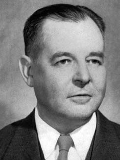
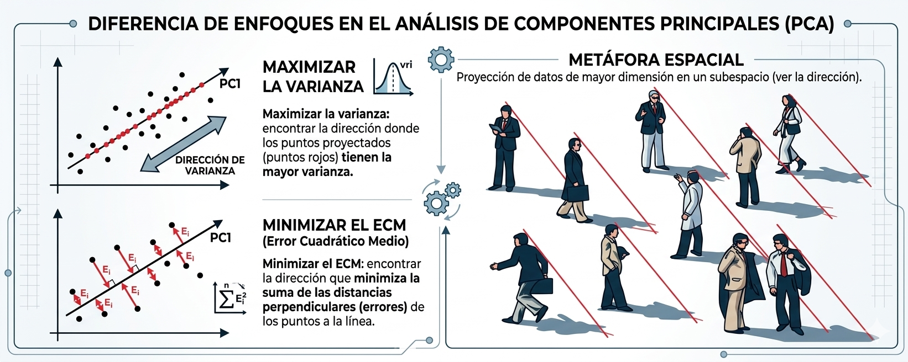
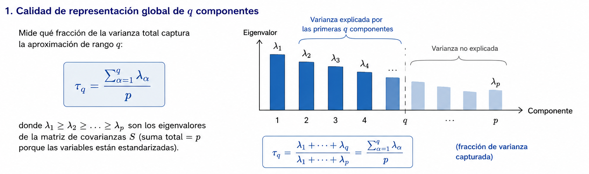
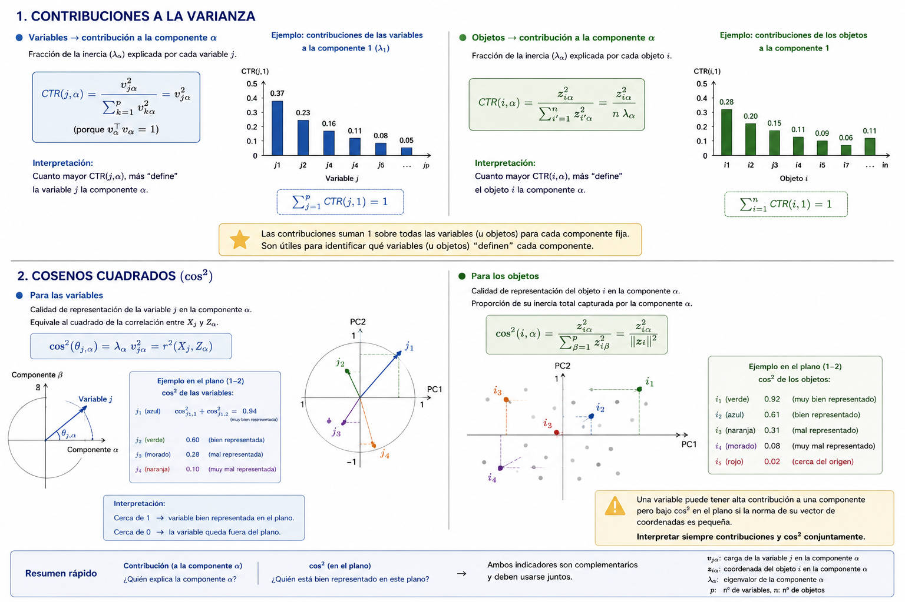
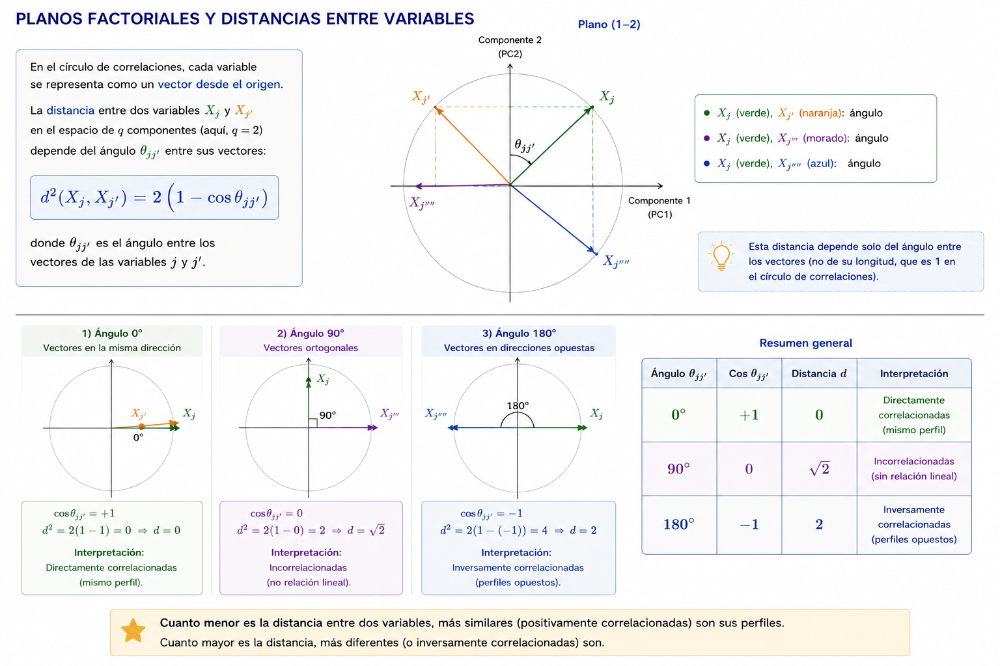
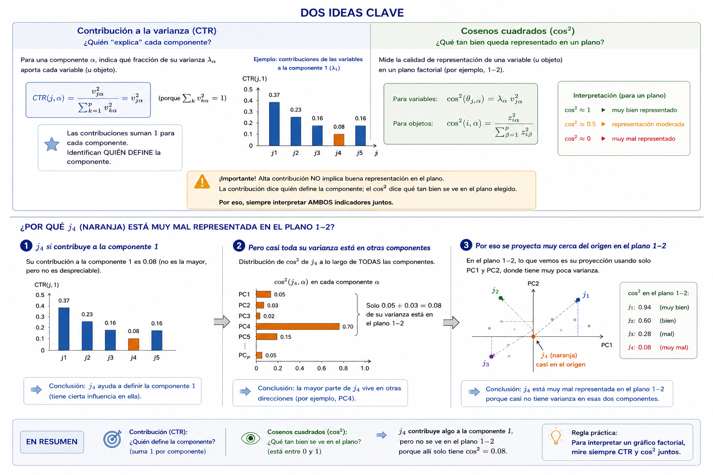
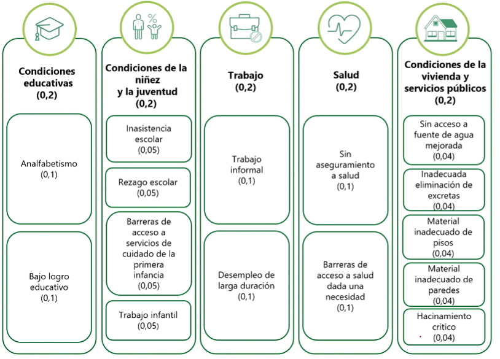

\newcommand\norm[1]{\left\lVert#1\right\rVert}

```{r}
#| message: false
#| warning: false
library(pacman)
p_load(here, tidyverse, FactoMineR, factoextra, corrplot, ggrepel, gt, janitor, jpeg)
```


```{r}
#| label: setup-imagenes
#| message: false
#| warning: false
#| cache: true
# Copiar imagen de referencia y generar versiones comprimidas
src  <- here::here("draft/otros/image.jpg")
dest <- here::here("images/rushmore.jpg")
if (file.exists(src) && !file.exists(dest)) file.copy(src, dest)

if (file.exists(dest)) {
  img_orig <- readJPEG(dest)
  # Submuestreo 3× para reducir tiempo de cómputo
  img <- img_orig[seq(1, nrow(img_orig), 3),
                  seq(1, ncol(img_orig), 3), ]
  # PCA independiente por canal RGB
  pca_r <- prcomp(img[,,1], center = FALSE)
  pca_g <- prcomp(img[,,2], center = FALSE)
  pca_b <- prcomp(img[,,3], center = FALSE)
  pca_list <- list(pca_r, pca_g, pca_b)

  nf <- nrow(img); nc <- ncol(img)

  reconstruir <- function(pca_ls, n_comp) {
    arr <- array(0, dim = c(nf, nc, 3L))
    for (ch in 1:3) {
      p   <- pca_ls[[ch]]
      rec <- p$x[, 1:n_comp, drop = FALSE] %*%
             t(p$rotation[, 1:n_comp, drop = FALSE])
      arr[, , ch] <- pmax(0, pmin(1, rec))
    }
    arr
  }

  for (k in c(3, 10, 30, 100)) {
    ruta <- here::here(paste0("images/rushmore_comp", k, ".jpg"))
    if (!file.exists(ruta)) writeJPEG(reconstruir(pca_list, k), ruta)
  }

  # Varianza explicada acumulada del canal rojo (representativo)
  var_exp <- cumsum(pca_r$sdev^2) / sum(pca_r$sdev^2)
}
```

# Análisis de Componentes Principales {background-color="#0077b6"}

## Contenido

1. Descripción del método
2. Fundamentos matemáticos
3. Construcción de las componentes
4. Guías para la interpretación
5. Ejemplo 1: Compresión de imágenes
6. Ejemplo 2: Rankings universitarios latinoamericanos
7. Ejemplo 3: Calidad de vida — ECV DANE
8. Variables y objetos suplementarios
9. Laboratorio

# Descripción del método {background-color="#0077b6"}

## Dos enfoques de las componentes principales {style="font-size: 80%;"}

::: {.columns}
::: {.column width="50%"}
### Enfoque estadístico

Buscar ponderaciones $v_1, \ldots, v_p$ de combinaciones lineales de las variables originales que **maximizan la varianza** de las proyecciones.

- Las ponderaciones se construyen de forma que las componentes sean **ortogonales** entre sí.
- Las componentes resultantes son **no correlacionadas**.
:::
::: {.column width="50%"}
### Enfoque de aprendizaje estadístico

Problema de optimización que **minimiza la suma de cuadrados residuales** entre los datos originales y su aproximación de rango reducido.

- Se busca la proyección de los datos sobre un subespacio de dimensión $q < p$.
- La solución proviene del Teorema de Descomposición en Valores Singulares (**TDVS**).
:::
:::

::: {.fragment}
::: {.re-blue}
> **Conclusión:** Ambos enfoques producen exactamente la misma solución. El TDVS garantiza la equivalencia mediante los valores y vectores propios de $X^\prime X$ y $XX^\prime$.
:::
:::

---

## Dos enfoques de las componentes principales {style="font-size: 80%;"}

<div style="text-align: justify;">

Pearson (1901) planteó un problema geométrico: encontrar una representación óptima de datos multivariados en una dimensión reducida con respecto al error cuadrático medio.

</div>

::: columns
::: {.column width="65%"}

Sea $\mathbf{X}\in \mathbb{R}^{n \times p}$ una matriz centrada, el problema del ACP es 

$$\min_{V \in \mathbb{R}^{p \times k}}
\sum_{i=1}^{n} \left\| \mathbf{x}_i - V V^\prime \mathbf{x}_i \right\|^2
\quad \text{s.a.} \quad V^\prime V = I_k, \quad k < p$$

Equivalente a:

$$\min_{V^\prime V = I_k} \left\|\mathbf{X} - \mathbf{X} V V^\prime \right\|_F^2$$
:::

::: {.column  width="35%"}

{fig-align="right" width="80%"}

:::

:::

---

## Dos enfoques de las componentes principales {style="font-size: 80%;"}

Hotelling (1933) mostró que las cargas de los componentes principales 
son los eigenvectores de la matriz de covarianza muestral.

::: columns
::: {.column width="60%"}

</br>
El objetivo del PCA puede escribirse como:

</br>

$$
\max_{V \in \mathbb{R}^{p \times k}}
\operatorname{tr}\!\left( V^\prime S V \right),
\quad \text{s.a.} \quad V^\prime V = I_k, \quad k<p
$$

donde

$$
S = \frac{1}{n} X^\prime X
$$

es la matriz de covarianza muestral y $X \in \mathbb{R}^{n \times p}$ 
es una matriz centrada.

:::

::: {.column  width="40%"}

{fig-align="right" width="80%"}

:::

:::

---

## Dos enfoques de las componentes principales {style="font-size: 80%;"}

Enfoque de Hotelling (1933) vs Pearson (1901)

<br>

{fig-align="center"}

## Descripción del método {style="font-size: 85%;"}

El **Análisis de Componentes Principales (ACP)** produce combinaciones lineales de las variables originales, denominadas:

> *componentes principales*, *factores* o *dimensiones*

::: {.incremental}
- **Reducción de dimensiones:** representar $p$ variables en $q \ll p$ componentes con mínima pérdida de información.
- **Visualización de tablas:** proyectar objetos y variables sobre planos factoriales interpretables.
- **Análisis y comprensión:** identificar la estructura de correlaciones entre variables.
- **Imputación de datos faltantes:** usar las componentes como base para imputar.
- **Predictores para regresión:** solución a la multicolinealidad entre covariables.
:::

---

## Utilidad del ACP {style="font-size: 90%;"}

El ACP es la base de los **métodos factoriales** más importantes:

::: {.incremental}
- **ACS** – Análisis de Correspondencias Simples: tablas de contingencia entre dos variables cualitativas.
- **ACM** – Análisis de Correspondencias Múltiples: tablas de individuos × variables cualitativas.
- **AFMG** – Análisis Factorial Múltiple Generalizado: tablas de individuos × bloques de variables.
- **STATIS**: tablas de tres índices (individuos × variables × condiciones).
- **Agrupamiento jerárquico:** el ACP es el preprocesamiento más común antes de clusterizar.
:::

::: {.fragment}
::: {.callout-note}
El ACP es un método **no supervisado**: no existe una variable respuesta $Y$. El objetivo es explorar la estructura de los datos, no predecir.
:::
:::

# Fundamentos matemáticos {background-color="#0077b6"}

## Matriz de datos centrados, estandarizados y normados {style="font-size: 90%;"}

Partiendo de la matriz de datos centrada y estandarizada $\widetilde{Y}$ (con denominador $\sqrt{n}$), se define:

$$Y = \frac{1}{\sqrt{n}}\,\widetilde{Y} = \frac{1}{\sqrt{n}}\,\widetilde{X}\,D^{-1/2}$$

donde $D = \text{diag}(s_1, \ldots, s_p)$ contiene las desviaciones estándar.

::: {.fragment}
**Propiedades:**

$$\text{med}(Y) = \frac{1}{\sqrt{n}} med(\tilde{Y}) = \mathbf{0}$$

$$S_Y = Y^\prime Y = \frac{1}{n}\,\widetilde{Y}^\prime\widetilde{Y} = R$$

La matriz de covarianzas de $Y$ **coincide** con la matriz de correlaciones $R$.
:::

---

## Aplicación del TDVS {style="font-size: 90%;"}

Aplicando el Teorema de Descomposición en Valores Singulares a $Y$:

$$Y_{n \times p} = U_{n \times p}\; L_{p \times p}\; V_{p \times p}^\prime$$

donde:

<div style="font-size:0.90em; line-height:1.1;">

| Objeto | Descripción |
|:------:|:-----------|
| $U$ | columnas ortonormales: $U^\prime U = I_p$, **direcciones en espacio de objetos** |
| $V$ | columnas ortonormales: $V^\prime V = I_p$, **direcciones en espacio de variables** (cargas/loadings) |
| $L = \text{diag}(\sqrt{\lambda_1}, \ldots, \sqrt{\lambda_p})$ | valores singulares, con $\lambda_1 \ge \cdots \ge \lambda_p \ge 0$ |

</div>

::: {.fragment}
Los $\lambda_\alpha$ son los valores propios de $Y^\prime Y = R$, y las columnas de $V$ son sus vectores propios. $\lambda_\alpha$ también son los valores propios de $YY^\prime$ y $U$ contiene en sus columnas sus vectores propios.
:::

---

## Matriz de componentes principales {style="font-size: 90%;"}

La **matriz de scores** (coordenadas de los objetos sobre las componentes) se obtiene como:

$$Z = Y\,V$$

::: {.fragment}
La $\alpha$-ésima componente principal es:
$$z_\alpha = Y\,v_\alpha = \sqrt{\lambda_\alpha}\,u_\alpha$$

donde $v_\alpha$ es la $\alpha$-ésima columna de $V$ (vector de cargas) y $u_\alpha$ es la $\alpha$-ésima columna de $U$.
:::

::: {.fragment}
La **coordenada** del objeto $i$ sobre la componente $\alpha$ es:
$$z_{i\alpha} = y_{i\cdot}^\prime v_\alpha = \sum_{j=1}^p y_{ij}\, v_{j\alpha}$$
:::

---

## Propiedades de las componentes principales {style="font-size: 90%;"}

Las columnas de $Z = YV$ satisfacen:

**1. Media cero:**
$$\frac{1}{n}Z^\prime\mathbf{1}_n = \frac{1}{n}V^\prime Y^\prime \mathbf{1}_n = V^\prime \text{med}(Y) = \mathbf{0}$$

**2. Incorrelacionadas:**
$$Z^\prime Z = V^\prime Y^\prime Y V = V^\prime R\, V = \Lambda = \text{diag}(\lambda_1, \ldots, \lambda_p)$$

::: {.fragment}
::: {.callout-important}
Las componentes principales son combinaciones lineales **no correlacionadas** y sus varianzas son los valores propios de $R$. La varianza de $Z_\alpha$ es exactamente $\lambda_\alpha$.
:::
:::

---

## Análisis para los objetos

El objeto $i$ queda representado en el plano factorial por el vector de coordenadas:

$$z_{i\cdot} = \left(z_{i1}, \ldots, z_{i\alpha}, \ldots, z_{ip}\right)$$

La varianza de la $\alpha$-ésima componente en el conjunto de $n$ objetos es:

$$\text{var}(Z_\alpha) = v_\alpha^\prime Y^\prime Y\, v_\alpha = v_\alpha^\prime R v_\alpha = \lambda_\alpha v_\alpha^\prime v_\alpha = \lambda_\alpha $$

::: {.fragment}
**Interpretación:** $v_1$ es la dirección de máxima varianza en el espacio de las variables; $v_2$ es la dirección de máxima varianza **ortogonal a** $v_1$; y así sucesivamente.
:::

---

## Análisis para las variables

De $Y = ULV^\prime$ se obtiene $Y^\prime = VLU^\prime$. Proyectando las variables sobre el espacio de objetos:

$$W = Y^\prime U = VL$$

La $\alpha$-ésima componente es $w_\alpha = Y^\prime u_\alpha$ y la coordenada de la variable $j$ sobre la componente $\alpha$:

$$w_{j\alpha} = \sum_{i=1}^n u_{i\alpha}\, y_{ij}$$

::: {.fragment}
Las columnas de $W$ describen cómo cada variable se **asocia** con cada dirección principal. La distancia de la variable $j$ al origen en el plano 1-2 mide cuánto de su varianza es capturada por esas dos componentes.
:::

---

## Proporción de varianza explicada {style="font-size: 90%;"}

La **varianza total** de los datos estandarizados es $\text{tr}(R) = p$.

La proporción de varianza capturada por las primeras $q$ componentes es:

$$\tau_q = \frac{\sum_{\alpha=1}^q \lambda_\alpha}{\sum_{\alpha=1}^p \lambda_\alpha} = \frac{\sum_{\alpha=1}^q \lambda_\alpha}{p}$$

::: {.fragment}
**Criterios para elegir $q$:**

::: {.incremental}
1. **Porcentaje acumulado:** retener componentes hasta alcanzar un umbral prefijado (p.ej., 70–80 %).
2. **Valor propio mayor que 1:** retener $\lambda_\alpha > 1$ (regla de Kaiser). Solo aplica cuando se trabaja con $R$.
3. **Gráfico de sedimentación (scree plot):** buscar el "codo" en la curva de valores propios.
:::
:::

---

## Ecuaciones de transición (I) {style="font-size: 90%;"}

Los vectores propios de $Y^\prime Y$ y $YY^\prime$ comparten los valores propios. 

Sea $v_\alpha$ vector propio de $R = Y^\prime Y$ con valor propio $\lambda_\alpha$:

$$Y^\prime Y\, v_\alpha = \lambda_\alpha\, v_\alpha$$

Multiplicando por $Y$ a la izquierda:

$$Y Y^\prime (Y v_\alpha) = \lambda_\alpha (Y v_\alpha)$$

::: {.fragment}
::: {.re-blue}
> $Y v_\alpha$ es vector propio de $YY^\prime$ **con el mismo valor propio** $\lambda_\alpha$. Las matrices $Y^\prime Y$ y $YY^\prime$ comparten todos sus valores propios no nulos.
:::
:::

---

## Ecuaciones de transición (II) {style="font-size: 90%;"}

La norma de $Yv_\alpha$ es:

$$\|Yv_\alpha\| = \sqrt{v_\alpha^\prime Y^\prime Y v_\alpha} = \sqrt{\lambda_\alpha}$$

Por tanto, el vector normalizado en el espacio de objetos es:

$$u_\alpha = \frac{1}{\sqrt{\lambda_\alpha}}\,Y v_\alpha$$

Y recíprocamente:

$$v_\alpha = \frac{1}{\sqrt{\lambda_\alpha}}\,Y^\prime u_\alpha$$

---

## Ecuaciones de transición (III) {style="font-size: 90%;"}

Sustituyendo $v_\alpha = \frac{1}{\sqrt{\lambda_\alpha}} Y^\prime u_\alpha$ en $z_\alpha = Yv_\alpha$:

$$z_\alpha = Y v_\alpha = \frac{1}{\sqrt{\lambda_\alpha}}\,YY^\prime u_\alpha = \frac{\lambda_\alpha}{\sqrt{\lambda_\alpha}}\,u_\alpha = \sqrt{\lambda_\alpha}\,u_\alpha$$

::: {.fragment}
::: {.re-blue}
> **Conclusión clave:** Basta calcular los vectores propios de $R = Y^\prime Y$ para obtener los del espacio de objetos, y viceversa. En la práctica, se elige la descomposición más eficiente según las dimensiones de la tabla ($n$ vs $p$).
:::
:::

# Construcción de las componentes {background-color="#0077b6"}

## Método de multiplicadores de Lagrange {style="font-size: 90%;"}

El **primer vector de cargas** $v_1$ es la solución del problema de optimización:

$$\max_{v_1} \quad v_1^\prime R\, v_1 \qquad \text{sujeto a} \quad v_1^\prime v_1 = 1$$

El Lagrangiano del problema es:

$$\mathcal{L} = v_1^\prime R\, v_1 - \lambda_1(v_1^\prime v_1 - 1)$$

Derivando e igualando a cero:

$$\frac{\partial \mathcal{L}}{\partial v_1} = 2R\,v_1 - 2\lambda_1 v_1 = 0 \implies R\,v_1 = \lambda_1\,v_1$$

::: {.fragment}
::: {.re-blue}
> **Conclusión:** $\lambda_1$ y $v_1$ son el **valor propio mayor** y su **vector propio asociado** de $R$. Las componentes sucesivas se obtienen imponiendo ortogonalidad $v_j^\prime v_i = 0$ para $i < j$.
:::
:::

---

## Cálculo de las componentes principales {style="font-size: 90%;"}

Ordenando los valores propios de $R$ de mayor a menor: $\lambda_1 \ge \lambda_2 \ge \cdots \ge \lambda_p \ge 0$, la $\alpha$-ésima componente principal es:

$$Z_\alpha = Y\, v_\alpha = \frac{1}{\sqrt{n}}\; \widetilde{Y}\, v_\alpha$$

con varianza $\text{var}(Z_\alpha) = \lambda_\alpha$.

::: {.fragment}
**Propiedad fundamental — conservación de la varianza total:**

$$\text{tr}(R) = \sum_{j=1}^p s_j^2 = p = \sum_{\alpha=1}^p \lambda_\alpha$$

El ACP redistribuye la varianza total de las $p$ variables originales en $p$ componentes independientes, concentrando la mayor parte en las primeras.
:::

# Guías para la interpretación {background-color="#0077b6"}

## Calidad de la representación global {style="font-size: 90%;"}

La **calidad de representación** de un conjunto de $q$ componentes mide qué fracción de la varianza total captura la aproximación de rango $q$:

$$\tau_q = \frac{\sum_{\alpha=1}^q \lambda_\alpha}{p}$$

{width=100%}

---

## Tres criterios para la interpretación de los factores

::: {.fragment}
1. **Correlaciones variable-Factor**: Indican hasta dónde es capaz una variable de explicar o conformar el factor.
2. **Contribuciones**: Es el aporte de cada variable a la varianza del factor.
3. **Cosenos cuadrados (cos2)**: Indican hasta dónde un factor es capaz de dar cuenta de una variable.
:::

## Interpretación de los factores {style="font-size: 90%;"}

La **correlación** entre la variable $X_j$ y la componente $Z_\alpha$ es:

$$r(X_j, Z_\alpha) = \sqrt{\lambda_\alpha}\; v_{j\alpha}$$

::: {.fragment}
**Interpretación:**

- Si $|r(X_j, Z_\alpha)|$ es alto, la variable $X_j$ tipifica bien la componente $\alpha$.
- Variables con alta correlación con la misma componente miden aspectos similares.
- Variables con correlaciones de signo opuesto están inversamente relacionadas.

En la práctica, en FactoMineR las coordenadas de las variables en el plano se obtienen directamente como $\sqrt{\lambda_\alpha}\; v_{j\alpha}$, lo que facilita la interpretación.
:::

---

## Interpretación de los factores {style="font-size: 90%;"}

La **contribución** de la variable $j$ a la componente $\alpha$ mide qué fracción de $\lambda_\alpha$ aporta esa variable:

$$\text{CTR}(j, \alpha) = \frac{v_{j\alpha}^2}{\sum_{k=1}^p v_{k\alpha}^2} = v_{j\alpha}^2$$

ya que $v_\alpha^\prime v_\alpha = 1$

Para los **objetos**, la contribución del objeto $i$ a la componente $\alpha$ es:

$$\text{CTR}(i, \alpha) = \frac{z_{i\alpha}^2}{\sum_{i^\prime=1}^n z_{i^\prime\alpha}^2} = \frac{z_{i\alpha}^2}{\lambda_\alpha}$$

::: {.fragment}
::: {.callout-note}
Las contribuciones suman 1 sobre todas las variables (u objetos) para cada componente fija. Son útiles para identificar qué variables (u objetos) "definen" cada componente.
:::
:::

---

## Interpretación de los factores {style="font-size: 90%;"}

Los **cosenos cuadrados** ($\cos^2$) miden la calidad de la representación de un objeto o variable en un plano factorial:

**Para las variables:**
$$\cos^2(\theta_{j,\alpha}) = \lambda_\alpha\, v_{j\alpha}^2 = r^2(X_j, Z_\alpha)$$

**Para los objetos:**
$$\cos^2(i, \alpha) = \frac{z_{i\alpha}^2}{\sum_{\beta=1}^p z_{i\beta}^2} = \frac{z_{i\alpha}^2}{\norm{z_i}^2}$$

::: {.fragment}
::: {.callout-warning}
Una variable puede tener **alta contribución** a una componente pero **bajo cos²** en el plano si la norma de su vector de coordenadas es pequeña. Siempre se recomienda interpretar ambos indicadores conjuntamente.
:::
:::

---

## Ilustración contribuciones y cosenos cuadrados {style="font-size: 100%;"}

{width=100%}

---

## Planos factoriales y distancias entre variables {style="font-size: 90%;"}

Las variables se representan en el plano factorial como vectores desde el origen. La distancia entre dos variables en el espacio de $q$ componentes es:

$$d^2(X_j, X_{j^\prime}) = 2\left(1 - \cos\theta_{jj^\prime}\right)$$

donde $\theta_{jj^\prime}$ es el ángulo entre sus vectores en el plano.

::: {.fragment}
| Ángulo | Coseno | Distancia | Interpretación |
|:------:|:------:|:---------:|:------------|
| $0°$ | $+1$ | $0$ | Directamente correlacionadas |
| $90°$ | $0$ | $\sqrt{2}$ | Incorrelacionadas |
| $180°$ | $-1$ | $2$ | Inversamente correlacionadas |
:::

---

## Planos factoriales y distancias entre variables

{width=100%}

---

## Tipificación de los objetos {style="font-size: 90%;"}

Para interpretar los objetos en el plano factorial se utilizan:

::: {.incremental}
- **Coordenadas** ($z_{i\alpha}$): posición del objeto sobre cada componente. Objetos con coordenadas similares tienen perfiles similares.
- **Contribuciones** (CTR): objetos con CTR alta "definen" la componente.
- **Cosenos cuadrados**: mide si el objeto está bien representado en el plano.
- **Cuadrantes opuestos:** objetos en cuadrantes opuestos tienen perfiles antípodas.
- **Distancia al origen:** objetos lejos del origen tienen perfiles distintos al perfil medio.
:::

---

### Tipificación de los objetos

{width=100%}

---

### Tipificación de los objetos

{fig-align="center" width=100%}

---

{fig-align="center" width=100%}

---

## Biplots: relaciones objeto-variable {style="font-size: 90%;"}

El **biplot** representa simultáneamente objetos y variables en el mismo plano factorial.

::: {.incremental}
- Los **objetos** aparecen como puntos.
- Las **variables** aparecen como vectores o flechas desde el origen.
- Un objeto cercano al extremo de una variable tiene un valor alto en esa variable.
- Un objeto opuesto al extremo de una variable tiene un valor bajo en ella.
- Variables con flechas en la misma dirección están correlacionadas positivamente.
:::

::: {.fragment}
::: {.callout-note}
En el biplot de factoextra (`fviz_pca_biplot`), los vectores de las variables están escalados por $\sqrt{\lambda_\alpha}$, lo que facilita la interpretación simultánea.
:::
:::

---

## Factor tamaño y variables suplementarias {style="font-size: 90%;"}

**Factor tamaño:**
Cuando la primera componente está correlacionada con **todas** las variables, se interpreta como un indicador de "tamaño" o "nivel general". Las componentes posteriores capturan contrastes (forma, estructura).

::: {.fragment}
**Variables suplementarias (ilustrativas):**

Variables que no participan en el cálculo del ACP pero se **proyectan sobre el plano** para interpretar las componentes en términos de variables externas o validar el análisis.

```r
PCA(datos, quanti.sup = c(3, 5))   # columnas 3 y 5 como suplementarias
```
:::

::: {.fragment}
**Objetos suplementarios (ilustrativos):**

Objetos que no participan en el cálculo pero se proyectan para evaluar su similitud con los objetos activos.

```r
PCA(datos, ind.sup = c(1, 4, 7))   # filas 1, 4 y 7 como ilustrativas
```
:::

# Ejemplo 1: Rankings universitarios latinoamericanos {background-color="#0077b6"}

## Descripción de los datos {style="font-size: 90%;"}

Se dispone de tres rankings internacionales para universidades latinoamericanas:

| Ranking | Institución | Criterio principal |
|:--------|:-----------|:-----------------|
| **Scimago** | SCImago Research Group | Producción e impacto científico |
| **QS** | Quacquarelli Symonds | Reputación académica y empleabilidad |
| **Webometrics** | CSIC (España) | Presencia y visibilidad en internet |

::: {.fragment}
Los datos corresponden a **promedios por país** de las posiciones de sus universidades (en negativo, para que mayor = mejor posición):
:::

---

## Carga de los datos

```{r}
#| echo: true
#| message: false
#| warning: false
library(pacman)
p_load(tidyverse, FactoMineR, factoextra, janitor, corrplot)

url <- "https://github.com/jgbabativam/Curso_Multivariado/raw/main/Datos/"
rank_lat <- read.csv2(paste0(url, "r14_Sci_Qs_Webometrics.csv"))
```

</br>

<div style="height:380px; overflow-y:auto;">
```{r}
#| message: false
#| warning: false
rank_lat |>
  select(1:5) |>
  gt() |>
  opt_row_striping() |>
  tab_style(style = cell_text(weight = "bold"),
            locations = cells_column_labels()) |>
  tab_options(table.font.size = px(16), data_row.padding = px(3),
              table.width = pct(100))
```
</div>


---

## Preparación de los datos {style="font-size: 90%;"}

Se analizan los promedios por país: columnas 2 (país) y 3-5 (rankings numéricos)

```{r}
#| echo: true
#| message: false
#| warning: false

rank <- rank_lat |> 
        select(Pais, SC.Lac.Ranking, QS.Ranking, WEB.Ranking.LA) |> 
        group_by(Pais) |> 
        summarise(across(where(is.numeric), ~mean(., na.rm = T))) |>
        column_to_rownames("Pais") |> 
        mutate(across(where(is.numeric), ~.*-1)) #Invertir escala 
         
names(rank) <- c("SC_Lac", "QS", "WEB")
```

<div style="height:280px; overflow-y:auto;">
```{r}
#| message: false
#| warning: false
rank |>
  round(1) |>
  rownames_to_column("País") |>
  gt() |>
  opt_row_striping() |>
  tab_style(style = cell_text(weight = "bold"),
            locations = cells_column_labels()) |>
  tab_options(table.font.size = px(16), data_row.padding = px(3),
              table.width = pct(100))
```
</div>

---

## Valores propios y varianza explicada

```{r}
#| echo: true
#| message: false
#| warning: false
pca_rank <- PCA(rank, graph = FALSE)
```

```{r}
#| echo: true
#| fig-align: center
#| fig-width: 9
#| fig-height: 6

fviz_eig(pca_rank, addlabels = TRUE, ylim = c(0, 100), barfill = "#0077b6", barcolor = "#0077b6", linecolor = "#C0392B") +
  labs(title = "Gráfico de sedimentación — Rankings latinoamericanos",
       x = "Componente", y = "% varianza explicada") + theme_bw()
```

---

## Plano 1-2 de variables

```{r}
#| echo: true
#| fig-align: center
#| fig-width: 8
#| fig-height: 6
fviz_pca_var(pca_rank, col.var = "contrib",
             gradient.cols = c("#00AFBB", "#E7B800", "#FC4E07"),
             repel = TRUE, title = "Plano 1-2 — Variables (rankings)") + theme_bw()
```

---

## Indicadores básicos — Variables  {style="font-size: 80%;"}

```{r}
#| echo: true
res_var <- pca_rank$var
cat("=== Coordenadas (cargas × √λ) ===\n")
round(res_var$coord, 3)
cat("\n=== Contribuciones (%) ===\n")
round(res_var$contrib, 2)
cat("\n=== Cosenos cuadrados ===\n")
round(res_var$cos2, 3)
```

---

## Tipificación de los países

```{r}
#| echo: true
#| fig-align: center
#| fig-width: 9
#| fig-height: 6.5
fviz_pca_ind(pca_rank, col.ind = "cos2",
             gradient.cols = c("#00AFBB", "#E7B800", "#FC4E07"), repel = TRUE, 
             title = "Plano 1-2 — Países (rankings universitarios)") + theme_bw()
```

---

## Biplot: países y rankings

```{r}
#| echo: true
#| fig-align: center
#| fig-width: 9
#| fig-height: 6.5
fviz_pca_biplot(pca_rank, repel = TRUE,
                col.var = "#C0392B", col.ind = "#0077b6",
                title = "Biplot — Rankings universitarios latinoamericanos") + theme_bw()
```

---

## Análisis complementario

Número de instituciones por país:

```{r}
#| echo: true

n_inst <- rank_lat |>
          select(Pais, SC.Lac.Ranking, QS.Ranking, WEB.Ranking.LA) |> 
          count(Pais, name = "nInst") 

n_inst[n_inst$nInst == 1,] ## Paises con una sola institución

```

<div style="height:230px; overflow-y:auto;">
```{r}
#| message: false
#| warning: false
n_inst |>
  gt() |>
  opt_row_striping() |>
  tab_style(style = cell_text(weight = "bold"),
            locations = cells_column_labels()) |>
  tab_options(table.font.size = px(16), data_row.padding = px(3),
              table.width = pct(50))
```
</div>

--- 

## Objetos suplementarios: países con una sola universidad {style="font-size: 80%;"}

Los países con una sola institución en los rankings (Bolivia, Cuba, Puerto Rico, Paraguay) son **atípicos** respecto a los demás. Se incluyen como objetos ilustrativos:

```{r}
#| echo: true
#| fig-align: center
#| fig-width: 11
#| fig-height: 6.5
# Bolivia=2, Cuba=7, Puerto Rico=12, Paraguay=13
pca_supl <- PCA(rank, ind.sup = c(2, 7, 12, 13), graph = FALSE)
fviz_pca_biplot(pca_supl, repel = TRUE, col.var  = "#C0392B", col.ind  = "#0077b6", col.ind.sup = "#8E44AD",
                title = "Biplot con países ilustrativos (en morado)") + theme_bw()
```

# Ejemplo 2: Calidad de vida — ECV DANE {background-color="#0077b6"}

## Encuesta Nacional de Calidad de Vida {style="font-size: 90%;"}

La **ECV** es el principal instrumento del DANE para medir las condiciones de vida de los hogares colombianos. Se realiza anualmente con cobertura nacional y departamental.

::: {.fragment}
El conjunto de datos que usaremos contiene **15 indicadores de calidad de vida** para los **33 departamentos** de Colombia (incluido Bogotá D.C.), construidos a partir de los resultados publicados por el DANE para la ECV 2022.

Todas las variables están en escala 0–100 con la convención:
:::

::: {.fragment}
::: {.re-blue}
> **Mayor valor = mejor condición de vida**

Los indicadores en escala inversa (analfabetismo, hacinamiento, IPM) se transformaron como $I_j = 100 - \text{indicador}$.
:::
:::

---

## Carga de los datos

```{r}
#| echo: true
#| message: false
#| warning: false
library(pacman)
p_load(tidyverse, janitor, corrplot)

url <- "https://github.com/jgbabativam/Curso_Multivariado/raw/main/Datos/"
ecv <- read.csv(paste0(url, "ecv_departamentos_2022.csv"), header = TRUE) |> 
       column_to_rownames("departamento") |> 
       rename(inv_hacinamiento = sin_hacinamiento,
              inv_ipm = sin_ipm, leen_adultos = lit_adultos)
```

<div style="height:450px; overflow-y:auto;">
```{r}
#| message: false
#| warning: false
ecv |>
  round(1) |>
  rownames_to_column("departamento") |>
  gt() |>
  opt_row_striping() |>
  tab_style(style = cell_text(weight = "bold"),
            locations = cells_column_labels()) |>
  tab_options(table.font.size = px(16), data_row.padding = px(3),
              table.width = pct(100))
```
</div>


---

## Exploración de la matriz de correlaciones

```{r}
#| echo: true
#| fig-align: center
#| fig-width: 10
#| fig-height: 6.5
#| message: false
#| warning: false
R_ecv <- cor(ecv)
corrplot(R_ecv, method  = "color", type    = "upper", order   = "hclust", 
         col = colorRampPalette(c("#2b8cbe", "white", "#d7301f"))(200),  diag = FALSE,
         tl.cex  = 0.65, tl.col  = "black", addCoef.col = "black", number.cex  = 0.45, mar = c(0, 0, 1.5, 0))
```

---

## Análisis de componentes principales

```{r}
#| echo: true
#| message: false
#| warning: false
pca_ecv <- PCA(ecv, graph = FALSE,
               scale.unit = TRUE,   # estandariza automáticamente
               ncp        = 5)      # retener 5 componentes
               
```

::: {.fragment}
```{r}
#| echo: true
# Tabla de valores propios
eig_ecv <- get_eigenvalue(pca_ecv)
round(eig_ecv, 3)
```
:::

---

## Varianza explicada — Gráfico de sedimentación

```{r}
#| echo: true
#| fig-align: center
#| fig-width: 9
#| fig-height: 6
fviz_eig(pca_ecv, addlabels  = TRUE, ncp = 10) +
  labs(title = "Gráfico de sedimentación — Calidad de vida ECV 2022",
       x = "Componente", y = "% varianza explicada") + theme_bw()
```

---

## Plano de variables: tres criterios de interpretación {style="font-size: 90%;"}

::: {.panel-tabset}

### Correlaciones

```{r}
#| echo: true
#| fig-align: center
#| fig-width: 9
#| fig-height: 6.0
#| message: false
#| warning: false
fviz_pca_var(pca_ecv, col.var = pca_ecv$var$coord[, 1], repel = TRUE,
             gradient.cols = c("#D6EAF8", "#2980B9", "#1A5276"),
             title = "Plano 1-2 — coloreado por correlación con Dim 1") + theme_bw()
```

::: {.callout-note}
Dim 1 explica ~92 % de la varianza: es un **factor tamaño**. Todas las variables correlacionan positivamente con él. Este factor refleja **infraestructura y bienestar general** (acueducto, alcantarillado, electricidad, vivienda, conectividad). `lit_adultos` y `educ_superior` podrían requerir una lectura aparte. Que una sola dimensión capture casi toda la varianza es un patrón muy común en tablas de indicadores socioeconómicos.
:::

### Contribuciones

```{r}
#| echo: true
#| fig-align: center
#| fig-width: 9
#| fig-height: 6.0
#| message: false
#| warning: false
fviz_pca_var(pca_ecv, col.var = "contrib", repel = TRUE,
             gradient.cols = c("#00AFBB", "#E7B800", "#FC4E07"),
             title = "Plano 1-2 — coloreado por contribución") + theme_bw()
```

### Cosenos cuadrados

```{r}
#| echo: true
#| fig-align: center
#| fig-width: 9
#| fig-height: 6.0
#| message: false
#| warning: false
fviz_pca_var(pca_ecv, col.var = "cos2", repel = TRUE,
             gradient.cols = c("#00AFBB", "#E7B800", "#FC4E07"),
             title = "Plano 1-2 — coloreado por cos²") + theme_bw()
```

:::

---

## Contribuciones de los indicadores

::: {.panel-tabset}

### Dimensión 1

```{r}
#| echo: true
#| fig-align: center
#| fig-width: 9
#| fig-height: 4.5
fviz_contrib(pca_ecv, choice = "var", axes = 1,
             fill = "#0077b6", color = "#0077b6",
             title = "Contribuciones a la Dim 1") +
  theme(axis.text.x = element_text(angle = 90, vjust = 0.5, hjust = 1)) 
```

### Dimensión 2

```{r}
#| echo: true
#| fig-align: center
#| fig-width: 9
#| fig-height: 4.5
fviz_contrib(pca_ecv, choice = "var", axes = 2,
             fill = "#C0392B", color = "#C0392B",
             title = "Contribuciones a la Dim 2") +
  theme(axis.text.x = element_text(angle = 90, vjust = 0.5, hjust = 1)) 
```

:::

---

## Plano de individuos (departamentos)

```{r}
#| echo: true
#| fig-align: center
#| fig-width: 10
#| fig-height: 6.5
fviz_pca_ind(pca_ecv, col.ind   = "cos2", repel = TRUE, labelsize = 3.5,
             gradient.cols = c("#00AFBB", "#E7B800", "#FC4E07"),
             title     = "Plano 1-2 — Departamentos de Colombia") + theme_bw()
```

---

## Biplot: departamentos e indicadores

```{r}
#| echo: true
#| fig-align: center
#| fig-width: 10
#| fig-height: 6.5
fviz_pca_biplot(pca_ecv, repel = TRUE, labelsize = 3.5,
                col.var   = "#C0392B", col.ind   = "#0077b6",
                title     = "Biplot — Calidad de vida ECV 2022") + theme_bw()
```

---

## Interpretación de las componentes — plano 1-2 {style="font-size: 90%;"}

```{r}
#| fig-align: center
#| fig-width: 10
#| fig-height: 5.5
#| message: false
#| warning: false
coord_var <- as.data.frame(pca_ecv$var$coord[, 1:2])
names(coord_var) <- c("Dim1", "Dim2")
coord_var$Variable <- rownames(coord_var)

ggplot(coord_var, aes(x = Dim1, y = Dim2, label = Variable)) +
  geom_vline(xintercept = 0, linetype = "dashed", color = "gray60") +
  geom_hline(yintercept = 0, linetype = "dashed", color = "gray60") +
  geom_segment(aes(x = 0, y = 0, xend = Dim1, yend = Dim2),
               arrow = arrow(length = unit(0.2, "cm")),
               color = "#0077b6", linewidth = 0.7) +
  ggrepel::geom_text_repel(size = 3.2, color = "#2C3E50",
                            max.overlaps = 20) +
  annotate("text", x = 0.87, y = -0.85,
           label = "Conectividad\ndigital",
           fontface = "italic", color = "#C0392B", size = 3.5) +
  annotate("text", x = 0.87, y = 0.85,
           label = "Servicios\nbásicos",
           fontface = "italic", color = "#27AE60", size = 3.5) +
  annotate("text", x = -0.25, y = 0.0,
           label = "Factor tamaño\n(infraestructura)", fontface = "bold.italic",
           color = "gray40", size = 3.2, angle = 90, vjust = -0.3) +
  xlim(-0.5, 1.15) +
  labs(title = "Coordenadas de variables en el plano 1-2",
       x = paste0("Dim 1 — Factor tamaño: infraestructura y bienestar general (",
                  round(eig_ecv[1,2], 1), "%)"),
       y = paste0("Dim 2 — Servicios básicos vs. Conectividad (",
                  round(eig_ecv[2,2], 1), "%)")) +
  theme_bw()
```

# Variables y objetos suplementarios {background-color="#0077b6"}

## Ejemplo ARWU: variables activas vs. ilustrativas {style="font-size: 90%;"}

Los rankings construidos con ponderaciones predefinidas (ARWU World Rank, Regional Rank, National Rank) pueden usarse como **variables ilustrativas** para validar si las componentes capturan los mismos patrones.

```{r}
#| echo: true
#| message: false
#| warning: false
arwu <- read.csv2(paste0(url, "ARWU_100_top.csv")) |> clean_names()
rownames(arwu) <- make.unique(as.character(arwu$institution))

# Invertir rankings: mayor = mejor posición
arwu <- arwu |>
  mutate(across(c(world_rank, national_rank, regional_rank), ~ -.))

# Variables activas: seis criterios académicos
vars_act <- c("alumni", "award", "hi_ci", "n_s", "pub", "pcp")
# Variables ilustrativas: tres rankings y puntaje total
vars_sup <- c("world_rank", "national_rank", "regional_rank", "total_score")

arwu_pca_data <- arwu |> select(all_of(c(vars_sup, vars_act)))

pca_arwu <- PCA(arwu_pca_data,
                quanti.sup = 1:length(vars_sup),
                graph      = FALSE)
```

---

## Plano de variables: criterios activos vs. ilustrativos

```{r}
#| echo: true
#| fig-align: center
#| fig-width: 9
#| fig-height: 5.5
plot.PCA(pca_arwu, choix = "var",
         title = "ARWU — Variables activas (negro) y suplementarias (azul)")
```

---

## Objetos suplementarios: universidades del rango 51-100

Las 50 universidades de menor rango se proyectan como **objetos ilustrativos** sobre el plano construido solo con el Top-50 del ARWU:

```{r}
#| echo: true
#| message: false
#| warning: false
#| fig-align: center
#| fig-width: 9
#| fig-height: 4.8
#| eval: false
# Top 50 como activos; universidades 51-100 como ilustrativas
arwu_pca_supl <- PCA(arwu_pca_data,
                     quanti.sup = 1:length(vars_sup),
                     ind.sup    = 51:100,
                     graph      = FALSE)

fviz_pca_biplot(arwu_pca_supl,
                repel        = TRUE,
                col.var      = "#C0392B",
                col.ind      = "#0077b6",
                col.ind.sup  = "#8E44AD",
                label        = "var",
                title = "ARWU — Top 50 (azul) y objetos ilustrativos 51-100 (morado)") +
  theme_bw()
```

---

## Objetos suplementarios: universidades del rango 51-100

Las 50 universidades de menor rango se proyectan como **objetos ilustrativos** sobre el plano construido solo con el Top-50 del ARWU:

```{r}
#| echo: false
#| message: false
#| warning: false
#| fig-align: center
#| fig-width: 11
#| fig-height: 6.8
# Top 50 como activos; universidades 51-100 como ilustrativas
arwu_pca_supl <- PCA(arwu_pca_data,
                     quanti.sup = 1:length(vars_sup),
                     ind.sup    = 51:100,
                     graph      = FALSE)

fviz_pca_biplot(arwu_pca_supl,
                repel        = TRUE,
                col.var      = "#C0392B",
                col.ind      = "#0077b6",
                col.ind.sup  = "#8E44AD",
                label        = "var",
                title = "ARWU — Top 50 (azul) y objetos ilustrativos 51-100 (morado)") +
  theme_bw()
```

# Ejemplo: Análisis de imágenes {background-color="#0077b6"}

## ¿Qué es un píxel? {style="font-size: 80%;"}

::: {.columns}
::: {.column width="60%"}

Un **píxel** (*picture element*) es la unidad mínima de una imagen digital: el punto de color más pequeño que puede representarse en pantalla o en un archivo.

::: {.incremental}
- En imágenes de **escala de grises**, cada píxel tiene un único valor de intensidad en $[0, 1]$ (0 = negro, 1 = blanco).
- En imágenes **a color**, cada píxel contiene **tres valores** de intensidad, uno por canal: **Rojo (R)**, **Verde (G)** y **Azul (B)**.
- Una imagen de resolución $n \times m$ tiene $n$ filas y $m$ columnas de píxeles — en total $n \cdot m$ píxeles.
:::

:::
::: {.column width="40%"}

```{r}
#| echo: false
#| fig-align: center
#| fig-width: 4.5
#| fig-height: 4.5
#| message: false
#| warning: false
if (exists("img_orig")) {
  crop <- img_orig[200:219, 300:319, ]
  pixel_demo <- expand.grid(row = 1:20, col = 1:20)
  pixel_demo$color <- rgb(
    as.vector(crop[,,1]),
    as.vector(crop[,,2]),
    as.vector(crop[,,3])
  )
  titulo <- "Zoom: 20 × 20 píxeles"
} else {
  set.seed(123)
  n_px <- 12
  pixel_demo <- expand.grid(row = 1:n_px, col = 1:n_px)
  pixel_demo$color <- rgb(
    runif(n_px^2, 0.15, 0.95),
    runif(n_px^2, 0.10, 0.85),
    runif(n_px^2, 0.20, 0.95)
  )
  titulo <- "Ejemplo: 12 × 12 píxeles"
}

ggplot(pixel_demo, aes(x = col, y = -row, fill = color)) +
  geom_tile(color = "white", linewidth = 0.7) +
  scale_fill_identity() +
  coord_fixed() +
  theme_void() +
  labs(title = titulo) +
  theme(plot.title = element_text(hjust = 0.5, size = 11, face = "bold",
                                  margin = margin(b = 6)))
```

:::
:::

::: {.fragment}
::: {.callout-note}
Los valores se almacenan usualmente como enteros en $[0, 255]$ (8 bits por canal). `readJPEG()` los normaliza automáticamente al intervalo $[0, 1]$.
:::
:::

---

## El tensor RGB {style="font-size: 85%;"}

::: {.columns}
::: {.column width="60%"}

Una imagen a color de $n \times m$ píxeles se representa como un **tensor** (arreglo tridimensional):

$$\mathbf{T} \in \mathbb{R}^{n \times m \times 3}$$

::: {.incremental}
- **Dimensión 1** — $n$ filas (alto de la imagen)
- **Dimensión 2** — $m$ columnas (ancho de la imagen)
- **Dimensión 3** — 3 canales de color: R, G, B
:::

::: {.fragment}
Cada **canal** es una "rebanada" o subtabla del tensor: una matriz $n \times m$ cuyos valores indican la intensidad de ese color primario en cada píxel.
:::

:::
::: {.column width="40%"}

```{r}
#| echo: false
#| fig-align: center
#| fig-width: 5.5
#| fig-height: 4.8
#| message: false
#| warning: false

w <- 4.8; h <- 3.0; dx <- 0.52; dy <- 0.36

b_data <- data.frame(
  x = c(dx*2, dx*2+w, dx*2+w, dx*2),
  y = c(dy*2, dy*2,   dy*2+h, dy*2+h)
)
g_data <- data.frame(
  x = c(dx,   dx+w,   dx+w,   dx),
  y = c(dy,   dy,     dy+h,   dy+h)
)
r_data <- data.frame(
  x = c(0, w, w, 0),
  y = c(0, 0, h, h)
)

ggplot() +
  geom_polygon(data = b_data, aes(x = x, y = y),
               fill = "#AED6F1", color = "#2471A3",
               alpha = 0.88, linewidth = 1.3) +
  geom_polygon(data = g_data, aes(x = x, y = y),
               fill = "#A9DFBF", color = "#1E8449",
               alpha = 0.88, linewidth = 1.3) +
  geom_polygon(data = r_data, aes(x = x, y = y),
               fill = "#F1948A", color = "#C0392B",
               alpha = 0.88, linewidth = 1.3) +
  annotate("text", x = dx*2 + w/2, y = dy*2 + h/2,
           label = "B", size = 12, fontface = "bold", color = "#1A5276") +
  annotate("text", x = dx   + w/2, y = dy   + h/2,
           label = "G", size = 12, fontface = "bold", color = "#145A32") +
  annotate("text", x =         w/2, y =         h/2,
           label = "R", size = 12, fontface = "bold", color = "#78281F") +
  annotate("text", x = w/2, y = -0.48,
           label = "m columnas (ancho)", size = 4, color = "gray35") +
  annotate("text", x = -0.75, y = h/2,
           label = "n filas (alto)", size = 4, color = "gray35", angle = 90) +
  annotate("segment",
           x    = dx*2 + w + 0.1,  xend = dx*2 + w + 0.65,
           y    = dy   + h/2,      yend = dy   + h/2,
           arrow = arrow(length = unit(0.2, "cm")), color = "gray35") +
  annotate("text", x = dx*2 + w + 0.38, y = dy + h/2 + 0.38,
           label = "3 canales", size = 3.8, color = "gray35") +
  coord_fixed(
    xlim = c(-1.0, dx*2 + w + 1.3),
    ylim = c(-0.75, dy*2 + h + 0.25)
  ) +
  theme_void() +
  labs(title = "Tensor RGB — n × m × 3") +
  theme(plot.title = element_text(hjust = 0.5, face = "bold", size = 13,
                                  margin = margin(b = 4)))
```

:::
:::

---

## ACP aplicado a datos visuales

Una imagen digital en color es un **arreglo tridimensional** de dimensiones $n \times m \times 3$:

- $n$: número de filas de píxeles (altura)
- $m$: número de columnas de píxeles (ancho)
- $3$: canales de color R, G, B

---

## ACP aplicado a datos visuales {style="font-size: 90%;"}

Cada canal es una **matriz de intensidades** en $[0,1]$. Si aplicamos ACP a cada canal por separado:

$$\text{Canal}_k = U_k\, L_k\, V_k^\prime, \quad k \in \{R, G, B\}$$

La reconstrucción usando solo las primeras $q$ componentes es:

$$\widehat{\text{Canal}}_k^{(q)} = U_k^{(q)}\, L_k^{(q)}\, \left(V_k^{(q)}\right)^\prime$$

donde $U_k^{(q)}$ y $V_k^{(q)}$ son las primeras $q$ columnas de $U_k$ y $V_k$.

---

## Monte Rushmore {style="font-size: 90%;"}

```{r}
#| echo: true
#| message: false
#| warning: false
library(pacman)
p_load(jpeg, tidyverse)

url_img <- "https://raw.githubusercontent.com/jgbabativam/Curso_Multivariado/main/images/rushmore.jpg"

tmp <- tempfile(fileext = ".jpg")
download.file(url_img, tmp, mode = "wb")

imagen <- readJPEG(tmp)

cat("Dimensiones:", paste(dim(imagen), collapse = " × "), "\n")
cat("Filas (alto):", nrow(imagen), "| Columnas (ancho):", ncol(imagen), "| Canales RGB:", dim(imagen)[3])
```

::: {.fragment}
```{r}
#| fig-align: center
#| out-width: "50%"
knitr::include_graphics(here::here("images/rushmore.jpg"))
```
:::

---

## PCA aplicado a cada canal RGB {style="font-size: 90%;"}


```{r}
#| echo: true
#| eval: false

img <- imagen[seq(1, nrow(imagen), 3),
              seq(1, ncol(imagen), 3), ]

# ACP por canal (sin centrado: preserva la escala de intensidades)
pca_r <- prcomp(img[,,1], center = FALSE)
pca_g <- prcomp(img[,,2], center = FALSE)
pca_b <- prcomp(img[,,3], center = FALSE)

# Creo la lista con los PCA del RGB.
pca_imagen <- list(pca_r, pca_g, pca_b)

# Matriz Reconstruida
reconstruir <- function(pca_ls, n_comp) {
  sapply(pca_ls, function(p) {
    rec <- p$x[, 1:n_comp] %*% t(p$rotation[, 1:n_comp])
    pmax(0, pmin(1, rec))          
  }, simplify = "array")
}

## Generar Imágenes
getwd()
for (i in seq.int(3, round(nrow(imagen) - 700), length.out = 10)) {
  pca.img <- sapply(pca_imagen, function(j) {
    compressed.img <- j$x[,1:i] %*% t(j$rotation[,1:i])
  }, simplify = 'array')
  writeJPEG(pca.img, paste('imagen_con_', round(i,0), '_componentes.jpg', sep = ''))
}
```

::: {.fragment}
::: {.callout-note}
Se usa `prcomp(..., center = FALSE)` porque los valores de intensidad ya están en $[0,1]$ y centrar alteraría la escala de grises. La reconstrucción es $\hat{X} = U^{(q)} \cdot (V^{(q)})^\prime$.
:::
:::

---

## Varianza explicada acumulada en los tres canales {style="font-size: 90%;"}

```{r, eval=TRUE}
#| echo: false
#| fig-align: center
#| fig-width: 11
#| fig-height: 6.5
#| message: false
#| warning: false

# Varianza acumulada para cada canal RGB
var_r <- cumsum(pca_r$sdev^2) / sum(pca_r$sdev^2)
var_g <- cumsum(pca_g$sdev^2) / sum(pca_g$sdev^2)
var_b <- cumsum(pca_b$sdev^2) / sum(pca_b$sdev^2)

max_comp <- min(150, length(var_r))

df_rgb <- bind_rows(
  data.frame(comp = seq_len(max_comp), var_acum = var_r[seq_len(max_comp)] * 100, Canal = "R"),
  data.frame(comp = seq_len(max_comp), var_acum = var_g[seq_len(max_comp)] * 100, Canal = "G"),
  data.frame(comp = seq_len(max_comp), var_acum = var_b[seq_len(max_comp)] * 100, Canal = "B")
)

puntos_ref <- df_rgb |> filter(comp %in% c(3, 10, 30, 100))

ggplot(df_rgb, aes(x = comp, y = var_acum, color = Canal)) +
  geom_line(linewidth = 1.1) +
  geom_point(data = puntos_ref, size = 3) +
  geom_text(data = puntos_ref |> filter(Canal == "R"),
            aes(label = paste0(comp, " comp.\n", round(var_acum, 1), "%")),
            vjust = -0.6, size = 3.0, color = "#C0392B") +
  scale_color_manual(values = c("R" = "#C0392B", "G" = "#1E8449", "B" = "#2471A3")) +
  scale_x_continuous(limits = c(1, 150)) +
  labs(title = "Varianza acumulada — canales R, G y B",
       x = "Número de componentes principales",
       y = "Varianza explicada acumulada (%)",
       color = "Canal") +
  theme_bw()
```


---

## Reconstrucción progresiva con pocas componentes

::: {.panel-tabset}

### 3 componentes

```{r}
#| fig-align: center
#| out-width: "80%"
if (file.exists(here::here("images/rushmore_comp3.jpg"))) {
  knitr::include_graphics(here::here("images/rushmore_comp3.jpg"))
}
```

### 10 componentes

```{r}
#| fig-align: center
#| out-width: "80%"
if (file.exists(here::here("images/rushmore_comp10.jpg"))) {
  knitr::include_graphics(here::here("images/rushmore_comp10.jpg"))
}
```

### 30 componentes

```{r}
#| fig-align: center
#| out-width: "80%"
if (file.exists(here::here("images/rushmore_comp30.jpg"))) {
  knitr::include_graphics(here::here("images/rushmore_comp30.jpg"))
}
```

### 100 componentes

```{r}
#| fig-align: center
#| out-width: "80%"
if (file.exists(here::here("images/rushmore_comp100.jpg"))) {
  knitr::include_graphics(here::here("images/rushmore_comp100.jpg"))
}
```

### Original

```{r}
#| fig-align: center
#| out-width: "80%"
knitr::include_graphics(here::here("images/rushmore.jpg"))
```

:::

# Laboratorio {background-color="#0077b6"}

## Laboratorio Ciudades

</br> 


Para ver este laboratorio de clic sobre este enlace:

[Laboratorio ACP](https://github.com/jgbabativam/Curso_Multivariado/blob/main/Laboratorios/LabC_ACP.pdf)

## Índice de Probreza Multidimensional - IPM

{fig-align="right" width="80%"}

## Asignación por grupos

Cada grupo trabajará con una semilla distinta y con **3 dimensiones del IPM diferentes**.

| Grupo | Semilla | Dimensiones IPM asignadas |
|------:|:-------:|----------------------------|
| 1 | 1234 | Educación – Niñez y juventud – Trabajo |
| 2 | 4321 | Salud – Vivienda – Servicios públicos |
| 3 | 2468 | Educación – Salud – Trabajo |
| 4 | 1357 | Niñez y juventud – Vivienda – Servicios públicos |
| 5 | 9876 | Educación – Vivienda – Trabajo |


---

## Laboratorio (1/5)

Usando los datos a nivel de hogares del **IPM** de la **Encuesta Nacional de Calidad de Vida (ECV 2025)** disponibles en el portal de microdatos del DANE:

[DANE Microdatos ECV 2025](https://microdatos.dane.gov.co/index.php/catalog/903/get-microdata)

Cada grupo debe usar el siguiente código como referencia para generar el conjunto de datos que va a trabajar. Los códigos deben ser entregados.

---

## Laboratorio (2/5) {style="font-size: 90%;"}

Selección de la muestra de 30.000 hogares.

```{r, echo=TRUE, eval=FALSE}
library(pacman)
p_load(tidyverse, sampling, haven)

ipm <- read_sav("IPM2025.sav")
n_total <- 30000 # Tamaño muestra

# Tamaños por estrato (afijación proporcional)
tam_estrato <- ipm |> 
               count(DEPARTAMENTO) |> 
               mutate(nh = round(n / sum(n) * n_total))

# Diseño estratificado
set.seed(semilla)
muestra <- strata(data = ipm,
                  stratanames = "DEPARTAMENTO",
                  size = tam_estrato$nh,
                  method = "srswor")

df_ipm <- getdata(ipm, muestra)
```

## Laboratorio (3/5) {style="font-size: 90%;"}

1. Calcules los indicadores de las variables del IPM de las dimensiones que le correspondió a nivel de departamento, incluyendo el promedio del IPM y el porcentaje de hogares en condición de pobreza multidimensional.

2. Calcule la matriz de correlaciones entre los indicadores seleccionados.

3. Aplique el ACP usando PCA() de FactoMineR:
  - `scale.unit = TRUE` 
  - `scale.unit = FALSE`

¿Cambian los resultados? ¿Por qué?

4. ¿Cuántas componentes retiene cada uno de los tres criterios presentados? Justifique cuál le parece más adecuado para este conjunto de datos.

## Laboratorio (4/5) {style="font-size: 90%;"}

::: {.incremental} 

5. Construya el **plano 1-2 de variables** con fviz_pca_var(). 
Identifique: 
  - Las dos variables peor representadas a la Dimensión 1. 
  - Las dos variables con la peor contribución a la Dimensión 2. 

6. Construya el **plano de individuos** con fviz_pca_ind() coloreando por $cos^2$ y otro por $contrib$. 
Identifique: 
  - El departamento con mejor calidad de vida general usando el criterio de correlación. 
  - El departamento peor representado en el plano 1-2 usando el criterio de los cosenos cuadrados. 
  - Dos departamentos con perfiles similares (use la distancia entre variables sobre el plano). 
  - Dos departamentos con perfiles opuestos (use la distancia entre variables sobre el plano).

:::

## Laboratorio (5/5) {style="font-size: 90%;"}

::: {.incremental}

7. Genere el **biplot** e interprete qué variable(s) caracterizan al departamento que quedó en el extremo derecho del eje 1. 

8. Agregue las variables IPM y porcentaje de hogares en condición de pobreza  (sin transformar) como **variables suplementarias** usando quanti.sup. ¿Cómo se ubica en el plano de variables? ¿Qué componente captura mejor la pobreza multidimensional? 

9. Repita el ACP con los indicadores de una de las dimensiones como variables suplementarias. ¿Cambia la interpretación de las componentes? 

:::