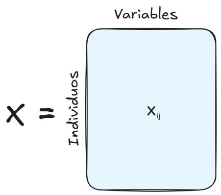
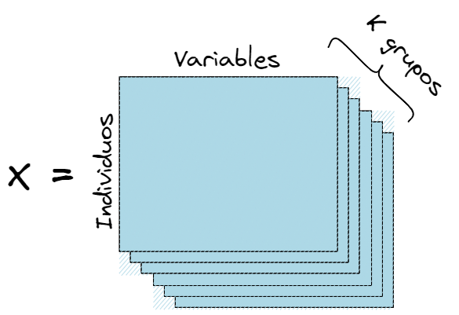
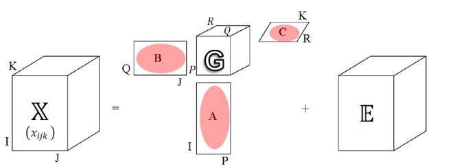
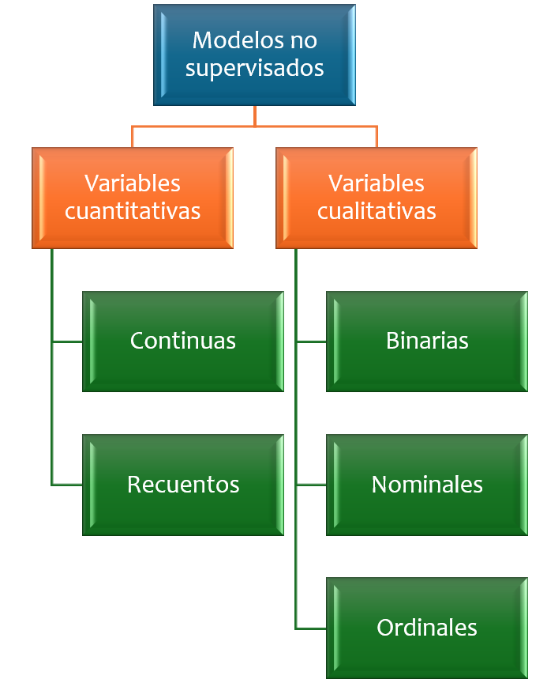
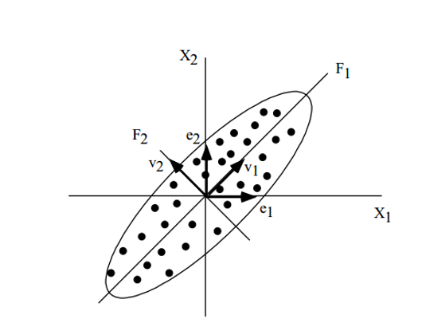
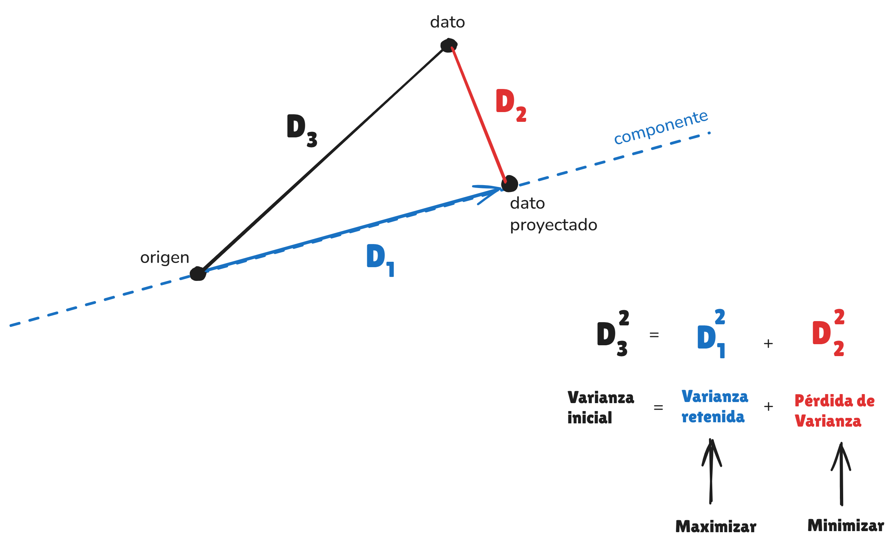

\newcommand\norm[1]{\left\lVert#1\right\rVert}

```{r}
library(pacman)

p_load(here)
```

# Panorama de la Estadística Descriptiva Multivariada \ en el moderno contexto del aprendizaje estadístico no supervisado {background-color="#0077b6"}

---

##  **Objetivo de los métodos supervisados** 

### Predecir una variable respuesta $Y$ a partir de predictores $X_1, \ldots, X_p$ mediante un modelo

$$Y = f(X_1, \ldots, X_p)$$
**Evaluación.** La calidad del modelo se mide con un *criterio externo de error*
que compara predicciones $\hat{y}_i$ con observaciones reales $y_i$.

---

### Relación entre el predictor y la variable respuesta

```{r, fig.align='center'}
#| message: false
#| warning: false
#| fig-width: 8
#| fig-height: 7

library(ggplot2)

set.seed(123)
n  <- 120
x  <- runif(n, -3, 3)
fx <- 1.2 + 0.9*x - 0.25*x^2
y  <- fx + rnorm(n, sd=0.6)

df <- data.frame(x = x, y = y)

ggplot(df, aes(x = x, y = y)) +
  geom_point(aes(color = "datos"),
             size = 2.2, alpha = 0.75) +
  stat_function(aes(color = "modelo"),
                fun = function(x) 1.2 + 0.9*x - 0.25*x^2,
                linewidth = 1.3) +
  scale_color_manual(
    values = c("datos" = "#1F3B73",
               "modelo" = "#C0392B"),
    labels = c("Datos observados",
               expression(hat(y) == f(X[1]))),
    name = NULL
  ) +
  labs(
    x = expression(X[1]),
    y = expression(hat(y))
  ) +
  theme_minimal(base_size = 15) +
  theme(
    legend.position = "top",
    legend.justification = "left",
    panel.grid.minor = element_blank(),
    panel.grid.major = element_line(color = "grey85"),
    axis.title = element_text(face = "bold"),
    legend.text = element_text(size = 12)
  )
```

## ¿Qué es lo supervisado?


**Idea clave.** Al observar $Y$, el aprendizaje se puede *supervisar*:

::: columns
::: {.column width="60%"}

</br></br>

* **Entrenamiento:** ajustar $f$ usando una fracción de los datos.
* **Prueba/validación:** evaluar en datos independientes comparando $\hat{y}_i$ vs. $y_i$ con una medida de error.

:::

::: {.column  width="40%"}

{fig-align="center" width="100%"}

:::

:::


## Métodos típicos en la categoría supervisados

</br>

* **Regresión**: Regresión lineal, polinómica y regularizada (ridge/lasso).

* **Clasificación**: Regresión logística, árboles, k-NN, SVM y redes neuronales.

* **Modelos extendidos**: Modelos lineales generalizados (GLM) y aditivos generalizados (GAM).

## Contraste: Aprendizaje Supervisado vs No Supervisado

**Idea central.** En el **Aprendizaje Estadístico No Supervisado** solo se observan variables explicativas $X_1, \ldots, X_p$; no existe una variable respuesta $Y$ que permita supervisar el aprendizaje ni evaluar el ajuste mediante un criterio externo de error.

. . . 

* No hay una respuesta observable que se desee predecir.
* El problema no se formula en términos de predicción supervisada.
* La evaluación del resultado es interna al método y de carácter exploratorio.

## Contraste: Aprendizaje Supervisado vs No Supervisado


{fig-align="center" width="100%"}

## Métodos en Aprendizaje No Supervisado

Como parte del **Aprendizaje Estadístico No Supervisado** se incluyen, entre otros, los siguientes métodos:

</br>

- **Reducción de dimensión:** Análisis de Componentes Principales (ACP).
- **Asociación en tablas categóricas:** Análisis de Correspondencias (AC) y Análisis de Correspondencias Múltiples (ACM).
- **Estructura de similitud:** métodos de agrupamiento (*clustering*).

---

## Ilustración en el plano factorial

```{r}
#| fig-width: 14
#| fig-height: 7
#| fig-dpi: 300
#| out-width: 100%
#| fig-align: center

set.seed(2026)
n <- 90

g <- rep(1:3, each = n/3)
x1 <- c(rnorm(n/3, -2, 0.6), rnorm(n/3,  0, 0.6), rnorm(n/3,  2, 0.6))
x2 <- c(rnorm(n/3,  0, 0.7), rnorm(n/3,  2, 0.7), rnorm(n/3, -1.5, 0.7))

pc1 <- as.numeric(scale(x1 + 0.2*x2))
pc2 <- as.numeric(scale(-0.3*x1 + x2))

df <- data.frame(
  pc1 = pc1,
  pc2 = pc2,
  grupo = factor(g, labels = paste0("Grupo ", 1:3))
)

centros <- aggregate(cbind(pc1, pc2) ~ grupo, data = df, FUN = mean)

library(ggplot2)
library(ggrepel)

ggplot(df, aes(pc1, pc2)) +
  geom_point(aes(color = grupo), size = 2.2, alpha = 0.85) +
  stat_ellipse(aes(color = grupo), level = 0.80, linewidth = 0.9, alpha = 0.20) +
  geom_point(
    data = centros,
    aes(pc1, pc2),
    shape = 4, size = 6, stroke = 1.4,
    inherit.aes = FALSE
  ) +
  geom_label_repel(
    data = centros,
    aes(pc1, pc2, label = grupo),
    inherit.aes = FALSE,
    size = 4.2,
    label.size = 0.25,
    min.segment.length = 0,
    seed = 2026
  ) +
  scale_color_brewer(palette = "Dark2") +
  labs(
    x = "Eje 1 (factor / componente)",
    y = "Eje 2 (factor / componente)",
    color = NULL
  ) +
  coord_equal() +
  theme_minimal(base_size = 20) +
  theme(
    legend.position = "none",
    panel.grid.minor = element_blank(),
    axis.title = element_text(face = "bold"),
    plot.margin = margin(5, 5, 5, 5)
  )
```

## Mapa conceptual

### La estadística multivariada en el contexto del aprendizaje no supervisado

{fig-align="center" width="100%"}

## Mapa conceptual

### La estadística multivariada en el contexto del aprendizaje no supervisado

{fig-align="center" width="100%"}

## Métodos tratados en este curso


* **PCA** (Principal Components Analysis).
* **CA** (Correspondence Analysis).
* **MCA** (Multiple Correspondence Analysis).
* **K-means**.
* **k-medoids** (Partitioning Around Medoids - PAM)
* **Clustering jerarquico** (aglomerativo o divisivo).

---

### Proceso iterativo no jerárquico

{fig-align="center" width="100%"}

## Proceso de analítica


```{r, out.width= '100%'}
knitr::include_graphics(here::here("images/Ciclo.png"))
```
[Wickham, H. y otros (2023)](https://r4ds.hadley.nz/)

## Métodos de reducción de la dimensionalidad 

::: columns
::: {.column width="30%" .fragment}

Dos modos

</br></br>

{fig-align="center" width="80%"}

:::

::: {.column  width="30%" .fragment}

Tablas Múltiples

</br></br>

{fig-align="center" width="110%"}

:::

::: {.column  width="40%" .fragment}

Métodos multi-way

</br></br>

{fig-align="center" width="110%"}

:::

:::

::: {.notes}
En el caso de los métodos para dos modos, estos se diferencian dependiendo la naturaleza de los datos (cuanti, cuali).

Múltiples: mismos individuos en las diferentes ocasiones, mismas variables en la diferentes ocasiones, etc
Tucker: La descomposición en pliegues, métodos PARAFAC.

Análisis de tensores: descomponer señales cerebrales registradas en múltiples canales, tiempos y frecuencias.
:::

## Tipos de análisis

{fig-align="center" width="90%"}


# ANÁLISIS DE COMPONENTES PRINCIPALES {background-color="#0077b6"}

## Objetivo general

Método para reducir la dimensionalidad de los datos conservando la mayor cantidad de información. El método se debe usar cuando las variables son cuantitativas y existe presencia de correlación

. . .

{fig-align="center" width="50%" dpi=300}


## Objetivos específicos

- **Visualizar patrones**: Sirve para visualizar la estructura de los datos y detectar patrones emergentes. 

- **Construir de índices sintéticos**: Las variables originales se resumen en un conjunto menor de componentes principales que contienen información de todas las variables originales.

- **Identificar factores latentes**: Identifica los factores principales que explican los cambios relacionados con el tema de interés.

- **Identificar grupos**: Ayuda a identificar grupos de individuos que comparten características similares. 

## Introducción

Sea $\mathbf{X}$ la matriz de datos, con $\mathbf{x}_i \in \mathbb{R}^p,\ i \in \{1, \dots, n\}$, que representa los valores de $p$ variables **cuantitativas** para $n$ individuos, se busca investigar si es posible representar los individuos mediante $r$ variables ($r<p$), con poca, o ninguna pérdida de información, si es posible.


{fig-align="center" width="50%"}

## Contexto histórico {background-image="images/evol1.png"  background-size="80%" background-position="center 20%"}


## Orígenes {background-image="images/fondo1.png"  background-size="85%" background-position="center top"}

::: {style="font-size: 0.8em;"}
<div style="text-align: justify;">

Pearson planteó un problema geométrico: encontrar una representación óptima de datos multivariados en una dimensión reducida con respecto al error cuadrático medio.

</div>

::: columns
::: {.column width="60%"}

Si $\mathbf{x}_i \in \mathbb{R}^p, i \in \{1, \dots, n\}$, están centrados, el objetivo de PCA es

$$
\min_{U \in \mathbb{R}^{p \times r}}
\sum_{i=1}^n \left\| \mathbf{x}_i - UU^\top \mathbf{x}_i \right\|^2
\quad \text{sujeto a} \quad
U^\top U = I_r,
$$

donde $r < p$.
:::

::: {.column  width="40%"}

{fig-align="right" width="80%"}

:::

:::

:::

::: {.notes}
El PCA fue definido por primera vez por Pearson (1901). Encontrar la representación óptima de los datos multivariantes en el espacio de baja dimensión al minimizar el error cuadrático medio de la proyección.
:::


## Orígenes {background-image="images/fondo1.png"  background-size="85%" background-position="center top"}

::: {style="font-size: 0.8em;"}
<div style="text-align: justify;">

Pearson planteó un problema geométrico: encontrar una representación óptima de datos multivariados en una dimensión reducida con respecto al error cuadrático medio.

</div>

::: columns
::: {.column width="60%"}

Si $\mathbf{x}_i \in \mathbb{R}^p, i \in \{1, \dots, n\}$, están centrados, el objetivo de PCA es

$$
\min_{U}
\| X - X U U^\top \|_F^2
\quad \text{sujeto a} \quad
U^\top U = I_r
$$

donde $r < p$.
:::

::: {.column  width="40%"}

{fig-align="right" width="80%"}

:::

:::

:::

::: {.notes}
El PCA fue definido por primera vez por Pearson (1901). Encontrar la representación óptima de los datos multivariantes en el espacio de baja dimensión al minimizar el error cuadrático medio de la proyección.
:::

## Orígenes {background-image="images/fondo1.png" background-size="85%" background-position="center top"}

::: {style="font-size: 0.8em;"}
<div style="text-align: justify;">
Hotelling (1933) demostró que las direcciones que maximizan la varianza proyectada son los autovectores de la matriz de covarianzas muestral.
</div>

::: columns
::: {.column width="60%"}
<br/>
El objetivo es maximizar:

$$
\max_{U \in \mathbb{R}^{p \times r}}
\operatorname{tr}\!\left(U^\top \mathbf{X}^\top \mathbf{X} U\right)
\quad \text{sujeto a} \quad
U^\top U = I_r,
$$

donde $r < p$.
:::

::: {.column width="40%"}
{fig-align="right" width="80%"}
:::
:::
:::

## Orígenes {background-image="images/fondo1.png"  background-size="85%" background-position="center top"}

Enfoque de Hotelling (1933) vs Pearson (1901)

<br>

{fig-align="center"}

## Orígenes {background-image="images/fondo1.png"  background-size="85%" background-position="center top"}

Maximizar la varianza en el espacio de los componentes principales es equivalente a minimizar el error de reconstrucción por mínimos cuadrados.

{fig-align="center"}

# CÁLCULO DE LAS COMPONENTES {background-color="#b2ebf2"}

## Formulación del problema

Sea $\mathbf{x}_i \in \mathbb{R}^p$, $i=1,\dots,n$, un conjunto de observaciones **centradas**.

El objetivo del Análisis de Componentes Principales (PCA) es encontrar un subespacio de dimensión $r < p$ que minimice el error de reconstrucción:

$$
\min_{U \in \mathbb{R}^{p \times r}}
\sum_{i=1}^n
\left\|
\mathbf{x}_i - UU^\top \mathbf{x}_i
\right\|^2
\quad \text{sujeto a} \quad
U^\top U = I_r
$$

donde las columnas de $U$ son ortonormales.

## Interpretación geométrica

* $UU^\top \mathbf{x}_i$ es la **proyección ortogonal** de $\mathbf{x}_i$ sobre el subespacio generado por $U$.
* El problema busca:

> El subespacio de dimensión $r$ que mejor aproxima los datos.

Equivalente a minimizar la pérdida de información.

## Forma matricial

Sea $X \in \mathbb{R}^{n \times p}$ la matriz de datos centrados. El problema es equivalente a:


$$
\min_{U}
\| X - X U U^\top \|_F^2
\quad \text{sujeto a} \quad
U^\top U = I_r
$$

donde $\|\cdot\|_F$ es la norma de Frobenius, es decir, $\|A\|^2_F=\operatorname{tr}\!\left(A^\top A\right)$. Entonces:

. . . 

$$
\min_{U}
\| X - X U U^\top \|_F^2 = \operatorname{tr}\!\left(X^\top X\right) - \operatorname{tr}\!\left(U^\top X^\top XU\right)
$$

El primer término no depende de $U$.

## Problema equivalente

$$
\max_{U}
\operatorname{tr}\!\left(U^\top X^\top XU\right)
\quad \text{sujeto a} \quad
U^\top U = I_r
$$

Si definimos la matriz de covarianza:

$$
S = \frac{1}{n} X^\top X
$$

obtenemos:

$$
\max_{U}
\operatorname{tr}(U^\top S U)
\quad \text{sujeto a} \quad
U^\top U = I_r
$$

## Maximización por multiplicadores de Lagrange

Sea $S = \frac{1}{n}X^\top X$ la matriz de covarianzas. El problema de PCA puede escribirse como:

$$
\max_{U}
\operatorname{tr}(U^\top S U)
\quad \text{sujeto a} \quad
U^\top U = I_r.
$$

. . . 

Construimos el Lagrangiano:

$$\mathcal{L} = \operatorname{tr}(U^\top S U) - \operatorname{tr}\!\left[\Lambda(U^\top U - I_r)\right]$$

donde $\Lambda$ es simétrica.

## Maximización por multiplicadores de Lagrange

Derivando respecto a $U$:

$$2SU - 2U\Lambda = 0$$

Por lo tanto:

$$SU = U\Lambda.$$


. . . 

Esto implica que:

$$
S u_k = \lambda_k u_k,
\quad k=1,\dots,r.
$$

Las columnas de $U$ son los autovectores de $S$ asociados a los mayores autovalores.

## Interpretación

Para una dirección unitaria $u$:

$$
\mathrm{Var}(Xu) = u^\top S u.
$$

PCA busca:

$$
\max_{\|u\|=1} u^\top S u.
$$

Por lo tanto:

* Primera componente → máxima varianza
* Segunda → máxima varianza restante
* Direcciones ortogonales


## Componentes Principales

Las componentes principales se obtienen como:

$$
Z = XU
$$

Reconstrucción de los datos:

$$
\hat X = ZU^\top
$$

Interpretación:

* $U$ → direcciones principales
* $Z$ → coordenadas en el nuevo sistema

## Descripción del ACP


{fig-align="center"}

## Descripción del ACP

Reproducir la matriz original usando menos dimensiones

<br>

. . .

<p align="center">

</p>


## Teorema de la factorización - SDV {background-image="images/fondo1.png"  background-size="85%" background-position="center top"}

El primer artículo sobre descomposición en valores singulares (SVD) fue publicado en Psychometrika (Eckart y Young, 1936).

<br>

<p align="center">

</p>

## Esquema de las componentes

<br>

{fig-align="center"}

## Interpretación en el espacio de las componentes

{fig-align="center"}


## Interpretación en el espacio de las componentes

{fig-align="center"}

# PROPIEDADES DE LAS COMPONENTES {background-color="#b2ebf2"}

## Propiedades de las componentes


# EJEMPLO {background-color="#b2ebf2"}

## Gran Encuesta Integrada de Hogares - GEIH

El conjunto de datos `RESUMEN.sav` contiene un preprocesamiento obtenido de la GEIH del DANE a nivel departamental para algunas variables de interés.

<br> 

```{r}
#| echo: true
library(pacman)
p_load(tidyverse, janitor,
       FactoMineR, factoextra, Factoshiny, 
       skimr, corrplot, psych, haven)

url <- "https://github.com/jgbabativam/AnaDatos/raw/main/datos/RESUMEN.sav"
datos <- read_sav(url) |> as_factor()
```

<br> 

Use el comando `glimpse()` y `skim()` para explorar el conjunto de datos.


## Preparación del conjunto de datos


EL ACP es una técnica que se aplica sobre variables cuantitativas.

::: {.panel-tabset}
### Correlación

```{r}
#| echo: false
#| eval: true
datos <- datos |> 
         column_to_rownames(var = "DPTO")


corrplot(datos |> cor(),
         method = "color", type = "upper", addCoef.col = "black", tl.col = "black", tl.srt = 45,
         col = colorRampPalette(c("darkred", "white", "steelblue"))(200))

```

### Código

```{r}
#| echo: true
#| eval: false
datos <- datos |> 
         column_to_rownames(var = "DPTO")


corrplot(datos |> cor(),
         method = "color", type = "upper", addCoef.col = "black", tl.col = "black", tl.srt = 45,
         col = colorRampPalette(c("darkred", "white", "steelblue"))(200))

```


:::


## Varianza explicada por las componentes

```{r}
#| echo: true
res <- PCA(datos, scale.unit = T, graph = F)
fviz_screeplot(res, addlabels = TRUE, ylim = c(0, 60))
```

::: {.notes}
mostrar que la suma de los valores propios (varianza de los CP) es igual a la suma de la V(X)
:::

## Análisis de las contribuciones

```{r, fig.align='center'}
#| echo: true

corrplot(res$var$contrib, is.corr=FALSE, tl.col = "black")
```


## Análisis correlación variable factor


```{r, echo=TRUE}
corrplot(res$var$cor, is.corr=FALSE, tl.col = "black")
```

## Análisis de los cos2

Capacidad de los factores para explicar las variables

```{r}
#| echo: true
corrplot(res$var$cos2, is.corr=FALSE, tl.col = "black")
```

## Primer plano factorial para las variables

```{r, fig.align='center'}
#| echo: true
fviz_pca_var(res, 
             col.var="contrib",
             gradient.cols = c("#00AFBB", "#E7B800", "#FC4E07"),
             repel = TRUE)
```

## Primer plano factorial para los individuos

```{r, fig.align='center'}
#| echo: true
fviz_pca_ind(res, col.ind = "cos2",
             gradient.cols = c("#00AFBB", "#E7B800", "#FC4E07"),
             repel = TRUE)
```

## Biplot

```{r, fig.align='center'}
#| echo: true
fviz_pca_biplot(res, repel = TRUE, col.ind = "blue", col.var = "red")
```

## Construcción de índices sintéticos

Teniendo en cuenta que: 

$$\mathbf{Z} =  \mathbf{XU}$$

. . . 

Entonces una CP es una variable latente que resume la información contenida en las variables originales. Por ejemplo, la primera CP es:

$$z_{1i} =  u_{11} \cdot x_{1i} + \cdots +u_{1p} \cdot x_{pi}$$

. . . 

La matriz $\mathbf{U}$ actúa como los ponderadores de las variables de la matriz $\mathbf{X}$, con lo cual $\mathbf{Z}$ es un índice que resume la información contenida en las variables originales. Como cada CP está incorrelacionada con las demás, entonces la información que explica cada una es diferente.