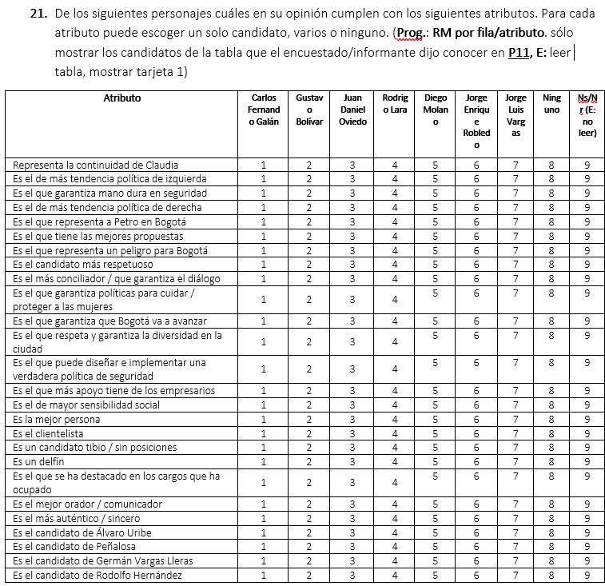

```{r}
#| message: false
#| warning: false
library(pacman)
p_load(here, tidyverse, FactoMineR, factoextra, corrplot,
       ggrepel, gt, janitor, haven, kableExtra)
```

```{r}
#| label: setup-url
url <- "https://github.com/jgbabativam/Curso_Multivariado/raw/main/Datos/"
```

# Análisis de Correspondencias {background-color="#0077b6"}

## Contenido: ACS y ACM {style="font-size: 90%;"}

::: {.columns}
::: {.column width="50%"}
**Análisis de Correspondencias Simples**

1. Descripción del método
2. Tablas de contingencia y perfiles
3. Inercia y distancia $\chi^2$
4. Obtención de los factores
5. Guías para la interpretación
6. Ej. 1: Sentimientos ante normas (ECC)
7. Ej. 2: Confianza en la justicia en 38 países
8. Ej. 3: Candidatos Bogotá 2023
:::
::: {.column width="50%"}
**Análisis de Correspondencias Múltiples**

9. Del ACS al ACM
10. Tabla disyuntiva y Tabla de Burt
11. Inercia de modalidades
12. Guías para la interpretación
13. Ej. 1: Justificaciones desobediencia (ECC)
14. Ej. 2: Confianza en instituciones — LAPOP Colombia 2021
15. Laboratorio
:::
:::

# Análisis de correspondencias simples {background-color="#0077b6"}

## ¿Qué es el ACS? {style="font-size: 85%;"}

El ACP requiere variables **cuantitativas**. Cuando los datos provienen de encuestas con respuestas categóricas, las escalas son **códigos** asignados a modalidades: no hay operaciones aritméticas con sentido entre ellas.

::: {.fragment}
El **Análisis de Correspondencias Simples (ACS)**:

::: {.incremental}
- Es una extensión del ACP para identificar relaciones entre **dos variables cualitativas**.
- Visualiza tablas de frecuencias o **tablas de contingencia** en un plano de pocas dimensiones.
- Puede interpretarse como un ACP para variables cualitativas.
- Identifica asociaciones entre las **modalidades de respuesta** de ambas variables.
:::
:::

::: {.fragment}
::: {.callout-note}
Cuando se trata de **más de dos** variables cualitativas, el método se generaliza al **Análisis de Correspondencias Múltiples (ACM)**, tratado en la segunda parte de esta presentación.
:::
:::

---

## Escalas de variables cualitativas {style="font-size: 88%;"}

::: {.incremental}
- **Nominal:** códigos que clasifican objetos sin orden. *Ejemplos:* sexo, ciudad, estado civil, universidad, país.

- **Ordinal o categórica:** categorías que indican **jerarquía u orden**. *Ejemplos:* estrato socioeconómico, nivel educativo, posición en ranking.

- **Likert:** escala ordinal para grados de aprobación o acuerdo. *Modalidades típicas:* Totalmente en desacuerdo · En desacuerdo · Indiferente · De acuerdo · Totalmente de acuerdo.

- **Hedonista:** escala ordinal de **niveles de preferencia o agrado**. *Modalidades:* Me desagrada mucho · Me desagrada · Ni me agrada ni desagrada · Me agrada · Me agrada mucho.
:::

::: {.fragment}
::: {.re-blue}
> Las opciones de respuesta se denominan **modalidades**. Las variables generadas por estas codificaciones son **variables cualitativas**.
:::
:::

# Tablas de contingencia {background-color="#0077b6"}

## Estructura de la tabla de contingencia 

</br> 

Sea $X$ la variable fila con $I$ modalidades y $Y$ la variable columna con $J$ modalidades. La tabla de contingencia es:

$$G = \{n_{ij}\}, \quad i = 1,\ldots,I, \quad j = 1,\ldots,J$$

donde $n_{ij}$ es el número de respuestas simultáneas a la modalidad $i$ de $X$ y la modalidad $j$ de $Y$.

---

## Estructura de la tabla de contingencia {style="font-size: 90%;"}

$$
\begin{array}{c|cccccc|c}
& 1 & 2 & \cdots & j & \cdots & J & \\
\hline
1 & n_{11} & n_{12} & \cdots & n_{1j} & \cdots & n_{1J} & n_{1.} \\
& \vdots & \vdots & & \vdots & & \vdots & \vdots \\
i & n_{i1} & n_{i2} & \cdots & n_{ij} & \cdots & n_{iJ} & n_{i.} \\
& \vdots & \vdots & & \vdots & & \vdots & \vdots \\
I & n_{I1} & n_{I2} & \cdots & n_{Ij} & \cdots & n_{IJ} & n_{I.} \\
\hline
& n_{.1} & n_{.2} & \cdots & n_{.j} & \cdots & n_{.J} & n
\end{array}
$$

Las **frecuencias marginales** son: $\;n_{i.} = \sum_{j=1}^J n_{ij}$ (fila) $\;$ y $\;$ $n_{.j} = \sum_{i=1}^I n_{ij}$ (columna).


---

## De frecuencias a perfiles {style="font-size: 95%;"}

Las frecuencias absolutas $n_{ij}$ dependen del total $n$ y no permiten comparar directamente. Las frecuencias relativas $f_{ij} = n_{ij}/n$ tampoco eliminan el efecto de las marginales.

::: {.fragment}
La solución son los **perfiles** (frecuencias condicionales):

$$\text{Perfiles fila:} \quad \frac{f_{ij}}{f_{i.}} = \frac{n_{ij}}{n_{i.}} \qquad \text{Perfiles columna:} \quad \frac{f_{ij}}{f_{.j}} = \frac{n_{ij}}{n_{.j}}$$

donde $f_{i.} = n_{i.}/n$ y $f_{.j} = n_{.j}/n$ son las frecuencias marginales relativas.
:::

::: {.fragment}
::: {.re-blue}
> $G_I = (f_{.1}, \ldots, f_{.J})$ es el **centroide de filas** (perfil promedio de filas).
> $G_J = (f_{1.}, \ldots, f_{I.})$ es el **centroide de columnas**.
:::
:::

---

## Inercia y distancia $\chi^2$ 

Si $X$ e $Y$ son **independientes**, se espera $f_{ij} = f_{i.} f_{.j}$. Se definen las **frecuencias esperadas**:

$$\hat{e}_{ij} = f_{i.} f_{.j}$$

Las **distancias estandarizadas** entre observado y esperado son:

$$z_{ij} = \frac{f_{ij} - \hat{e}_{ij}}{\sqrt{\hat{e}_{ij}}}$$

---

## Inercia y distancia $\chi^2$

</br> 

La estadística $\chi^2$ y la **inercia total** son:

$$\chi^2 = n \sum_{i=1}^I \sum_{j=1}^J z_{ij}^2 \qquad \Longrightarrow \qquad T = \frac{\chi^2}{n} = \sum_{i=1}^I \sum_{j=1}^J z_{ij}^2$$

::: {.callout-important}
La **inercia** $T$ elimina el efecto del tamaño muestral. Es la varianza total que el ACS descompone en factores.
:::

# Obtención de los factores {background-color="#0077b6"}

## Diferencias entre ACP y ACS

- **ACP**: En las tablas de datos del ACP las filas representan objetos y las columnas son las variables, de manera que el análisis por filas es un análisis de similitudes entre objetos, el análisis por columnas es un análisis de correlación entre variables.

- **ACS**: Las filas y columnas representan las modalidades de dos variables cualitativas, y por tanto la interpretación de los dos análisis es la misma. Asociación entre modalidades
de la variable que está en las filas (columnas) y el análisis simultáneo de filas y columnas es para identificar el grado de asociación entre modalidades de las dos variables.


## Factores del ACS {style="font-size: 90%;"}

Las **coordenadas** de filas y columnas sobre el $\alpha$-ésimo factor son promedios ponderados de las distancias estandarizadas:

$$r_{i\alpha} = \sum_{j=1}^J z_{ij}\, u_{j\alpha} = \sum_{j=1}^J \frac{f_{ij} - \hat{e}_{ij}}{\sqrt{\hat{e}_{ij}}}\, u_{j\alpha} \qquad \text{(filas)}$$

$$c_{j\alpha} = \sum_{i=1}^I z_{ij}\, v_{i\alpha} = \sum_{i=1}^I \frac{f_{ij} - \hat{e}_{ij}}{\sqrt{\hat{e}_{ij}}}\, v_{i\alpha} \qquad \text{(columnas)}$$

::: {.fragment}
**Equivalencia con perfiles:** un enfoque que produce los mismos resultados consiste en proyectar directamente los perfiles fila y columna. Las coordenadas de las filas son:

$$r_{\alpha i} = \frac{1}{f_{i.}} \sum_{j=1}^J \frac{f_{ij}}{f_{.j}}\, u_{j\alpha}$$
:::

---

## Ecuaciones de transición {style="font-size: 90%;"}

Los vectores propios de las matrices de filas y columnas están relacionados por:

$$v_\alpha = \frac{1}{\sqrt{\lambda_\alpha}}\, F\, D_J^{-1}\, u_\alpha \qquad \qquad u_\alpha = \frac{1}{\sqrt{\lambda_\alpha}}\, F^\prime\, D_I^{-1}\, v_\alpha$$

donde $F = \{f_{ij}\}$ es la matriz de frecuencias relativas, $D_I = \text{diag}(f_{i.})$ y $D_J = \text{diag}(f_{.j})$.

::: {.fragment}
::: {.re-blue}
> Las ecuaciones de transición permiten, a partir de las coordenadas de un espacio, calcular las del otro. Es la base de la **representación simultánea** de filas y columnas en el mismo plano.
:::
:::

::: {.fragment}
**Filas y columnas suplementarias:** para filas o columnas que no participan en el cálculo, sus coordenadas se obtienen proyectando sus perfiles sobre los factores ya calculados.
:::

# Interpretación del ACS {background-color="#0077b6"}

## Tres herramientas de interpretación {style="font-size: 90%;"}

::: {.fragment}
1. **Coordenadas** ($r_{i\alpha}$, $c_{j\alpha}$): posición de la modalidad sobre el factor.
2. **Contribuciones:** aporte de la modalidad a la varianza del factor:
$$C_\alpha(i) = \frac{f_{i.}\, r_{\alpha i}^2}{\lambda_\alpha} \qquad C_\alpha(j) = \frac{f_{.j}\, c_{\alpha j}^2}{\lambda_\alpha}$$
3. **Cosenos cuadrados:** capacidad del factor para representar la modalidad:
$$\cos^2_\alpha(i) = \frac{r_{\alpha i}^2}{d^2(i, G_I)} \qquad \cos^2_\alpha(j) = \frac{c_{\alpha j}^2}{d^2(j, G_J)}$$
:::

::: {.fragment}
::: {.callout-note}
Modalidades con **coordenada alta + contribución alta + cos² alto** tipifican el factor y pueden usarse como indicadores de las propiedades que define ese factor.
:::
:::

---

## Reglas de interpretación de las coordenadas {style="font-size: 88%;"}

::: {.incremental}
- **Puntos fila, columna o mixtos cercanos entre sí** → los encuestados que contestaron una modalidad también contestaron la otra; sus distribuciones son similares.

- **Puntos cercanos al centro del plano** → modalidades con frecuencias **altas** de respuesta; representan la opinión de la mayoría (punto promedio o modal).

- **Puntos lejanos del origen** → modalidades con frecuencias **bajas** de respuesta; son las que más distinguen a los individuos.

- **Puntos en extremos opuestos del plano** → baja frecuencia de respuesta **y** distribuciones opuestas; indican opiniones contrapuestas.
:::

::: {.fragment}
::: {.callout-warning}
El ACS **aleja del origen** las modalidades poco frecuentes, identificando así las características que más distinguen a los objetos.
:::
:::

# Ejemplo 1: Sentimientos ante normas — ECC {background-color="#0077b6"}

## Encuesta de Cultura Ciudadana {style="font-size: 88%;"}

La **Encuesta de Cultura Ciudadana (ECC)** fue realizada por Corporación Visionarios en varias ciudades latinoamericanas. Incluye preguntas sobre sentimientos hacia normas, facilidad para cumplir la ley, celebración de acuerdos, confianza, seguridad y pluralismo.

::: {.fragment}
Dos preguntas permiten explorar si quienes tienen sentimientos positivos hacia las normas también les queda más fácil cumplirlas:

**P16.** *De modo general, las palabras* regla o norma *despiertan en Usted un sentimiento:*

| 1. Muy negativo | 2. Negativo | 3. Indiferente | 4. Positivo | 5. Muy positivo |

**P17b.** *Le queda fácil actuar conforme a la ley:*

| 1. Nunca | 2. Casi nunca | 3. Casi siempre | 4. Siempre |
:::

---

## Carga de los datos

```{r}
#| echo: true
#| message: false
#| warning: false
library(pacman)
p_load(tidyverse, FactoMineR, factoextra, gt, janitor, corrplot)

url <- "https://github.com/jgbabativam/Curso_Multivariado/raw/main/Datos/"
CCLatin <- read.csv2(paste0(url, "Muestra_CC.csv"), sep = ";")
```

::: {.fragment}
```{r}
#| echo: true
t16x17 <- table(CCLatin$p16, CCLatin$p17_b)
```
:::

<div style="height:380px; overflow-y:auto;">
```{r}
#| message: false
#| warning: false
t16x17 |>
  as.data.frame.matrix() |>
  rownames_to_column("P16 \\ P17b") |>
  gt() |>
  opt_row_striping() |>
  tab_style(style = cell_text(weight = "bold"),
            locations = cells_column_labels()) |>
  tab_options(table.font.size = px(15), data_row.padding = px(3),
              table.width = pct(100)) |>
  tab_header(title = "Tabla de contingencia: sentimientos ante normas × facilidad para cumplir la ley")
```
</div>

---

## Perfiles fila {style="font-size: 88%;"}

```{r}
#| echo: true
perfilesF <- as.data.frame.matrix(t16x17)
perf_fil  <- cbind(perfilesF, TotFil = rowSums(t16x17))
perfilas  <- round(perf_fil / perf_fil$TotFil, 3)
```

<div style="height:280px; overflow-y:auto;">
```{r}
perfilas |>
  rownames_to_column("Sentimiento (P16)") |>
  gt() |>
  opt_row_striping() |>
  tab_style(style = cell_text(weight = "bold"),
            locations = cells_column_labels()) |>
  tab_options(table.font.size = px(18), data_row.padding = px(3),
              table.width = pct(100)) |>
  tab_header(title = "Perfiles fila: distribución de facilidad para cumplir la ley según sentimiento ante normas")
```
</div>

::: {.fragment}
::: {.callout-note}
Los perfiles fila eliminan el efecto del total de encuestados y permiten comparar directamente las distribuciones entre modalidades. Observe que el sentimiento "Indiferente" tiene la mayor proporción en "Casi siempre" + "Siempre".
:::
:::

---

## Perfiles columna {style="font-size: 88%;"}

```{r}
#| echo: true
perColum  <- round(sweep(perfilesF, 2, colSums(perfilesF), "/"), 3)
```

<div style="height:280px; overflow-y:auto;">
```{r}
perColum |>
  rownames_to_column("Sentimiento (P16)") |>
  gt() |>
  opt_row_striping() |>
  tab_style(style = cell_text(weight = "bold"),
            locations = cells_column_labels()) |>
  tab_options(table.font.size = px(18), data_row.padding = px(3),
              table.width = pct(100)) |>
  tab_header(title = "Perfiles columna para el sentimiento ante reglas o normas vs. facilidad para obedecer la ley")
```
</div>

::: {.fragment}
::: {.callout-note}
Se elimina el efecto del total de encuestados. Hay una fuerte similitud entre las distribuciones según la facilidad para actuar conforme a la ley. Lo paradógico es que cualquiera sea el grado de facilidad para actuar conforme a la ley, en todos los casos domina el sentimiento positivo y en menor grado muy positivo.
:::
:::

---

## ACS — Tabla de contingencia ECC {style="font-size: 90%;"}

```{r}
#| echo: true
#| message: false
#| warning: false
acs_p16x17 <- CA(as.data.frame.matrix(t16x17), graph = FALSE)
```

::: {.fragment}
```{r}
#| echo: true
eig_acs <- get_eigenvalue(acs_p16x17)
round(eig_acs, 3)
```
:::

---

## Análisis de las filas — Factores 1 y 2 {style="font-size: 85%;"}

::: {.columns}
::: {.column width="62%"}
```{r}
#| echo: false
cor_f <- round(acs_p16x17$row$coord[, 1:2], 2)
con_f <- round(acs_p16x17$row$contrib[, 1:2], 2)
cos_f <- round(acs_p16x17$row$cos2[, 1:2], 2)

data.frame(
  Modalidad = rownames(cor_f),
  CF1 = cor_f[, 1], CF2 = cor_f[, 2],
  NF1 = con_f[, 1], NF2 = con_f[, 2],
  SF1 = cos_f[, 1], SF2 = cos_f[, 2]
) |>
  gt() |>
  tab_spanner(label = "Coordenadas",        columns = c(CF1, CF2)) |>
  tab_spanner(label = "Contribuciones (%)", columns = c(NF1, NF2)) |>
  tab_spanner(label = "Cos²",         columns = c(SF1, SF2)) |>
  cols_label(Modalidad = "Modalidad",
             CF1 = "F1", CF2 = "F2",
             NF1 = "F1", NF2 = "F2",
             SF1 = "F1", SF2 = "F2") |>
  opt_row_striping() |>
  tab_style(style = cell_text(weight = "bold"),
            locations = cells_column_labels()) |>
  tab_style(style = cell_text(weight = "bold"),
            locations = cells_column_spanners()) |>
  tab_options(table.font.size = px(17), data_row.padding = px(5),
              table.width = pct(100))
```
:::
::: {.column width="38%"}
```{r}
#| echo: false
#| fig-height: 3.8
#| fig-width: 3.2
cos2_mat <- acs_p16x17$row$cos2[, 1:2]
rownames(cos2_mat) <- gsub("p16_PNOR=\\d+_", "", rownames(cos2_mat))
colnames(cos2_mat) <- c("F1", "F2")
corrplot(cos2_mat, is.corr = FALSE, method = "color",
         addCoef.col = "black", number.cex = 0.85,
         tl.col = "black", tl.cex = 0.9,
         col = COL1("Reds", 100), cl.ratio = 0.25,
         col.lim = c(0, 1),
         mar = c(0, 0, 1.8, 0),
         title = "Cos² por factor")
```
:::
:::

::: {.callout-note}
**Factor 1** queda tipificado por **muy positivo** (contr. 38.09%, cos²=0.92) —pese a tener la menor coordenada en valor absoluto (−0.19)— y por **indiferente** (coord. 0.50, cos²=0.94, contr. 15.21%). Las modalidades **muy neg** y **neg** definen el **Factor 2**, contribuyendo conjuntamente el 94.6% de su varianza. **Lectura del Factor 1:** coordenadas extremas negativas → sentimientos muy negativos; pequeñas negativas → sentimientos muy positivos; positivas (~0.5) → indiferencia ante las normas.
:::

---

## Plano factorial — Análisis por filas {style="font-size: 90%;"}

```{r}
#| echo: true
#| fig-align: center
#| fig-width: 9
#| fig-height: 5.5
fviz_ca_row(acs_p16x17, repel = TRUE, col.row = "cos2",
            gradient.cols = c("#00AFBB", "#E7B800", "#FC4E07"),
            title = "Análisis por filas — Sentimientos ante palabras como regla o norma") + theme_bw()
```

---

## Indicadores de columnas — Facilidad para actuar conforme a la ley {style="font-size: 85%;"}

::: {.columns}
::: {.column width="62%"}
```{r}
#| echo: false
cor_c <- round(acs_p16x17$col$coord[, 1:2], 2)
con_c <- round(acs_p16x17$col$contrib[, 1:2], 2)
cos_c <- round(acs_p16x17$col$cos2[, 1:2], 2)

data.frame(
  Modalidad = rownames(cor_c),
  CF1 = cor_c[, 1], CF2 = cor_c[, 2],
  NF1 = con_c[, 1], NF2 = con_c[, 2],
  SF1 = cos_c[, 1], SF2 = cos_c[, 2]
) |>
  gt() |>
  tab_spanner(label = "Coordenadas",        columns = c(CF1, CF2)) |>
  tab_spanner(label = "Contribuciones (%)", columns = c(NF1, NF2)) |>
  tab_spanner(label = "Cos²",         columns = c(SF1, SF2)) |>
  cols_label(Modalidad = "Modalidad",
             CF1 = "F1", CF2 = "F2",
             NF1 = "F1", NF2 = "F2",
             SF1 = "F1", SF2 = "F2") |>
  opt_row_striping() |>
  tab_style(style = cell_text(weight = "bold"),
            locations = cells_column_labels()) |>
  tab_style(style = cell_text(weight = "bold"),
            locations = cells_column_spanners()) |>
  tab_options(table.font.size = px(17), data_row.padding = px(5),
              table.width = pct(100))
```
:::
::: {.column width="38%"}
```{r}
#| echo: false
#| fig-height: 3.8
#| fig-width: 3.2
cos2_col <- acs_p16x17$col$cos2[, 1:2]
rownames(cos2_col) <- gsub("p17b_FACL=\\d+_", "", rownames(cos2_col))
colnames(cos2_col) <- c("F1", "F2")
corrplot(cos2_col, is.corr = FALSE, method = "color",
         addCoef.col = "black", number.cex = 0.85,
         tl.col = "black", tl.cex = 0.9,
         col = COL1("Reds", 100), col.lim = c(0, 1), cl.ratio = 0.25,
         mar = c(0, 0, 1.8, 0),
         title = "Cos² por factor")
```
:::
:::

::: {.callout-note}
**Factor 1** está mejor tipificado por **siempre** (p17b_FACL=4_s): mayor contribución (44.25%) y mejor representada sobre este factor (cos²=0.98), con coordenada negativa (−0.12). La modalidad **casi nunca** tiene la mayor coordenada positiva (0.24) y alta contribución (33.81%). **Factor 2** es un indicador de poca facilidad para cumplir la ley: **nunca** (p17b_FACL=1_n) tiene la mayor coordenada (0.37), la mayor contribución (38.85%) y el mejor cos² en F2 (0.79), situándose lejos del origen.
:::

---

## Análisis por columnas {style="font-size: 90%;"}

```{r}
#| echo: true
#| fig-align: center
#| fig-width: 9
#| fig-height: 5.5
fviz_ca_col(acs_p16x17, repel = TRUE, col.col = "cos2",
            gradient.cols = c("#00AFBB", "#E7B800", "#FC4E07"),
            title = "Análisis por columnas — Facilidad para actuar conforme a la ley") + theme_bw()
```

---

## Representación simultánea {style="font-size: 90%;"}

```{r}
#| echo: true
#| fig-align: center
#| fig-width: 9
#| fig-height: 5.2
fviz_ca_biplot(acs_p16x17, repel = TRUE, col.row = "#0077b6", col.col = "#C0392B",
               title = "Asociación entre sentimientos y facilidad para cumplir la ley") + theme_bw()
```

::: {.callout-note}
**Centro del plano**: *siempre* y *casi siempre* (azul) se ubican junto a *indiferente*, *positivo* y *muy positivo* (rojo) indicando **asociación**, estar cerca del origen es una señal de que la mayoría de los encuestados comparte sentimientos positivos hacia las normas y encuentra fácil actuar conforme a la ley. **Asociación clave:** la cercanía entre *nunca* (p17b_FACL=1_n) y *negativo* (p16_PNOR=2_neg) confirma que quienes nunca cumplen la ley tienden a mostrar sentimientos negativos ante las normas o reglas.
:::

---

## Interpretación de la representación simultánea {style="font-size: 88%;"}

::: {.incremental}
- El **centro del plano** concentra las modalidades más frecuentes: sentimientos positivos y "casi siempre" / "siempre" cumplir la ley. Refleja la opinión de la mayoría.

- Las modalidades **muy negativo** y **nunca/casi nunca** se encuentran lejos del origen, indicando que tienen bajas frecuencias y que **distinguen más** a los encuestados.

- La **cercanía** entre *p16 muy_negativo* y *p17b nunca/casi_nunca* sugiere asociación: quienes tienen sentimientos muy negativos hacia las normas tienden a reportar que nunca o casi nunca les queda fácil cumplir la ley.

- La mayoría de los encuestados reporta sentimientos **positivos o muy positivos** hacia las normas, y simultáneamente que **siempre o casi siempre** les queda fácil actuar conforme a la ley.
:::

---

## Variable suplementaria: nivel educativo {style="font-size: 90%;"}

¿Tienen los niveles educativos más altos mayor facilidad para cumplir la ley o mejores sentimientos hacia las normas?

```{r}
#| echo: true
#| message: false
#| warning: false
Nedx17  <- table(CCLatin$p7_NEd, CCLatin$p17_b)
pnor_Ned_faci <- rbind(as.data.frame.matrix(t16x17), as.data.frame.matrix(Nedx17))
ca_supl <- CA(pnor_Ned_faci, row.sup = 6:11, graph = FALSE)
```

::: {.fragment}
```{r}
#| echo: true
#| fig-align: center
#| fig-width: 9
#| fig-height: 4.8
plot.CA(ca_supl, title = "Sentimientos, facilidad para cumplir la ley y nivel educativo (suplementario)")
```
:::

---

## Variable suplementaria: indicadores por nivel educativo {style="font-size: 85%;"}

::: {.columns}
::: {.column width="62%"}
```{r}
#| echo: false
cor_s <- round(ca_supl$row.sup$coord[, 1:2], 2)
cos_s <- round(ca_supl$row.sup$cos2[, 1:2], 2)

data.frame(
  Nivel = rownames(cor_s),
  CF1 = cor_s[, 1], CF2 = cor_s[, 2],
  SF1 = cos_s[, 1], SF2 = cos_s[, 2]
) |>
  gt() |>
  tab_spanner(label = "Coordenadas", columns = c(CF1, CF2)) |>
  tab_spanner(label = "Cos²",       columns = c(SF1, SF2)) |>
  cols_label(Nivel = "Nivel educativo",
             CF1 = "F1", CF2 = "F2",
             SF1 = "F1", SF2 = "F2") |>
  opt_row_striping() |>
  tab_style(style = cell_text(weight = "bold"),
            locations = cells_column_labels()) |>
  tab_style(style = cell_text(weight = "bold"),
            locations = cells_column_spanners()) |>
  tab_options(table.font.size = px(17), data_row.padding = px(5),
              table.width = pct(100))
```
:::
::: {.column width="38%"}
```{r}
#| echo: false
#| fig-height: 4.2
#| fig-width: 3.2
cos2_sup <- ca_supl$row.sup$cos2[, 1:2]
rownames(cos2_sup) <- sub("^\\d+\\s+", "", rownames(cos2_sup))
colnames(cos2_sup) <- c("F1", "F2")
corrplot(cos2_sup, is.corr = FALSE, method = "color",
         addCoef.col = "black", number.cex = 0.82,
         tl.col = "black", tl.cex = 0.82,
         col = COL1("Reds", 100), cl.ratio = 0.25,
         col.lim = c(0, 1),
         mar = c(0, 0, 1.8, 0),
         title = "Cos² por factor")
```
:::
:::

::: {.callout-note}
Las variables suplementarias solo tienen coordenadas y Cos² (no contribuciones). **Sin educación** y **Posgrado** tienen las mayores coordenadas negativas sobre F1 (−0.32 y −0.20). La mejor representada es **Sin educación** (cos²=0.72); **Posgrado** alcanza cos²=0.55, suficiente para estar bien representada en F1. Ambos niveles se proyectan del mismo lado que *muy positivo* y *siempre fácil cumplir la ley*, lo que podría indicar asociación con encuestados que tienen sentimientos muy positivos hacia las normas y alta facilidad para acatarlas.
:::

# Ejemplo 2: Confianza en la justicia en 38 países {background-color="#0077b6"}

## Encuesta Mundial de Valores {style="font-size: 88%;"}

La **Encuesta Mundial de Valores** se realiza periódicamente desde 1981 e indaga opiniones sobre democracia, tolerancia, religión, medio ambiente y diversidad, entre otros temas.

::: {.fragment}
Una de sus preguntas interroga por el **grado de confianza en la justicia** en 38 países, incluyendo varios latinoamericanos. La variable-fila es el **país** y la variable-columna es el **nivel de confianza** declarado por los encuestados.
:::

::: {.fragment}
```{r}
#| echo: true
#| message: false
#| warning: false
library(pacman)
p_load(tidyverse, janitor, FactoMineR, factoextra, corrplot)

conf_just <- read.csv2(paste0(url, "ConfianzaJUsticia.csv")) |> 
             column_to_rownames("Pais") |> 
             arrange(desc(muchis.))

```
:::

---

## Tabla de contingencia: Países × Niveles de confianza

<div style="height:420px; overflow-y:auto;">
```{r}
#| message: false
#| warning: false
conf_just |>
  rownames_to_column("País") |>
  gt() |>
  opt_row_striping() |>
  tab_style(style = cell_text(weight = "bold"),
            locations = cells_column_labels()) |>
  tab_options(table.font.size = px(14), data_row.padding = px(2),
              table.width = pct(100)) |>
  tab_header(title = "Grados de confianza en la justicia (Encuesta Mundial de Valores)")
```
</div>

---

## ACS: Confianza en la justicia

```{r}
#| echo: true
#| message: false
#| warning: false
acs_conf <- CA(conf_just, graph = FALSE)
#round(get_eigenvalue(acs_conf), 3)
```

::: {.fragment}
```{r}
#| echo: true
#| fig-align: center
#| fig-width: 10
#| fig-height: 4.5
fviz_eig(acs_conf, addlabels = TRUE, barfill = "#0077b6", barcolor = "#0077b6", linecolor = "#C0392B") +
  labs(title = "Gráfico de sedimentación — Confianza en la justicia", x = "Dimensión", y = "% varianza explicada") + theme_bw()
```
:::

---

## Plano de columnas: niveles de confianza {style="font-size: 90%;"}

```{r}
#| echo: true
#| fig-align: center
#| fig-width: 9
#| fig-height: 5.5
fviz_ca_col(acs_conf, repel = TRUE,
            col.col = "contrib",
            gradient.cols = c("#00AFBB", "#E7B800", "#FC4E07"),
            title = "Niveles de confianza — por contribución") + theme_bw()
```

---

## Plano de filas: países {style="font-size: 90%;"}

```{r}
#| echo: true
#| fig-align: center
#| fig-width: 10
#| fig-height: 5.5
fviz_ca_row(acs_conf, repel = TRUE, labelsize = 3,
            col.row = "cos2",
            gradient.cols = c("#00AFBB", "#E7B800", "#FC4E07"),
            title = "Países — grado de confianza en la justicia (cos²)") + theme_bw()
```

---

## Representación simultánea: países y niveles de confianza {style="font-size: 90%;"}

```{r}
#| echo: true
#| fig-align: center
#| fig-width: 10
#| fig-height: 5.5
fviz_ca_biplot(acs_conf, repel = TRUE, labelsize = 3,
               col.row = "#0077b6", col.col = "#C0392B",
               title = "Asociación entre países y niveles de confianza en la justicia") +
  theme_bw()
```

---

## Interpretación {style="font-size: 88%;"}

::: {.incremental}
- Los países cercanos al **extremo positivo del Factor 1** se caracterizan por una **alta proporción de confianza** ("mucho" o "bastante") en la justicia.

- Los países en el extremo **negativo del Factor 1** presentan **baja o ninguna confianza** en la justicia.

- Los países cercanos al **origen del plano** tienen distribuciones similares al promedio mundial.

- Los países en extremos **opuestos del eje 2** difieren en los grados intermedios de confianza.

- Los países latinoamericanos tienden a agruparse, reflejando patrones culturales comunes respecto a la percepción del sistema judicial.
:::

# Ejemplo 3: Elecciones Alcaldía de Bogotá 2023 {background-color="#0077b6"}

## Contexto {style="font-size: 88%;"}

En contextos electorales, identificar la percepción ciudadana hacia los candidatos resulta fundamental. Los datos analizados provienen de una muestra aleatoria de 300 personas, extraída de un estudio con 4894 encuestas aplicadas en todas las localidades de Bogotá. El instrumento evaluó a los candidatos a la Alcaldía de Bogotá 2023 mediante preguntas de selección múltiple, donde los participantes asignaron diversos atributos a cada perfil.

::: {.fragment}
La tabla resultante es:

| Dimensión | Descripción |
|:----------|:-----------|
| **Filas** | 26 atributos percibidos (positivos, negativos, ideológicos, de alineación política) |
| **Columnas** | 9 candidatos (incluye "Ninguno" y "Ns/Nr") |

: {tbl-colwidths="[30,70]"}

El ACS permite construir el **mapa perceptivo** de los candidatos.
:::

---

## Diseño del cuestionario {style="font-size: 70%;"}

Se entrega a los entrevistados una tarjeta con la imagen y nombres de los candidatos. Luego se leen los atributos y para cada uno el encuestado responde con cuál(es) candidatos lo asocia.

<p align="center">

</p>

## Carga de los datos

</br>

```{r}
#| echo: true
#| message: false
#| warning: false
library(pacman)
p_load(here, tidyverse, FactoMineR, factoextra, corrplot,
       ggrepel, gt, janitor, haven)

url <- "https://github.com/jgbabativam/Curso_Multivariado/raw/main/Datos/"
clase <- read_sav(paste0(url, "df_clase.sav"))

```

</br>

Explore el conjunto de datos con `glimpse(as_factor(clase))` y compare con el cuestionario

## Ordenar y transformar

```{r, out.width= '100%', fig.align = 'center'}
knitr::include_graphics(here::here("images/tidyr-pivoting.gif"))
```
[Fuente: tidyexplain](https://www.garrickadenbuie.com/project/tidyexplain/)


## Preparación de los datos {style="font-size: 86%;"}

```{r}
#| echo: true
#| message: false
#| warning: false

df_long <- clase |>
  pivot_longer(cols = starts_with("P21"), names_to = "P21", values_to = "respuesta") |>
  filter(!is.na(respuesta))

max_dig <- max(nchar(as.character(as.numeric(df_long$respuesta))), na.rm = TRUE)
cols_resp <- paste0("r_", 0:max_dig)

df1 <- df_long |>
  mutate(respuesta = as.character(as.numeric(respuesta))) |>
  filter(!is.na(respuesta)) |>
  separate(respuesta, into = cols_resp, sep = "", fill = "right") |>
  select(-r_0)

df_reest <- df1 |>
  pivot_longer(cols = starts_with("r_"),
               names_to = "var", values_to = "candidato",
               values_drop_na = TRUE) |>
  filter(candidato != "" & candidato != "0") |>
  select(-var) |>
  separate(P21, c("pregunta", "item"), sep = "_") |>
  mutate(
    item = factor(as.integer(item), levels = 1:26,
      labels = c("Continuidad Claudia","Izquierda","Mano dura",
                 "Derecha","Representa Petro","Mejores propuestas",
                 "Peligro p/Bogotá","Más respetuoso","Más conciliador",
                 "Protege mujeres","Bogotá avanza","Respeta diversidad",
                 "Política seguridad","Apoyo empresarial","Sensibilidad social",
                 "Mejor persona","Clientelista","Tibio","Delfín",
                 "Destacado en cargos","Mejor comunicador","Más auténtico",
                 "Cand. Uribe","Cand. Peñalosa","Cand. Vargas Ll.","Cand. Rodolfo")),
    candidato = factor(as.integer(candidato), levels = 1:9,
      labels = c("C.F. Galán","G. Bolívar","J.D. Oviedo","R. Lara",
                 "D. Molano","J.E. Robledo","J.L. Vargas","Ninguno","Ns/Nr"))
  ) |>
  select(-pregunta)
```

---

## Tabla de contingencia: atributos × candidatos

```{r}
#| echo: true
tabla_cand <- df_reest |>
  count(item, candidato) |>
  pivot_wider(names_from = candidato, values_from = n, values_fill = 0) |>
  column_to_rownames("item")
```

<div style="height:330px; overflow-y:auto;">
```{r}
tabla_cand |>
  rownames_to_column("Atributo") |>
  gt() |>
  opt_row_striping() |>
  tab_style(style = cell_text(weight = "bold"),
            locations = cells_column_labels()) |>
  tab_options(table.font.size = px(13), data_row.padding = px(2),
              table.width = pct(100))
```
</div>

---

## ACS — Perfil de candidatos

```{r}
#| echo: true
#| message: false
#| warning: false
res <- CA(tabla_cand, graph = FALSE)
fviz_screeplot(res, addlabels = TRUE, ylim = c(0, 50), barfill = "#0077b6", barcolor = "#0077b6", linecolor = "#C0392B") +
  labs(title = "Gráfico de sedimentación — Candidatos Bogotá 2023",
       x = "Dimensión", y = "% varianza explicada") + theme_bw()
```

---

## Contribuciones de las columnas (candidatos)

```{r}
#| echo: true
corrplot(res$col$contrib, is.corr=FALSE, tl.col = "black")
```

## Contribuciones de las filas (atributos)

```{r}
#| echo: true
corrplot(res$row$contrib, is.corr=FALSE, tl.col = "black")
```

## Análisis de los cosenos para los candidatos

```{r}
#| echo: true
corrplot(res$col$cos2, is.corr=FALSE, tl.col = "black")
```

## Análisis de los cosenos para los atributos

```{r}
#| echo: true
corrplot(res$row$cos2, is.corr=FALSE, tl.col = "black")
```


---

## Perfil de los candidatos (Plano 1-2)

```{r}
#| echo: true
fviz_ca_col(res, repel = TRUE, col.col = "cos2", axes = c(1,2),
            gradient.cols = c("#00AFBB", "#E7B800", "#FC4E07"),
            select.col = list(cos2 = 0.5))
```

## Posicionamiento de los atributos (Plano 1-2)

```{r}
#| echo: true
fviz_ca_row(res, repel = TRUE, col.row = "cos2", axes = c(1,2),
            gradient.cols = c("lightblue", "blue", "darkblue"),
            select.row = list(cos2 = 0.5))
```

---

## Biplot: candidatos y atributos {style="font-size: 90%;"}

```{r}
#| echo: true
fviz_ca_biplot(res, axes = c(1,2),
               repel = TRUE, 
               select.col = list(cos2 = 0.5),
               select.row = list(cos2 = 0.5))
```

## Análisis complementarios

1. Haga un análisis que le permita encontrar las diferencias y similaridades entre los candidatos Galán, Oviedo, Molano y Vargas.
2. ¿Cuáles son los aspectos que diferencian al candidato Lara frente a los candidatos Galán y Oviedo?.
3. ¿Que modificación debe realizar si su objetivo se centra en encontrar los aspectos que diferencian al candidato Lara frente a los candidatos Molano y Vargas?.

# GRACIAS! {background-color="#ddf3ff"}

 
# Citación y derechos de autor

Este material ha sido creado por Jimmy Corzo y [Giovany Babativa-Márquez](https://github.com/jgbabativam) y es de libre distribución bajo la licencia [Creative Commons Attribution-ShareAlike 4.0](https://creativecommons.org/licenses/by-sa/4.0/).

Cualquier copia parcial o total de este material, debe citar la fuente como:

> Corzo J., \& Babativa-Márquez, J.G. *Diapositivas del curso de estadística descriptiva multivariada*. URL: https://jgbabativam.github.io/Curso_Multivariado/ 


