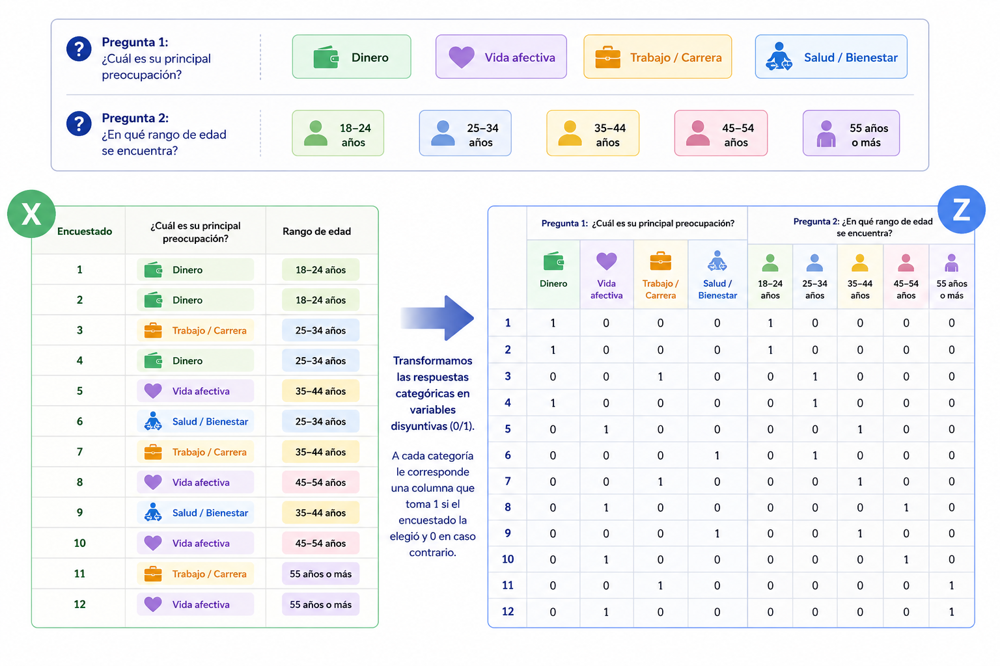
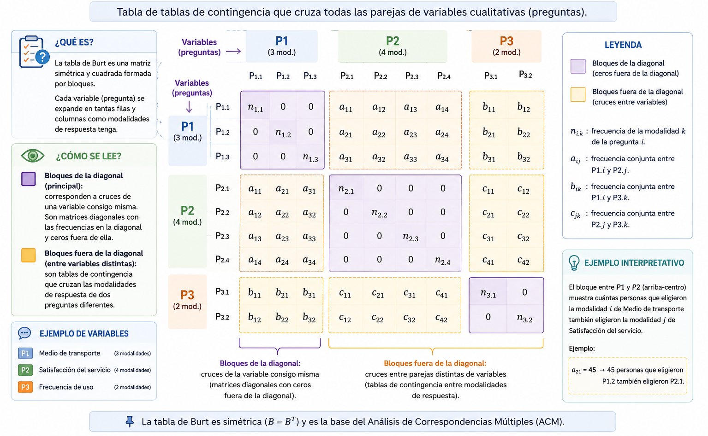
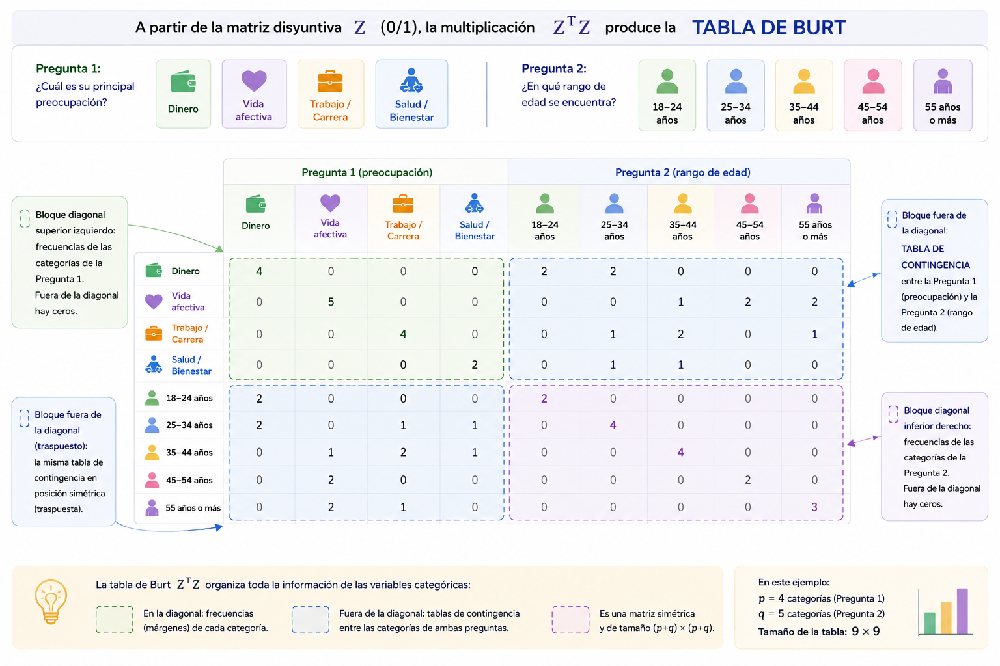

```{r}
#| message: false
#| warning: false
library(pacman)
p_load(here, tidyverse, FactoMineR, factoextra, corrplot,
       ggrepel, gt, janitor, haven, kableExtra)
```

```{r}
#| label: setup-url
url <- "https://github.com/jgbabativam/Curso_Multivariado/raw/main/Datos/"
```

# Análisis de Correspondencias Múltiples (ACM) {background-color="#0077b6"}

## Del ACS al ACM {style="font-size: 90%;"}

El ACS identifica asociaciones entre **dos** variables cualitativas. Cuando el interés se centra en $Q \geq 3$ preguntas cualitativas, se generaliza al **Análisis de Correspondencias Múltiples (ACM)**.

::: {.fragment}
El ACM se construye sobre una **Tabla de Tablas de Contingencia** denominada **tabla de Burt**, que es una matriz simétrica por bloques donde cada bloque es la tabla de frecuencias entre un par de variables:
:::


## Matriz disyuntiva {style="font-size: 88%;"}

Suponiendo $n$ individuos que responden $Q$ preguntas, la respuesta a la pregunta $q$ (con $p_q$ modalidades) se codifica en una **matriz disyuntiva** $Z_q$ de dimensiones $n \times p_q$:

$$Z_q \in \mathbb{R}^{n \times p_q}$$

cuyos elementos son:

$$
Z_q = \{ z_q(i,k) \}, \quad 
i = 1, \dots, n,\;
k = 1, \dots, p_q,\;
q = 1, \dots, Q$$

donde

$$z_q(i,k) =
\begin{cases}
1 & \text{si el individuo } i \text{ seleccionó la opción } k \text{ de la pregunta } q \\
0 & \text{en caso contrario}
\end{cases}$$

## Ejemplo de una tabla disyuntiva {.smaller}

Si la pregunta $q$ tiene $p_q=3$ opciones de respuesta
($o_1$, $o_2$ y $o_3$), la tabla disyuntiva $Z_q$ tiene la forma:

| ind | $p_q\,o_1$ | $p_q\,o_2$ | $p_q\,o_3$ | Suma |
|:---:|:----------:|:----------:|:----------:|:----:|
| 1 | 1 | 0 | 0 | 1 |
| 2 | 0 | 0 | 1 | 1 |
| $\vdots$ | $\vdots$ | $\vdots$ | $\vdots$ | $\vdots$ |
| $j$ | 1 | 0 | 0 | 1 |
| $\vdots$ | $\vdots$ | $\vdots$ | $\vdots$ | $\vdots$ |
| $n$ | 0 | 1 | 0 | 1 |

::: {.callout-note}
Cada fila contiene exactamente un valor igual a 1, indicando la opción seleccionada por el individuo correspondiente. Por tanto,

$$
\sum_{k=1}^{p_q} z_{q(jk)} = 1,
\qquad j=1,\ldots,n.
$$
:::


## Tabla disyuntiva completa para $Q$ preguntas {.smaller}

La estructura de la matriz disyuntiva completa $Z$, junto con los totales por fila (que producen el número de preguntas) y por columna (que producen el número de individuos que seleccionaron cada modalidad de respuesta), es la siguiente:

$$
\scriptsize
\begin{array}{c|ccc|cc|c|ccc|c}
i &
p_1o_1 & p_1o_2 & p_1o_3 &
p_2o_1 & p_2o_2 &
\cdots &
p_qo_1 & p_qo_2 & p_qo_3 &
z_{i\cdot}
\\
\hline
1 &
1 & 0 & 0 &
1 & 0 &
\cdots &
1 & 0 & 0 &
Q
\\
2 &
0 & 0 & 1 &
0 & 1 &
\cdots &
1 & 0 & 0 &
Q
\\
\vdots &
\vdots & \vdots & \vdots &
\vdots & \vdots &
\ddots &
\vdots & \vdots & \vdots &
\vdots
\\
n &
0 & 1 & 0 &
1 & 0 &
\cdots &
0 & 1 & 0 &
Q
\\
\hline
&
z_{1(\cdot 1)} &
z_{1(\cdot 2)} &
z_{1(\cdot 3)} &
z_{2(\cdot 1)} &
z_{2(\cdot 2)} &
\cdots &
z_{q(\cdot 1)} &
z_{q(\cdot 2)} &
z_{q(\cdot 3)} &
nQ
\end{array}
$$

::: {.callout-note appearance="simple"}
Cada fila contiene exactamente una respuesta por pregunta, por lo que su suma es igual al número total de preguntas $Q$. La suma de todos los elementos de la matriz es $nQ$.
:::

---

## Tabla disyuntiva completa para $Q$ preguntas  {.smaller}
> En la práctica puede sea necesario pasar de una tabla disyuntiva completa a una tabla de códigos o viceversa 

<style>
.tabla-codigos {
  font-size: 0.58em;
  text-align: center;
  margin: auto;
  border-collapse: collapse;
}
.tabla-codigos th,
.tabla-codigos td {
  padding: 3px 6px;
  border: 1px solid #999;
}
.tabla-codigos .sin-borde {
  border: none;
}
.tabla-codigos .grupo {
  font-weight: bold;
}
</style>

La tabla en códigos se obtiene reemplazando, para cada pregunta, el bloque disyuntivo por el número de la modalidad seleccionada.

<table class="tabla-codigos">
<tr>
  <th class="sin-borde"></th>
  <th colspan="9">Tabla disyuntiva completa</th>
  <th class="sin-borde"></th>
  <th colspan="3">Tabla en códigos</th>
</tr>

<tr>
  <th>ind</th>
  <th colspan="4">$p_1$</th>
  <th colspan="2">$p_2$</th>
  <th colspan="3">$p_3$</th>
  <td class="sin-borde"></td>
  <th>$p_1$</th>
  <th>$p_2$</th>
  <th>$p_3$</th>
</tr>

<tr>
  <td></td>
  <td>$o_1$</td><td>$o_2$</td><td>$o_3$</td><td>$o_4$</td>
  <td>$o_1$</td><td>$o_2$</td>
  <td>$o_1$</td><td>$o_2$</td><td>$o_3$</td>
  <td class="sin-borde"></td>
  <td></td><td></td><td></td>
</tr>

<tr><td>1</td><td>1</td><td>0</td><td>0</td><td>0</td><td>1</td><td>0</td><td>1</td><td>0</td><td>0</td><td class="sin-borde"></td><td>1</td><td>1</td><td>1</td></tr>
<tr><td>2</td><td>0</td><td>1</td><td>0</td><td>0</td><td>0</td><td>1</td><td>0</td><td>0</td><td>1</td><td class="sin-borde"></td><td>2</td><td>2</td><td>3</td></tr>
<tr><td>3</td><td>0</td><td>0</td><td>1</td><td>0</td><td>0</td><td>1</td><td>0</td><td>1</td><td>0</td><td class="sin-borde"></td><td>3</td><td>2</td><td>2</td></tr>
<tr><td>4</td><td>0</td><td>0</td><td>0</td><td>1</td><td>1</td><td>0</td><td>0</td><td>1</td><td>0</td><td class="sin-borde">$\leftrightarrow$</td><td>4</td><td>1</td><td>2</td></tr>
<tr><td>5</td><td>0</td><td>0</td><td>1</td><td>0</td><td>1</td><td>0</td><td>1</td><td>0</td><td>0</td><td class="sin-borde"></td><td>3</td><td>1</td><td>1</td></tr>
<tr><td>6</td><td>0</td><td>1</td><td>0</td><td>0</td><td>0</td><td>1</td><td>0</td><td>0</td><td>1</td><td class="sin-borde"></td><td>2</td><td>2</td><td>3</td></tr>
<tr><td>7</td><td>1</td><td>0</td><td>0</td><td>0</td><td>0</td><td>1</td><td>0</td><td>1</td><td>0</td><td class="sin-borde"></td><td>1</td><td>2</td><td>2</td></tr>
<tr><td>8</td><td>1</td><td>0</td><td>0</td><td>0</td><td>1</td><td>0</td><td>1</td><td>0</td><td>0</td><td class="sin-borde"></td><td>1</td><td>1</td><td>1</td></tr>
<tr><td>9</td><td>0</td><td>0</td><td>1</td><td>0</td><td>0</td><td>1</td><td>0</td><td>1</td><td>0</td><td class="sin-borde"></td><td>3</td><td>2</td><td>2</td></tr>
</table>

## Matriz disyuntiva completa {style="font-size: 80%;"}

La **matriz disyuntiva completa** concatena todas las preguntas:

$$Z = [Z_1,\, Z_2,\, \cdots,\, Z_Q] \qquad (n \times p), \quad p = \sum_{q=1}^Q p_q$$

<p align="center">

</p>

## Ejemplo: Matriz disyuntiva completa 

<p align="center">

</p>

# Tabla de Burt {style="font-size: 90%;"}

Al realizar la operación $Z^\prime Z$ se llega a la matriz que concatena todas las tablas de contingencia entre pares de variables, denominada tabla de *Burt*

::: {.fragment}
$$B = Z^\prime Z = \begin{bmatrix} Z_1^\prime Z_1 & Z_1^\prime Z_2 & \cdots & Z_1^\prime Z_Q \\ Z_2^\prime Z_1 & Z_2^\prime Z_2 & \cdots & Z_2^\prime Z_Q \\ \vdots & \vdots & \ddots & \vdots \\ Z_Q^\prime Z_1 & Z_Q^\prime Z_2 & \cdots & Z_Q^\prime Z_Q \end{bmatrix}$$
:::

::: {.fragment}
::: {.re-blue}
> La equivalencia entre un ACM para dos preguntas y un ACS está documentada en Lebart et al. (1984).
:::
:::


---

## Tabla de Burt: estructura por bloques {.smaller}
<!-- {style="font-size: 90%;"} -->

La tabla de Burt $B = Z^\prime Z$ es simétrica por bloques:

**Bloque diagonal de la tabla de Burt**

$$
D_q = Z_q^\prime Z_q =
\begin{pmatrix}
z_{q(\cdot 1)} & 0 & \cdots & 0 \\
0 & z_{q(\cdot 2)} & \cdots & 0 \\
\vdots & \vdots & \ddots & \vdots \\
0 & 0 & \cdots & z_{q(\cdot p_q)}
\end{pmatrix},
\qquad q=1,\ldots,Q.
$$
<!-- $$D_q = Z_q^\prime Z_q = \text{diag}(z_{q(\cdot 1)},\, z_{q(\cdot 2)},\, \ldots,\, z_{q(\cdot p_q)}), \quad q=1, \ldots, Q$$ -->

::: {.fragment}
**Fuera de la diagonal:**  tablas de contingencia entre las preguntas $q$ y $q^\prime$:
$$Z_q^\prime Z_{q^\prime} = \left\{ \sum_{i=1}^n z_{q(ij)}\, z_{q^\prime(ik)} \right\}_{j,k}$$
cuyo elemento $(j,k)$ es el número de individuos que contestaron la opción $j$ de la pregunta $q$ **y** la opción $k$ de la pregunta $q^\prime$.
:::

---

## Tabla de Burt: estructura por bloques fuera de la diagonal

</br></br>

$$
\scriptsize
Z_q^\prime Z_{q'}=
\underbrace{
\begin{pmatrix}
z_{q(1,1)} & z_{q(2,1)} & \cdots & z_{q(n,1)}\\
z_{q(1,2)} & z_{q(2,2)} & \cdots & z_{q(n,2)}\\
\vdots & \vdots & \ddots & \vdots\\
z_{q(1,p_q)} & z_{q(2,p_q)} & \cdots & z_{q(n,p_q)}
\end{pmatrix}
}_{p_q\times n}
\;
\underbrace{
\begin{pmatrix}
z_{q'(1,1)} & z_{q'(1,2)} & \cdots & z_{q'(1,p_{q'})}\\
z_{q'(2,1)} & z_{q'(2,2)} & \cdots & z_{q'(2,p_{q'})}\\
\vdots & \vdots & \ddots & \vdots\\
z_{q'(n,1)} & z_{q'(n,2)} & \cdots & z_{q'(n,p_{q'})}
\end{pmatrix}
}_{n\times p_{q'}}.
$$
<!-- <p align="center"> -->
<!--  -->
<!-- </p> -->

## Tabla de Burt: estructura por bloques {style="font-size: 90%;"}

<p align="center">

</p>


## Ejemplo: Tabla de Burt

<p align="center">

</p>

## Obtención de las componentes {style="font-size: 85%;"}

Para el ACM se usan entonces los perfiles fila y columna de la tabla disyuntiva completa, se mantiene
el criterio de distancia $\chi^2$ y las interpretaciones son los mismos que los del ACS.

La matriz a la que se calculan los valores y vectores propios es:

$$S = \frac{1}{Q} Z^\prime Z D^{-1} = \frac{1}{Q} B D^{-1}$$

donde 

- $D^{-1} = \text{diag}(D_1^{-1}, D_2^{-1}, \ldots, D_Q^{-1})$

- $D_q^{-1} = Z_q^\prime Z_q =  \text{diag}(1/z_{q(\cdot 1)}, 1/z_{q(\cdot 2)}, \ldots, 1/z_{q(\cdot p_q)}), \quad q=1,\ldots Q$

## Interpretación de los elementos de la matriz $S$ {.smaller}

Como la tabla de Burt $B$ es una matriz por bloques, cuyos bloques están dados por los productos cruzados $Z_q^\prime Z_{q'}$, los elementos de la matriz $S$ pueden escribirse como

$$
s_{jk}
=
\frac{1}{Q}
\sum_{i=1}^{n}
\frac{
z_{q(ij)}\,z_{q'(ik)}
}{
z_{q'(\cdot k)}
},
$$

donde

- $z_{q(ij)}=1$ si el individuo $i$ seleccionó la modalidad $j$ de la pregunta $q$, y $0$ en caso contrario;
- $z_{q'(ik)}=1$ si el individuo $i$ seleccionó la modalidad $k$ de la pregunta $q'$, y $0$ en caso contrario.

::: {.callout-note appearance="simple"}
El producto

$$
z_{q(ij)}\,z_{q'(ik)}
$$

vale $1$ únicamente cuando el individuo $i$ selecciona simultáneamente las modalidades $j$ y $k$. Por tanto,

$$
\sum_{i=1}^{n}
z_{q(ij)}\,z_{q'(ik)}
$$

representa el número de respuestas simultáneas a dichas modalidades.

Al dividir por $z_{q'(\cdot k)}$, se obtiene una frecuencia relativa condicionada a la modalidad $k$. Finalmente, el factor $1/Q$ normaliza esta cantidad respecto al número total de preguntas del cuestionario.
:::

# Inercia en el ACM {background-color="#0077b6"}

## Varianza e inercia en el ACS y el ACM {.smaller}

> En ACS y ACM se utiliza el concepto de inercia en lugar de la varianza del ACP, porque hay una diferencia importante entre éstos. La varianza está basada en la distancia euclidiana en datos cuantitativos y por tanto mide dispersión, mientras que la inercia utiliza la distancia $\chi^2$ que es una medida de la atracción o repulsión entre modalidades de las variables.

::: {.callout-note appearance="simple"}

* En el contexto del Análisis de Correspondencias Simple (ACS) y del Análisis de Correspondencias Múltiples (ACM), suele asociarse la varianza de las opciones de respuesta con el concepto físico de **inercia**.

* Una mayor varianza implica un mayor grado de dispersión de los datos alrededor de su centro de gravedad. Esta idea puede interpretarse en términos de inercia, ya que una dispersión más grande supone un mayor radio de acción o de influencia de una modalidad o de una pregunta.

* Por esta razón, en el análisis de correspondencias la variabilidad de los perfiles suele cuantificarse mediante medidas de inercia (véase, por ejemplo, Lebart, 2006).

Interpretación geométrica

- Modalidades cercanas al centro de gravedad $\Rightarrow$ baja inercia.
- Modalidades alejadas del centro de gravedad $\Rightarrow$ alta inercia.
- Una mayor inercia indica una mayor contribución a la estructura de asociación presente en los datos.

:::

## Inercia de modalidades, preguntas y total {style="font-size: 70%;"}

::: {.fragment}
**Inercia (varianza) de una modalidad** $j$:

$$I(j) = \frac{1}{Q}\left(1 - \frac{z_{.j}}{n}\right)$$

Aumenta cuando **pocos individuos** la contestaron ($z_{.j}$ pequeño); disminuye con $Q$.
:::

::: {.fragment}
**Inercia de una pregunta completa** $q$:

$$I(q) = \sum_{j=1}^{p_q} I(j) = \sum_{j=1}^{p_q} \frac{1}{Q}\left(1 - \frac{z_{.j}}{n}\right) = \frac{1}{Q}(p_q - 1)$$

Solo depende de $p_q$ y $Q$: **no tiene interés estadístico**.
:::

::: {.fragment}
**Inercia total:**

$$IT = \sum_q I(q) = \frac{p}{Q} - 1$$

También es función de $p$ y $Q$, por lo que **tampoco tiene interés estadístico**.
:::

---

## Conclusión sobre la inercia {style="font-size: 95%;"}

::: {.fragment}
::: {.callout-important}
**La única inercia con interés real para la interpretación es la de las modalidades**, porque depende de la proporción de respuestas que tuvo cada modalidad en la encuesta:

$$I(j) = \frac{1}{Q}\left(1 - \frac{z_{.j}}{n}\right)$$

Las modalidades **raramente contestadas** tienen inercia alta: son las que más distinguen a los individuos y aparecerán lejos del origen en el plano factorial.
:::
:::

::: {.fragment}
::: {.re-blue}
> Esta propiedad del ACM es especialmente útil en investigación social: las respuestas atípicas o poco comunes revelan los grupos más diferenciados de la población encuestada.
:::
:::

# Interpretación del ACM {background-color="#0077b6"}

## Guías para la interpretación {style="font-size: 88%;"}

Todas las reglas del ACS son aplicables directamente al ACM. Adicionalmente:

::: {.incremental}
- **Proximidad entre individuos** → respondieron aproximadamente las mismas opciones de respuesta; tienen opiniones similares.

- **Proximidad entre modalidades de preguntas diferentes** → asociación entre ellas: fueron contestadas aproximadamente por los mismos individuos.

- **Proximidad entre modalidades de la misma pregunta** → las distribuciones de quienes las contestaron son similares (aunque sean excluyentes).

- **Modalidades suplementarias (cualitativas):** no participan en el cálculo pero se proyectan en el plano. Sus posiciones indican tendencias o perfiles.

- **Variables suplementarias cuantitativas:** se correlacionan con los factores usando la correlación variable–factor ($\sqrt{\lambda_\alpha}\, v_{j\alpha}$), igual que en ACP.
:::

# Ejemplo 1: Justificaciones para desobedecer la ley — ECC {background-color="#0077b6"}

## Descripción del ejemplo {style="font-size: 88%;"}

La ECC incluye una pregunta que indaga si se justifica o no desobedecer la ley en 11 circunstancias (ítems). Para cada ítem el encuestado responde **sí** o **no**.

::: {.fragment}
Las justificaciones son:

| | |
|:--|:--|
| a. Alcanzar sus objetivos | g. No hay castigo |
| b. Ayudar a la familia | h. Alguien lo ha hecho y le fue bien |
| c. Luchar contra ley o régimen injusto | i. Es lo acostumbrado |
| d. Por provecho económico | j. Pagar un favor |
| e. Creencia religiosa lo permite | k. Defender propiedades o bienes |
| f. Responder a una ofensa al honor | |

Se incluyen ciudad y nivel educativo como **variables suplementarias**.
:::

---

## Carga y preparación de los datos {style="font-size: 86%;"}

```{r}
#| echo: true
#| message: false
#| warning: false
library(pacman)
p_load(tidyverse, FactoMineR, factoextra, gt, janitor, corrplot)

url <- "https://github.com/jgbabativam/Curso_Multivariado/raw/main/Datos/"
CCLatin <- read.csv2(paste0(url, "Muestra_CC.csv"), sep = ";")

cclp20 <- CCLatin[, c(4, 8, 64:74)]

etiq_si <- c("Si alcanzar objetivos","Si ayudar familia",
             "Si lucha ley reg injusto","Si por provecho económico",
             "Si creencia religiosa","Si resp. ofensa honor",
             "Si no hay castigo","Si alg ha hecho y ha ido bien",
             "Si es lo acostumbrado","Si pagar favor",
             "Si defender prop o bienes")

nombres_p20 <- paste0("P20_", letters[1:11])
for (k in seq_along(nombres_p20)) {
  col <- nombres_p20[k]
  cclp20[[col]][grepl("=1_si", cclp20[[col]])] <- etiq_si[k]
}

# Variables activas: ítems p20a-p20k (sin ciudad ni nivel educativo)
datos_acm <- cclp20[, -(1:2)]
```

---

## ACM: Valores propios

```{r}
#| echo: true
#| message: false
#| warning: false
acm_p20 <- MCA(datos_acm, graph = FALSE)
```

::: {.fragment}
```{r}
#| echo: true
#| fig-align: center
#| fig-width: 9
#| fig-height: 4.5
fviz_eig(acm_p20, addlabels = TRUE, ncp = 8,
         barfill = "#0077b6", barcolor = "#0077b6", linecolor = "#C0392B") +
  labs(title = "Gráfico de sedimentación — Justificaciones desobediencia de la ley",
       x = "Dimensión", y = "% varianza explicada") + theme_bw()
```
:::

---

## Indicadores de modalidades {style="font-size: 75%;"}

```{r}
#| echo: true
indp20 <- round(cbind(acm_p20$var$coord[, 1:3],
                      acm_p20$var$contrib[, 1:3],
                      acm_p20$var$cos2[, 1:3]), 2)
indp20 <- indp20[order(indp20[, 4], decreasing = TRUE), ]
colnames(indp20) <- c("Coo F1","Coo F2","Coo F3",
                      "Con F1","Con F2","Con F3",
                      "Cos F1","Cos F2","Cos F3")
head(indp20, 12)
```

---

## Plano 1-2: modalidades de respuesta

```{r}
#| echo: true
#| fig-align: center
#| fig-width: 10
#| fig-height: 5.5
fviz_mca_var(acm_p20, repel = TRUE, labelsize = 3,
             col.var = "contrib",
             gradient.cols = c("#00AFBB", "#E7B800", "#FC4E07"),
             title = "Plano 1-2: Justificaciones para desobedecer la ley") + theme_bw()
```

---

## Interpretación del Factor 1 y Factor 2 {style="font-size: 88%;"}

::: {.incremental}
- Sobre el **Factor 1**: todas las respuestas "Sí" tienen coordenadas **positivas**; las respuestas "No" tienen coordenadas **negativas**. Es un indicador de la **disposición general a justificar la desobediencia** de la ley.

- Las mayores contribuciones al Factor 1 son de "Sí no hay castigo" y "Sí por provecho económico": justificaciones de carácter **oportunista/impunidad**.

- El **Factor 2** está tipificado por "Sí ayudar familia" y "Sí lucha contra ley injusta": justificaciones de tipo **prosocial o cívico**, cualitativamente distintas.

- El Factor 3 distingue "Sí defender propiedades" y "Sí creencia religiosa": justificaciones más **individuales o filosóficas**.
:::

---

## Plano 1-2 con variables suplementarias {style="font-size: 90%;"}

::: {.panel-tabset}

### Plano

```{r}
#| echo: false
#| fig-align: center
#| fig-width: 9
#| fig-height: 4.5

cclp20_ilus <- CCLatin[, c(4, 8, 64:74)]

for (k in seq_along(nombres_p20)) {
  col <- nombres_p20[k]
  cclp20_ilus[[col]][grepl("=1_si", as.character(cclp20_ilus[[col]]))] <- etiq_si[k]
}

acm_supl <- MCA(cclp20_ilus, quali.sup = c(1, 2), graph = FALSE)

fviz_mca_var(
  acm_supl,
  repel = TRUE,
  labelsize = 3,
  title = "Justificaciones con ciudad y nivel educativo (suplementarias)"
) +
  theme_bw()
```

### Código

```{r}
#| eval: false
#| echo: true

# Construir tabla con ciudad (col 4) y nivel educativo (col 8) como suplementarias
# y P20_a...P20_k (cols 64-74) como variables activas
cclp20_ilus <- CCLatin[, c(4, 8, 64:74)]

for (k in seq_along(nombres_p20)) {
  col <- nombres_p20[k]
  cclp20_ilus[[col]][grepl("=1_si", as.character(cclp20_ilus[[col]]))] <- etiq_si[k]
}

acm_supl <- MCA(cclp20_ilus, quali.sup = c(1, 2), graph = FALSE)

fviz_mca_var(
  acm_supl,
  repel = TRUE,
  labelsize = 3,
  title = "Justificaciones con ciudad y nivel educativo (suplementarias)"
) +
  theme_bw()
```

:::

# Ejemplo 2: Confianza en instituciones — LAPOP Colombia 2021 {background-color="#0077b6"}

## Contexto: Barómetro de las Américas {style="font-size: 65%;"}

El **Barómetro de las Américas** (LAPOP) es una encuesta científica transnacional que mide actitudes, valores y percepciones ciudadanas en América Latina.

La edición Colombia 2021 incluye **2 993 encuestados** y utiliza un diseño de **muestra dividida**, por lo que distintos módulos se aplican a diferentes subconjuntos de personas.

::: {.fragment}

### Dimensión analizada: **Apoyo al sistema político**

Se utilizan seis preguntas del mismo módulo (*n*= 1 366), medidas en una escala de 1 a 7.

| Var. | Pregunta |
|:---:|:----------|
| `b2` | Respeto por las instituciones políticas |
| `b3` | Protección de los derechos básicos del ciudadano |
| `b4` | Orgullo de vivir bajo el sistema político |
| `b6` | Apoyo al sistema político |
| `b32` | Confianza en el gobierno local |
| `b47a` | Confianza en las elecciones |

Las respuestas se recodifican en tres categorías:

**Baja (1–3)** · **Media (4)** · **Alta (5–7)**

El género (`q1tb`: Hombre/Mujer) se incorpora como **variable suplementaria**.

:::

---

## Preparación del conjunto de datos {style="font-size: 86%;"}

```{r}
#| echo: true
#| message: false
#| warning: false
library(pacman)
p_load(here, tidyverse, FactoMineR, factoextra, corrplot,
       ggrepel, gt, janitor, haven)

url <- "https://github.com/jgbabativam/Curso_Multivariado/raw/main/Datos/"
lapop_raw <- read_dta(paste0(url, "COL_2021_LAPOP.dta"))

recode_trust <- function(x) {
  xn <- suppressWarnings(as.numeric(x))
  dplyr::case_when(
    xn %in% 1:3 ~ "Baja",
    xn == 4     ~ "Media",
    xn %in% 5:7 ~ "Alta",
    TRUE        ~ NA_character_
  )
}

lapop_acm <- lapop_raw |>
  transmute(
    Respeto    = recode_trust(b2),
    Derechos   = recode_trust(b3),
    Orgullo    = recode_trust(b4),
    Apoyo      = recode_trust(b6),
    GobLocal   = recode_trust(b32),
    Elecciones = recode_trust(b47a),
    Genero = dplyr::case_when(
      as.numeric(q1tb) == 1 ~ "Hombre",
      as.numeric(q1tb) == 2 ~ "Mujer",
      TRUE ~ NA_character_
    )
  ) |>
  drop_na() |>
  mutate(across(everything(), factor))
```

---

## ACM: Valores propios

```{r}
#| echo: true
#| message: false
#| warning: false
acm_lapop <- MCA(lapop_acm,
                 quali.sup = which(names(lapop_acm) == "Genero"), graph = FALSE)
```

::: {.fragment}
```{r}
#| echo: true
#| fig-align: center
#| fig-width: 9
#| fig-height: 4.5
fviz_eig(acm_lapop, addlabels = TRUE, ncp = 8,
         barfill = "#0077b6", barcolor = "#0077b6", linecolor = "#C0392B") +
  labs(title = "Gráfico de sedimentación. Legitimidad política y confianza (LAPOP 2021)", x = "Dimensión", y = "% inercia explicada") + theme_bw()
```
:::

---

## Plano 1-2: modalidades de confianza

```{r}
#| echo: true
#| fig-align: center
#| fig-width: 10
#| fig-height: 5.5
fviz_mca_var(acm_lapop, repel = TRUE, labelsize = 3.5,
             col.var = "contrib",
             gradient.cols = c("#00AFBB", "#E7B800", "#FC4E07"),
             title = "Legitimidad política y confianza institucional — LAPOP Colombia 2021") + theme_bw()
```

---

## Plano con género como variable suplementaria

```{r}
#| echo: true
#| fig-align: center
#| fig-width: 10
#| fig-height: 5.5
fviz_mca_var(acm_lapop, repel = TRUE, labelsize = 3.5,
             col.var.sup = "#C0392B",
             title = "Legitimidad política con género del encuestado (suplementario). LAPOP 2021") + theme_bw()
```

---

## Plano de individuos {style="font-size: 90%;"}

```{r}
#| echo: true
#| fig-align: center
#| fig-width: 10
#| fig-height: 5.5
fviz_mca_ind(acm_lapop, geom = "point", alpha.ind = 0.3,
             col.ind = "cos2",
             gradient.cols = c("#00AFBB", "#E7B800", "#FC4E07"),
             title = "Encuestados: Legitimidad política LAPOP Colombia 2021") + theme_bw()
```

---

## Interpretación {style="font-size: 70%;"}

::: {.incremental}
- El **Factor 1** Muestra en su **zona de valores positivos** a quienes consideran que hay un alto grado de respeto por las instituciones, apoyo y orgullo por el sistema político, confianza en las elecciones y protección de los derechos, lo que indica alto grado de **optimismo respecto de la Estabilidad y el Funcionamiento de las Instituciones Democráticas (EFID)**, mientras que en la **zona de valores negativos** del mismo factor se encuentran sus contrapartes indicando **pesimismo en cuanto a la EFID**.

<!-- es un eje de **legitimidad política general**: en un extremo, todas las modalidades "Alta" (quienes valoran las instituciones); en el otro, todas las modalidades "Baja" (quienes las rechazan). -->

- El **Factor 2** muestra un **optimismo moderado (medio)** respecto a la **EFID** exeptuando el respeto por las instituciones el cual está posiciomado cerca de las percepciones bajas o pesimistas.

<!-- diferencia entre los componentes: la **confianza específica** en gobierno local y elecciones (`b32`, `b47a`) puede separarse de las percepciones de **legitimidad difusa** del sistema (`b2`–`b6`), reflejando distintos tipos de desafección institucional. -->

- La variable suplementaria **Género** muestra que en Colombia, las mujeres tienden a ser **levemente más optimistas** en su percepción sobre la **EFID** que los hombres.

<!-- muestra si hombres y mujeres difieren en su valoración del sistema político. En Colombia, las mujeres suelen mostrar menores niveles de orgullo y apoyo al sistema que los hombres. -->

<!-- - Las modalidades **"Baja"** lejos del origen revelan los ciudadanos más críticos del sistema: los que sienten que sus derechos no están protegidos, que el sistema no merece apoyo y que las elecciones no son confiables. -->

<!-- - Los encuestados con todas las modalidades **"Alta"** son ciudadanos con alta legitimidad sistémica — perfil atípico en el contexto político colombiano de 2021. -->
:::

# Laboratorio {background-color="#0077b6"}

## Datos del laboratorio {style="font-size: 60%;"}

Los ejercicios utilizan los datos de la **Encuesta de Cultura Ciudadana (ECC)**  disponible en el repositorio del curso.

```{r}
#| echo: true
#| eval: false
library(pacman)
p_load(tidyverse, FactoMineR, factoextra, haven, corrplot)

url   <- "https://github.com/jgbabativam/Curso_Multivariado/raw/main/Datos/"
datos <- read.csv2(paste0(url, "Muestra_CC.csv"), sep = ";")
```

Las variables de interés son:

| Variable | Descripción |
|:---------|:-----------|
| `p16` | Sentimientos ante palabras "regla o norma" (1=muy negativo a 5=muy positivo) |
| `p17_b` | Facilidad para actuar conforme a la ley (1=nunca a 4=siempre) |
| `p21` | Preferencia para celebrar acuerdos |
| `p7_NEd` | Nivel educativo |
| `citi` | Ciudad |
| `p20a`–`p20k` | Justificaciones para desobedecer la ley (si/no) |

---

## Asignación por grupos {style="font-size: 70%;"}

Cada grupo trabajará con semilla distinta y una **pareja de preguntas diferente para el ACS** y un **conjunto distinto de ítems para el ACM**.

| Grupo | Semilla | ACS: variables | ACM: ítems p20 |
|------:|:-------:|:---------------|:---------------|
| 1 | 1357 | `p16` × `p17_b` | a, b, c, d, e (objetivos, familia, régimen, económico, religión) |
| 2 | 2468 | `p17_b` × `p21` | f, g, h, i, j (honor, impunidad, costumbre, favor) |
| 3 | 3579 | `p16` × `p21` | c, d, e, f, k (régimen, económico, religión, honor, propiedad) |
| 4 | 9753 | `p21` × `p7_NEd` | a, g, h, i, j, k (objetivos, impunidad, costumbre, favor, propiedad) |

---

## Laboratorio — ACS (1/3)

Con la pareja de variables asignada a su grupo:

::: {.incremental}
1. Construya la **tabla de contingencia** e interprete las frecuencias marginales: ¿qué modalidades son más frecuentes?

2. Calcule y grafique los **perfiles fila** y los **perfiles columna**. ¿Observa algún patrón? ¿Qué modalidades tienen distribuciones más similares entre sí?

3. Aplique el ACS con `CA()` del paquete `FactoMineR`.

4. ¿Cuántos factores retiene? Justifique con el **porcentaje de varianza acumulada** y el gráfico de sedimentación.

5. Construya el **análisis por filas** (coordenadas, contribuciones, cos²). Identifique las dos modalidades que mejor tipifican el Factor 1 y las que mejor tipifican el Factor 2.
:::

---

## Laboratorio — ACS (2/3)

::: {.incremental}
6. Construya el **análisis por columnas**. Identifique la modalidad con mayor contribución al Factor 1 y la con mayor cos² en el Factor 2.

7. Construya la **representación simultánea** (biplot) de filas y columnas. Describa al menos **tres asociaciones** entre modalidades de las dos variables que pueda identificar en el plano.

8. Agregue la variable **`citi` (ciudad)** como variable suplementaria (`row.sup`). ¿Alguna ciudad muestra una tendencia particular en las variables analizadas?

9. Agregue el **nivel educativo `p7_NEd`** como variable suplementaria. ¿Los niveles educativos más altos tienden a agregar con alguna modalidad particular?
:::

---

## Laboratorio — ACM (3/3) {style="font-size: 90%;"}

Con los ítems de justificación para desobedecer la ley asignados a su grupo:

::: {.incremental}
1. Aplique el **ACM** con `MCA()`. ¿Cuántos factores capturan el 50% de la varianza? Justifique la elección.

2. Construya la tabla de **coordenadas, contribuciones y cos²** para las primeras 3 dimensiones. ¿Qué modalidades definen el Factor 1?

3. Construya el **plano 1-2 de modalidades** (`fviz_mca_var`). Identifique los grupos de justificaciones con perfiles similares.

4. Agregue **ciudad y nivel educativo** como variables suplementarias (`quali.sup`). ¿Alguna ciudad muestra mayor tendencia a justificar la desobediencia? ¿Hay diferencias por nivel educativo?

5. Elabore un **análisis interpretativo** de los factores identificados, nombrando cada dimensión según las modalidades que la tipifican.
:::

# GRACIAS! {background-color="#ddf3ff"}

 
# Citación y derechos de autor

Este material ha sido creado por Jimmy Corzo y [Giovany Babativa-Márquez](https://github.com/jgbabativam) y es de libre distribución bajo la licencia [Creative Commons Attribution-ShareAlike 4.0](https://creativecommons.org/licenses/by-sa/4.0/).

Cualquier copia parcial o total de este material, debe citar la fuente como:

> Corzo J., \& Babativa-Márquez, J.G. *Diapositivas del curso de estadística descriptiva multivariada*. URL: https://jgbabativam.github.io/Curso_Multivariado/ 


