```{r}
#| message: false
#| warning: false
library(pacman)
p_load(here, tidyverse, FactoMineR, factoextra, corrplot, cluster,
       ggrepel, gt, janitor, haven, kableExtra)
```

```{r}
#| label: setup-url
url <- "https://github.com/jgbabativam/Curso_Multivariado/raw/main/Datos/"
```

# Análisis Clúster {background-color="#0077b6"}

## ¿Qué es el análisis clúster? {style="font-size: 90%;"}

Conjunto de técnicas para agrupar individuos con base en la similaridad que tienen en un vector de variables $\mathbf{x}' = (x_1, \ldots, x_p)$, **sin conocer de antemano** a qué grupo pertenece cada uno.

::: {.fragment}
Un buen agrupamiento cumple dos condiciones simultáneas:

1. **Homogeneidad interna**: los individuos dentro de un mismo clúster son lo más similares posible.
2. **Heterogeneidad externa**: los clústeres se diferencian claramente entre sí.
:::

::: {.fragment}
::: {.re-blue}
> A diferencia de la clasificación supervisada, aquí no existe una variable "respuesta" que indique el grupo verdadero: el algoritmo lo construye a partir de la estructura de los datos.
:::
:::

## Aplicaciones típicas {style="font-size: 88%;"}

::: {.incremental}
- **Segmentación de mercado**: agrupar clientes según hábitos de consumo para diseñar estrategias diferenciadas.
- **Tipologías sociales**: perfiles de ciudadanos según percepciones, actitudes o comportamientos (encuestas).
- **Caracterización territorial**: agrupar países, departamentos o municipios según indicadores socioeconómicos.
- **Reducción de complejidad**: resumir cientos de observaciones en unos pocos perfiles interpretables.
- **Insumo para otras técnicas**: crear una variable de grupo que luego se use en análisis descriptivo o predictivo.
:::

## Tipos de análisis clúster {style="font-size: 85%;"}

<p align="center">
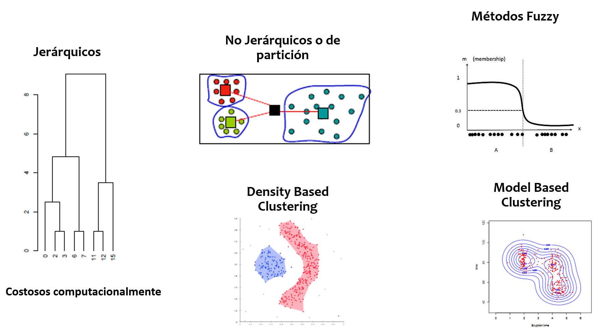
</p>

::: {.fragment}
En este curso nos concentramos en los dos enfoques clásicos: **jerárquicos** y **de partición (no jerárquicos)**, y en su combinación mediante **HCPC**.
:::

## Jerárquicos vs. no jerárquicos {style="font-size: 88%;"}

::: {.columns}
::: {.column width="50%"}
**Jerárquicos**

Construyen un árbol (dendrograma) agrupando sucesivamente los elementos o grupos más próximos, sin fijar de antemano el número de clústeres.

*Costosos computacionalmente para $n$ grande.*
:::

::: {.column width="50%"}
**No jerárquicos (partición)**

Dividen el conjunto de individuos en un número **prefijado** $k$ de grupos, optimizando algún criterio (p. ej. minimizar la varianza intra-clúster).

*Requieren definir $k$ antes de correr el algoritmo.*
:::
:::

## Etapas de un análisis clúster {style="font-size: 85%;"}

::: {.incremental}
1. Definir claramente los **objetivos** del análisis.
2. Seleccionar las **variables** relevantes (evitar redundancia).
3. **Estandarizar** las variables para evitar el efecto de la escala.
4. Elegir una **medida de distancia** o disimilaridad.
5. Elegir el **algoritmo** de agrupación.
6. Obtener la **agrupación** y decidir el número de clústeres.
7. **Validar** e interpretar los resultados.
:::

## Estandarización {style="font-size: 88%;"}

Cuando las variables tienen escalas distintas, las de mayor varianza dominan el cálculo de distancias. Se estandariza cada variable como:

$$z_{ij} = \frac{x_{ij} - \bar{x}_j}{s_j}, \qquad j = 1, \ldots, p$$

::: {.fragment}
::: {.callout-important}
Esto es indispensable quando las variables se miden en unidades diferentes (p. ej. ingresos en pesos y años de educación).
:::
:::

## Medidas de distancia {style="font-size: 85%;"}

**Distancia euclídea** (la más usada con variables cuantitativas estandarizadas):

$$d_{ij} = \sqrt{\sum_{k=1}^p (x_{ik} - x_{jk})^2}$$

::: {.fragment}
Otras alternativas según el tipo de variable:

- **Manhattan**: $d_{ij} = \sum_{k=1}^p |x_{ik} - x_{jk}|$ — más robusta a atípicos.
- **Distancia $\chi^2$**: para tablas de frecuencias (la misma del ACS/ACM).
- **Gower**: para mezclas de variables cuantitativas y cualitativas.
:::

::: {.fragment}
::: {.re-blue}
> Cuando las variables activas provienen de un ACP o un ACM, ya se trabaja sobre coordenadas factoriales, ortogonales y en la misma escala: allí la distancia euclídea es la elección natural.
:::
:::

# Métodos no jerárquicos: K-medias {background-color="#0077b6"}

## El algoritmo de las $K$-medias {style="font-size: 80%;"}

Dado un número de grupos $k$, el algoritmo busca la partición que **minimiza la suma de cuadrados intra-clúster**:

$$\min \sum_{c=1}^{k} \sum_{i \in C_c} \| x_i - \bar{x}_c \|^2$$

::: {.fragment}
Dos variantes clásicas:

<p align="center">
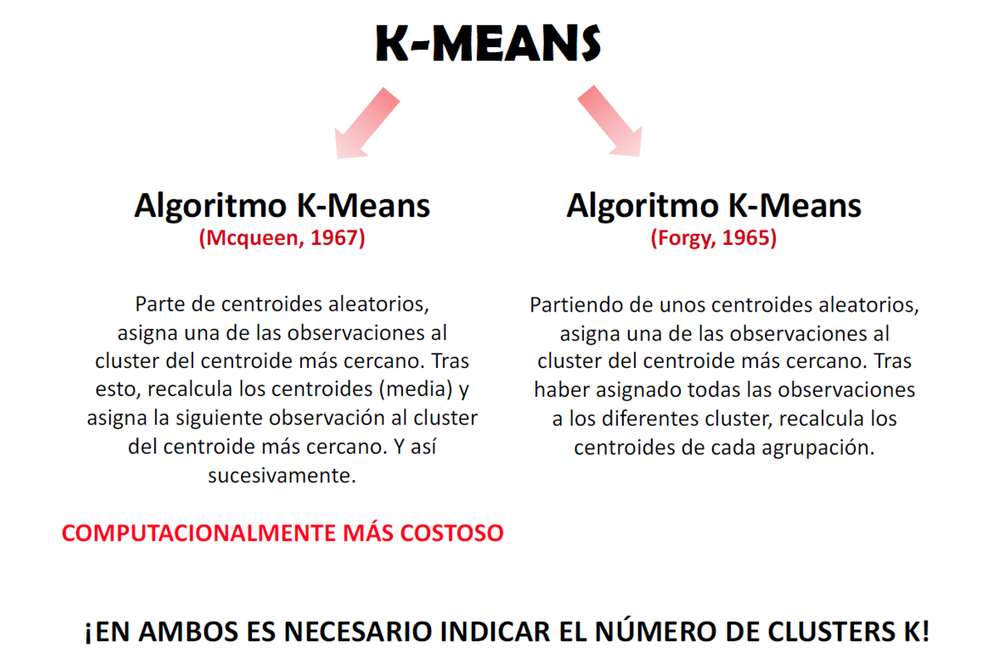
</p>
:::

## Algoritmo de las $K$-medias: paso a paso {style="font-size: 90%;"}

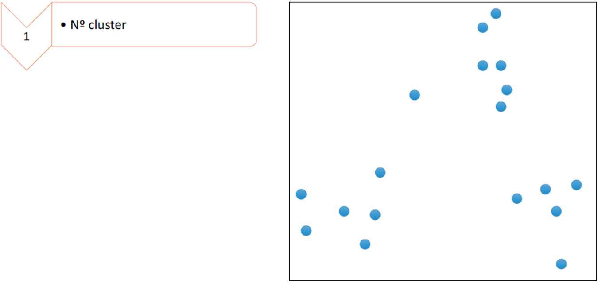{fig-align="center" width="95%"}

## Algoritmo de las $K$-medias: paso a paso {style="font-size: 90%;"}

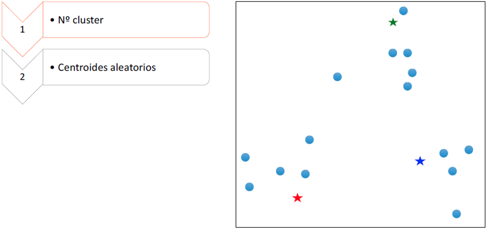{fig-align="center" width="95%"}

## Algoritmo de las $K$-medias: paso a paso {style="font-size: 90%;"}

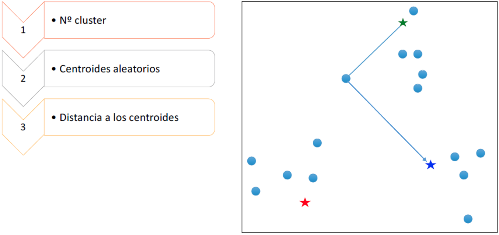{fig-align="center" width="95%"}

## Algoritmo de las $K$-medias: paso a paso {style="font-size: 90%;"}

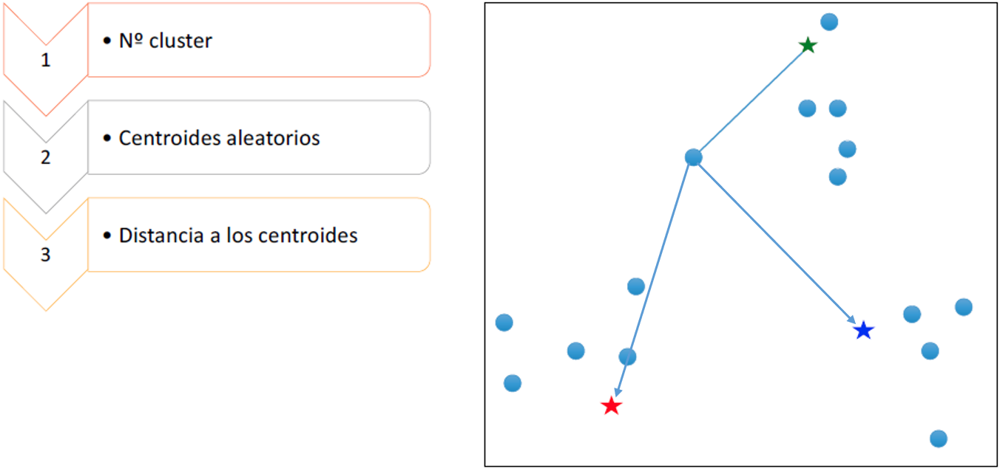{fig-align="center" width="95%"}

## Algoritmo de las $K$-medias: paso a paso {style="font-size: 90%;"}

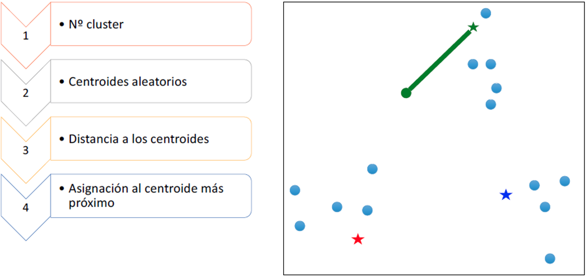{fig-align="center" width="95%"}

## Algoritmo de las $K$-medias: paso a paso {style="font-size: 90%;"}

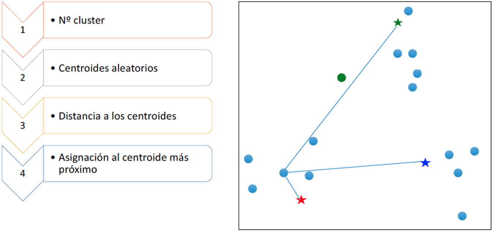{fig-align="center" width="95%"}


## Algoritmo de las $K$-medias: paso a paso {style="font-size: 90%;"}

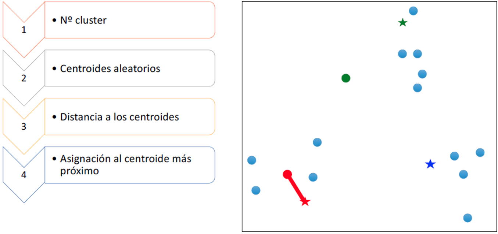{fig-align="center" width="95%"}

## Algoritmo de las $K$-medias: resultado final {style="font-size: 90%;"}

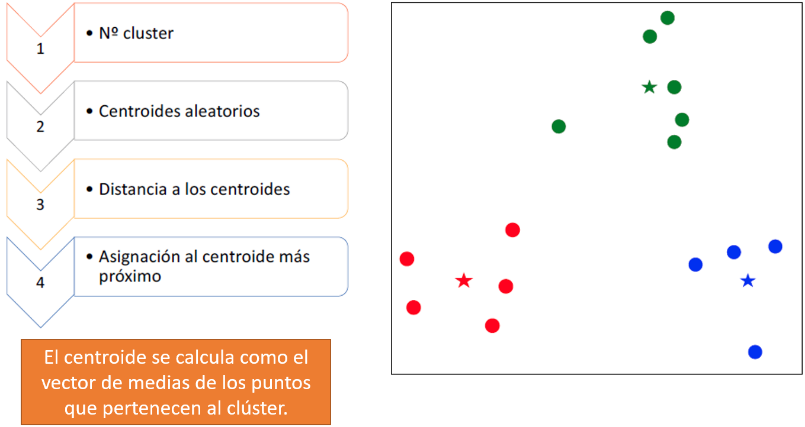{fig-align="center" width="95%"}

::: {.fragment}
El proceso se repite (reasignar → recalcular centroides) hasta que las asignaciones **no cambian** entre una iteración y la siguiente.
:::

# Ejemplo de juguete {background-color="#0077b6"}

## Datos artificiales {style="font-size: 88%;"}

Seis individuos descritos por dos variables: gasto mensual y años de educación.

```{r}
#| echo: true
datos <- data.frame(
  Individuo = c("A", "B", "C", "D", "E", "F"),
  gastos = c(5, 6, 15, 16, 25, 30),
  educa  = c(5, 6, 14, 15, 20, 19)
)
print(datos)
```

## Visualización {style="font-size: 88%;"}

```{r}
#| echo: true
#| fig-align: center
#| fig-width: 8
#| fig-height: 5
ggplot(datos, aes(x = gastos, y = educa, label = Individuo)) +
  geom_point(size = 3, color = "steelblue") +
  geom_text(vjust = -1) +
  labs(x = "Gastos", y = "Años de educación") +
  theme_bw()
```

::: {.fragment}
A simple vista se intuyen (al menos) dos grupos: {A, B} y {C, D, E, F}, y posiblemente un tercero {E, F} dentro de este último.
:::

## Estandarización de las variables {style="font-size: 85%;"}

$$z_{ij} = \frac{x_{ij} - \bar{x}_j}{s_j}$$

```{r}
#| echo: true
(datos_z <- datos |>
   mutate(gastoz = (gastos - mean(gastos)) / sd(gastos),
          educaz = (educa  - mean(educa))  / sd(educa)))
```

## Matriz de distancias {style="font-size: 88%;"}

```{r}
#| echo: true
(distancias <- dist(datos_z[, c("gastoz", "educaz")]))
```

::: {.fragment}
Los individuos A-B, C-D y E-F son los pares más próximos: son los primeros candidatos a fusionarse en cualquier algoritmo de agrupación.
:::

## Aplicación de $K$-medias ($k=2$) {style="font-size: 85%;"}

```{r}
#| echo: true
set.seed(123)
km <- kmeans(datos_z[, c("gastoz", "educaz")], centers = 2)
datos_z$cluster <- as.factor(km$cluster)
km$cluster
```

```{r}
#| fig-align: center
#| fig-width: 8
#| fig-height: 4.5
centros <- as.data.frame(km$centers)
colnames(centros) <- c("gastoz", "educaz")
ggplot(datos_z, aes(x = gastoz, y = educaz, color = cluster, label = Individuo)) +
  geom_point(size = 4) +
  geom_text(vjust = -1.2) +
  geom_point(data = centros, aes(x = gastoz, y = educaz),
             color = "black", size = 5, shape = 8, inherit.aes = FALSE) +
  labs(title = "K-medias sobre datos estandarizados (k=2)") +
  theme_bw()
```

## Métodos para elegir $k$ {style="font-size: 70%;"}

El número de clústeres $k$ debe fijarse **antes** de correr K-medias. Dos criterios ayudan a elegirlo:

::: {.columns}
::: {.column width="50%"}
**Método del codo (elbow)**

Grafica la suma de cuadrados intra-clúster (WSS) contra $k$:

$$WSS(k) = \sum_{c=1}^{k} \sum_{i \in C_c} \| x_i - \bar{x}_c \|^2$$

$WSS$ siempre **disminuye** al aumentar $k$. Se busca el punto donde la curva deja de descender rápidamente — el "codo" — porque agregar más grupos aporta poca reducción adicional de varianza.
:::

::: {.column width="50%"}
**Ancho de silueta (silhouette)**

Para cada individuo $i$, compara su distancia promedio a los demás miembros de su clúster ($a_i$) con la distancia promedio al clúster vecino más próximo ($b_i$):

$$s_i = \frac{b_i - a_i}{\max(a_i,\, b_i)}, \qquad s_i \in [-1, 1]$$

Se elige el $k$ que **maximiza** el ancho de silueta promedio $\bar{s}$. Valores cercanos a 1 indican individuos bien agrupados; cercanos a 0 o negativos, mal clasificados.
:::
:::

::: {.fragment}
::: {.callout-important}
El codo es una regla visual (subjetiva); la silueta da un valor numérico comparable entre distintos $k$. Se recomienda usar **ambos** junto con el criterio del analista.
:::
:::

## ¿Cómo elegir $k$ en el ejemplo de juguete? {style="font-size: 85%;"}

::: {.panel-tabset}

### Método del codo

```{r}
#| echo: true
#| fig-align: center
#| fig-width: 8
#| fig-height: 4.5
fviz_nbclust(datos_z[, c("gastoz", "educaz")], kmeans,
             method = "wss", k.max = 5) +
  labs(title = "Suma de cuadrados intra-clúster (WSS)")
```

### Silueta

```{r}
#| echo: true
#| fig-align: center
#| fig-width: 8
#| fig-height: 4.5
fviz_nbclust(datos_z[, c("gastoz", "educaz")], kmeans,
             method = "silhouette", k.max = 5) +
  labs(title = "Ancho de silueta promedio")
```

:::


## Alternativas al K-medias {style="font-size: 82%;"}

<p align="center">
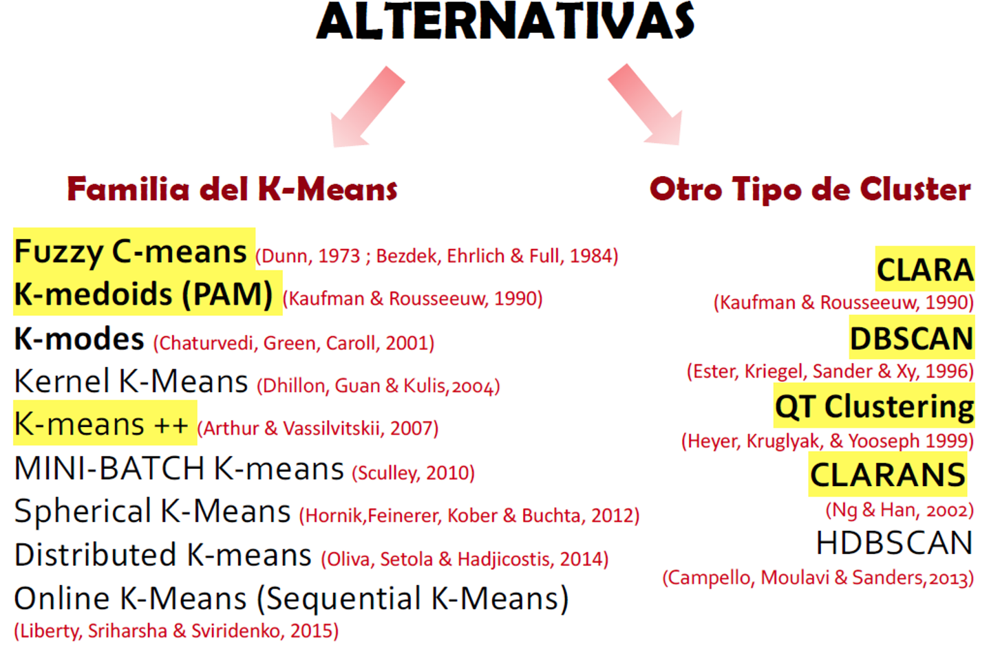
</p>

::: {.fragment}
Destacan `K-medoids (PAM)` (más robusto a atípicos, admite cualquier matriz de distancias) y `DBSCAN` (no requiere fijar $k$, identifica grupos de forma arbitraria y detecta ruido).
:::

# Métodos jerárquicos {background-color="#0077b6"}

## La idea de jerarquía {style="font-size: 85%;"}

Los métodos jerárquicos construyen agrupaciones **anidadas**, igual que una clasificación taxonómica: cada nivel agrupa a los elementos del nivel anterior.

<p align="center">
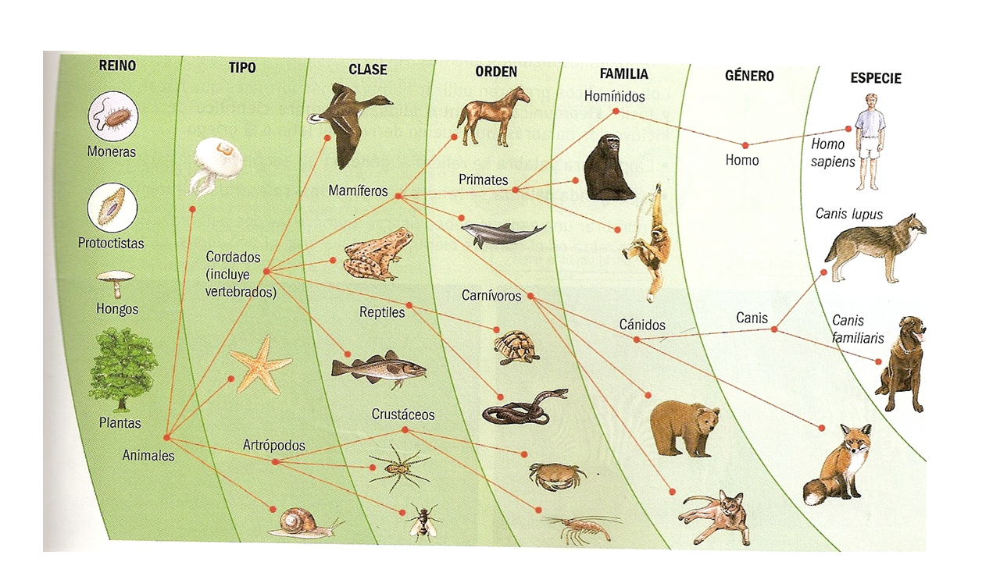
</p>

## Algoritmo de aglomeración jerárquica {style="font-size: 88%;"}

::: {.incremental}
1. Comenzar con tantos grupos como individuos ($n$ grupos). Las distancias entre grupos son las distancias entre los elementos originales.
2. Fusionar los **dos grupos más próximos** según la matriz de distancias.
3. Sustituir esos dos grupos por uno nuevo que los representa, y **recalcular** las distancias de este nuevo grupo con los demás.
4. Repetir (2) y (3) hasta que todos los elementos queden en un único grupo.
:::

::: {.fragment}
El resultado es un **dendrograma**: un árbol que resume el orden y la "altura" (distancia) a la que se produjo cada fusión.
:::

## Criterios de enlace (linkage) {style="font-size: 82%;"}

La forma de "recalcular" la distancia entre grupos define el método:

| Método | Distancia entre grupos $A$ y $B$ | Característica |
|:-------|:----------------------------------|:----------------|
| **Simple** (single) | $\min_{i\in A, j\in B} d_{ij}$ | Sensible a efecto "cadena" |
| **Completo** (complete) | $\max_{i\in A, j\in B} d_{ij}$ | Grupos compactos, sensible a atípicos |
| **Promedio** (average) | $\frac{1}{|A||B|}\sum_{i\in A, j\in B} d_{ij}$ | Compromiso entre los anteriores |
| **Ward** | Mínimo incremento en la inercia intra-clúster al fusionar | El más usado en la práctica |

## Ejemplo de juguete: dendrograma {style="font-size: 85%;"}

```{r}
#| echo: true
#| fig-align: center
#| fig-width: 8
#| fig-height: 5
hc_complete <- hclust(distancias, method = "complete")

plot(hc_complete, labels = datos$Individuo,
     main = "Clúster jerárquico (enlace completo)",
     sub = "", xlab = "", ylab = "Distancia")
rect.hclust(hc_complete, k = 2, border = "red")
```

## Comparación de criterios de enlace {style="font-size: 70%;"}

::: {.panel-tabset}

### Simple

```{r}
#| echo: true
#| fig-align: center
#| fig-height: 4.2
plot(hclust(distancias, method = "single"), labels = datos$Individuo,
     main = "Enlace simple", sub = "", xlab = "", ylab = "Distancia")
```

### Completo

```{r}
#| echo: true
#| fig-align: center
#| fig-height: 4.2
plot(hclust(distancias, method = "complete"), labels = datos$Individuo,
     main = "Enlace completo", sub = "", xlab = "", ylab = "Distancia")
```

### Promedio

```{r}
#| echo: true
#| fig-align: center
#| fig-height: 4.2
plot(hclust(distancias, method = "average"), labels = datos$Individuo,
     main = "Enlace promedio", sub = "", xlab = "", ylab = "Distancia")
```

### Ward

```{r}
#| echo: true
#| fig-align: center
#| fig-height: 4.2
plot(hclust(distancias, method = "ward.D2"), labels = datos$Individuo,
     main = "Método de Ward", sub = "", xlab = "", ylab = "Distancia")
```

:::

::: {.fragment}
En este ejemplo, **los cuatro criterios** coinciden en la partición en dos grupos: {A, B} y {C, D, E, F}, el mismo resultado que arrojó K-medias. En datos reales esto no siempre ocurre: la elección del método sí puede cambiar la agrupación.
:::

## ¿Cuántos grupos retener? {style="font-size: 88%;"}

::: {.incremental}
- **Regla visual**: cortar el dendrograma donde la distancia vertical entre fusiones consecutivas sea **grande** (un "salto" evidente).
- **Criterio de inercia**: elegir el número de clústeres que maximiza la ganancia relativa de inercia inter-clúster al pasar de $k$ a $k-1$ grupos.
- Ambos criterios coinciden con la lógica que usa `HCPC()` para sugerir automáticamente un número de grupos.
:::

# HCPC: Clasificación jerárquica sobre componentes principales {background-color="#0077b6"}

## La idea del HCPC {style="font-size: 85%;"}

`HCPC()` (*Hierarchical Clustering on Principal Components*) combina lo mejor de los dos mundos vistos hasta ahora, en tres etapas:

::: {.incremental}
1. **Reducción de dimensión**: se parte de las coordenadas factoriales de un ACP, ACM o ACS (en vez de las variables originales).
2. **Clasificación jerárquica** (Ward) sobre esas coordenadas, para construir el dendrograma y sugerir el número de clústeres.
3. **Consolidación** de la partición con un algoritmo de $K$-medias, partiendo de los centros de gravedad obtenidos en el paso jerárquico.
:::

## ¿Por qué trabajar sobre componentes? {style="font-size: 88%;"}

::: {.incremental}
- Las coordenadas factoriales son **ortogonales**: se elimina la redundancia (correlación) entre variables originales.
- Al retener solo los primeros ejes se **filtra ruido** y se reduce el costo computacional.
- Permite unificar el flujo de trabajo: el **mismo objeto** (`PCA()`, `MCA()` o `CA()`) alimenta tanto el mapa factorial como la clasificación.
- `HCPC()` produce, además del dendrograma, una **caracterización automática** de cada clúster: qué variables (o modalidades) lo tipifican.
:::

# Estudio de caso 1: perfiles de calidad de vida departamental {background-color="#0077b6"}

## Los datos {style="font-size: 86%;"}

Retomamos los 33 departamentos colombianos y sus 15 indicadores de calidad de vida (ECV-DANE 2022) usados en el ACP.

```{r}
#| echo: true
#| message: false
#| warning: false
url <- "https://github.com/jgbabativam/Curso_Multivariado/raw/main/Datos/"
 
ecv <- read.csv(paste0(url, "ecv_departamentos_2022.csv"), header = TRUE) |>
       column_to_rownames("departamento") |>
       rename(inv_hacinamiento = sin_hacinamiento,
              inv_ipm = sin_ipm, leen_adultos = lit_adultos)
```

## Paso 1: ACP (recordatorio) {style="font-size: 85%;"}

```{r}
#| echo: true
#| message: false
#| warning: false
pca_ecv <- PCA(ecv, graph = FALSE, scale.unit = TRUE, ncp = 5)
```

```{r}
#| echo: true
#| fig-align: center
#| fig-width: 9
#| fig-height: 4.5
fviz_eig(pca_ecv, addlabels = TRUE, ncp = 5) +
  labs(title = "Varianza explicada — Calidad de vida ECV 2022",
       x = "Componente", y = "% varianza explicada") + theme_bw()
```

## Paso 2: HCPC — dendrograma {style="font-size: 85%;"}

```{r}
#| echo: true
res.clus.ecv <- HCPC(pca_ecv, graph = FALSE)
table(res.clus.ecv$data.clust$clust)
```

```{r}
#| fig-align: center
#| fig-width: 9
#| fig-height: 5
fviz_dend(res.clus.ecv, cex = 0.6, palette = "jco",
          rect = TRUE, rect_fill = TRUE, horiz = TRUE,
          rect_border = "jco", labels_track_height = 0.8,
          main = "Dendrograma — Departamentos según calidad de vida")
```

## Paso 3: Plano factorial por clúster {style="font-size: 88%;"}

```{r}
#| echo: true
#| fig-align: center
#| fig-width: 9
#| fig-height: 5.5
fviz_cluster(res.clus.ecv, repel = TRUE,
             show.clust.cent = TRUE, palette = "jco",
             ggtheme = theme_minimal(),
             main = "Clúster de departamentos — Calidad de vida ECV 2022")
```

## Caracterización de los clústeres {style="font-size: 72%;"}

```{r}
#| echo: true
desc_ecv <- map_dfr(names(res.clus.ecv$desc.var$quanti), function(k) {
  as.data.frame(res.clus.ecv$desc.var$quanti[[k]]) |>
    rownames_to_column("variable") |>
    mutate(cluster = k) |>
    select(cluster, variable, `Mean in category`, `Overall mean`, v.test) |>
    slice_max(order_by = abs(v.test), n = 4)
})
```

<div style="height:500px; overflow-y:auto; border:1px solid #ddd;">

```{r}
desc_ecv |>
  mutate(across(where(is.numeric), ~round(., 1))) |>
  gt(groupname_col = "cluster") |>
  cols_label(variable = "Variable", `Mean in category` = "Media en clúster",
             `Overall mean` = "Media global", v.test = "v.test") |>
  tab_options(table.font.size = px(18), data_row.padding = px(3))
```

</div>

## Interpretación {style="font-size: 82%;"}

::: {.incremental}
- **Clúster 1** (4 dptos: Amazonas, Vaupés, Guainía, Vichada): valores **muy por debajo** de la media nacional en todos los indicadores (internet, alcantarillado, educación superior, IPM). Es el grupo con las condiciones de vida más precarias — la Amazonía y la Orinoquía profundas.

- **Clúster 2** (13 dptos: Caribe, Pacífico, Arauca, Caquetá, Putumayo…): indicadores **moderadamente por debajo** de la media, en departamentos históricamente afectados por el conflicto y con menor cobertura de servicios.

- **Clúster 3** (16 dptos: Bogotá, Antioquia, Valle, eje cafetero, Santanderes…): indicadores **por encima** de la media en todas las dimensiones — la región Andina y las principales áreas metropolitanas.
:::

## Individuos "parangón" de cada clúster {style="font-size: 85%;"}

Son los departamentos **más representativos** (más cercanos al centro de su clúster):

<div style="height:500px; overflow-y:auto; border:1px solid #ddd;">

```{r}
#| echo: true
map_dfr(names(res.clus.ecv$desc.ind$para), function(k) {
  tibble(cluster = k, departamento = names(res.clus.ecv$desc.ind$para[[k]]),
         distancia = round(res.clus.ecv$desc.ind$para[[k]], 3))
}) |> gt(groupname_col = "cluster") |>
  tab_options(table.font.size = px(18), data_row.padding = px(3))
```

</div>

# Estudio de caso 2: retomando el ACM — confianza institucional {background-color="#0077b6"}

## Recordando el ACM: LAPOP Colombia 2021 {style="font-size: 70%;"}

Retomamos el ejemplo de confianza institucional (b2, b3, b4, b6, b32, b47a; escalas recodificadas Baja/Media/Alta) con el género como variable suplementaria.

```{r}
#| echo: true
#| message: false
#| warning: false
lapop_raw <- read_dta(paste0(url, "COL_2021_LAPOP.dta"))

recode_trust <- function(x) {
  xn <- suppressWarnings(as.numeric(x))
  dplyr::case_when(
    xn %in% 1:3 ~ "Baja",
    xn == 4     ~ "Media",
    xn %in% 5:7 ~ "Alta",
    TRUE        ~ NA_character_
  )
}

lapop_acm <- lapop_raw |>
  transmute(
    Respeto = recode_trust(b2), Derechos = recode_trust(b3),
    Orgullo = recode_trust(b4), Apoyo = recode_trust(b6),
    GobLocal = recode_trust(b32), Elecciones = recode_trust(b47a),
    Genero = dplyr::case_when(as.numeric(q1tb) == 1 ~ "Hombre",
                               as.numeric(q1tb) == 2 ~ "Mujer",
                               TRUE ~ NA_character_)
  ) |> drop_na() |> mutate(across(everything(), factor))

acm_lapop <- MCA(lapop_acm,
                 quali.sup = which(names(lapop_acm) == "Genero"),
                 graph = FALSE)
```

## HCPC sobre las coordenadas del ACM {style="font-size: 85%;"}

```{r}
#| echo: true
res.clus.lapop <- HCPC(acm_lapop, graph = FALSE)
table(res.clus.lapop$data.clust$clust)
```

```{r}
#| fig-align: center
#| fig-width: 9
#| fig-height: 5
fviz_dend(res.clus.lapop, cex = 0.4, palette = "jco",
          rect = TRUE, rect_fill = TRUE,
          main = "Dendrograma — Confianza institucional LAPOP 2021")
```

## Plano de individuos coloreado por clúster {style="font-size: 88%;"}

```{r}
#| echo: true
#| fig-align: center
#| fig-width: 9
#| fig-height: 5.5
fviz_cluster(res.clus.lapop, geom = "point", alpha = 0.4,
             palette = "jco", ggtheme = theme_minimal(),
             main = "Encuestados LAPOP 2021 según legitimidad política")
```

## Caracterización cualitativa de los clústeres {style="font-size: 68%;"}

```{r}
#| echo: true
desc_lapop <- map_dfr(names(res.clus.lapop$desc.var$category), function(k) {
  as.data.frame(res.clus.lapop$desc.var$category[[k]]) |>
    rownames_to_column("modalidad") |>
    mutate(cluster = k) |>
    select(cluster, modalidad, `Mod/Cla`, Global, v.test) |>
    slice_max(order_by = v.test, n = 4)
})
```

<div style="height:500px; overflow-y:auto; border:1px solid #ddd;">

```{r}
desc_lapop |>
  mutate(across(where(is.numeric), ~round(., 1))) |>
  gt(groupname_col = "cluster") |>
  cols_label(modalidad = "Modalidad", `Mod/Cla` = "% en el clúster",
             Global = "% global", v.test = "v.test") |>
  tab_options(table.font.size = px(17), data_row.padding = px(3))
```

</div>

## Interpretación {style="font-size: 76%;"}

::: {.incremental}
- **Clúster 1** (n=487, 36%): domina la modalidad **"Baja"** en las seis variables — ciudadanos con **desafección generalizada** hacia el sistema político.

- **Clúster 2** (n=126, 9%): grupo pequeño y atípico, tipificado casi exclusivamente por **"Respeto Media"** (concentra el 100% de esa modalidad); en el resto de variables se inclina hacia valores bajos. Es el tipo de perfil "particular" que un análisis exploratorio univariado difícilmente detectaría.

- **Clúster 3** (n=368, 27%): predominan las modalidades **"Media"** — ciudadanos **ambivalentes**, ni claramente críticos ni claramente leales al sistema.

- **Clúster 4** (n=385, 28%): domina la modalidad **"Alta"** en todas las variables — ciudadanos con **alta legitimidad percibida** del sistema político. Este clúster tiene una proporción de **mujeres significativamente mayor** a la esperada ($\chi^2$, p = 0.022), asociación visible gracias a `Genero` como variable suplementaria.
:::

## De la teoría a la práctica {style="font-size: 88%;"}

::: {.re-blue}
> El mismo flujo de trabajo — reducir dimensión, clasificar jerárquicamente y consolidar con K-medias — funciona igual sobre coordenadas de un **ACP** (variables cuantitativas) que de un **ACM** (variables cualitativas). Lo único que cambia es el objeto que se pasa a `HCPC()`.
:::

# Laboratorio {background-color="#0077b6"}

## Datos del laboratorio {style="font-size: 70%;"}

```{r}
#| echo: true
#| eval: false
library(pacman)
p_load(tidyverse, FactoMineR, factoextra, cluster, haven, janitor)

url <- "https://github.com/jgbabativam/Curso_Multivariado/raw/main/Datos/"
```

Cada grupo trabajará con una **semilla distinta**, un conjunto de variables cuantitativas para K-medias/jerárquico y un subconjunto de ítems cualitativos para el ACM + HCPC.

| Grupo | Semilla | Datos cuantitativos | ACM + HCPC: ítems p20 (Muestra_CC.csv) |
|------:|:-------:|:---------------------|:----------------------------------------|
| 1 | 1357 | `SUEsolo2012.csv` (universidades públicas) | a, b, c, d, e |
| 2 | 2468 | `r14_Sci_Qs_Webometrics.csv` (universidades LatAm) | f, g, h, i, j |
| 3 | 3579 | `ecv_departamentos_2022.csv` (otro subconjunto de indicadores) | c, d, e, f, k |
| 4 | 9753 | `IPM2025.sav` (pobreza multidimensional) | a, g, h, i, j, k |

## Laboratorio — K-medias (1/3) {style="font-size: 85%;"}

Con el conjunto de datos cuantitativos asignado a su grupo:

::: {.incremental}
1. Seleccione al menos **4 variables cuantitativas** relevantes y elimine observaciones con datos faltantes.
2. **Estandarice** las variables y justifique por qué es necesario en este caso.
3. Use `fviz_nbclust()` (WSS y silueta) para proponer un número de clústeres $k$.
4. Aplique `kmeans()` con el $k$ elegido y su semilla asignada (`set.seed()`).
5. Visualice la partición con `fviz_cluster()` y calcule la **silueta promedio** (`silhouette()`, `fviz_silhouette()`). ¿La calidad de la partición es adecuada?
:::

## Laboratorio — Jerárquico (2/3) {style="font-size: 70%;"}

::: {.incremental}
6. Con la misma matriz estandarizada, construya la **matriz de distancias** (`dist()`) y aplique `hclust()` con al menos **dos criterios de enlace** distintos.
7. Grafique ambos dendrogramas. ¿Los cortes en el mismo número de grupos coinciden con la partición de K-medias?
8. Aplique un **ACP** sobre las mismas variables y luego `HCPC()` sobre el resultado. Compare el número de clústeres sugerido automáticamente con el que usted eligió en el punto 3.
9. Use `res.clus$desc.var$quanti` para **caracterizar** cada clúster: ¿qué variables lo definen y en qué sentido (por encima o por debajo de la media)?
10. Nombre cada clúster con una etiqueta descriptiva y redacte un párrafo de interpretación.
:::

## Laboratorio — ACM + HCPC (3/3) {style="font-size: 70%;"}

Con los ítems de justificación para desobedecer la ley asignados a su grupo:

::: {.incremental}
1. Aplique el **ACM** (`MCA()`) sobre los ítems asignados.
2. Aplique `HCPC()` sobre el resultado del ACM. ¿Cuántos clústeres sugiere automáticamente?
3. Grafique el dendrograma y el plano de individuos coloreado por clúster.
4. Use `res.clus$desc.var$category` para identificar las modalidades que **tipifican** cada clúster.
5. Agregue **ciudad** o **nivel educativo** (`Muestra_CC.csv`) como variable suplementaria en el ACM antes de correr `HCPC()`. ¿Alguna de estas variables se asocia significativamente con algún clúster?
6. Elabore una **caracterización final**: nombre cada clúster según el perfil de justificaciones que lo tipifica.
:::

# GRACIAS! {background-color="#ddf3ff"}

# Citación y derechos de autor

Este material ha sido creado por Jimmy Corzo y [Giovany Babativa-Márquez](https://github.com/jgbabativam) y es de libre distribución bajo la licencia [Creative Commons Attribution-ShareAlike 4.0](https://creativecommons.org/licenses/by-sa/4.0/).

Cualquier copia parcial o total de este material, debe citar la fuente como:

> Corzo J., \& Babativa-Márquez, J.G. *Diapositivas del curso de estadística descriptiva multivariada*. URL: https://jgbabativam.github.io/Curso_Multivariado/
